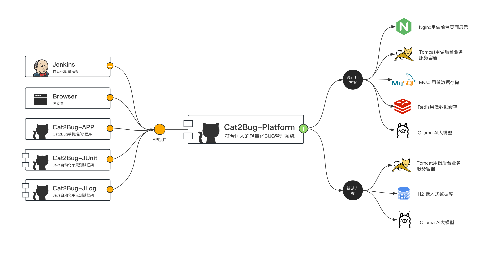
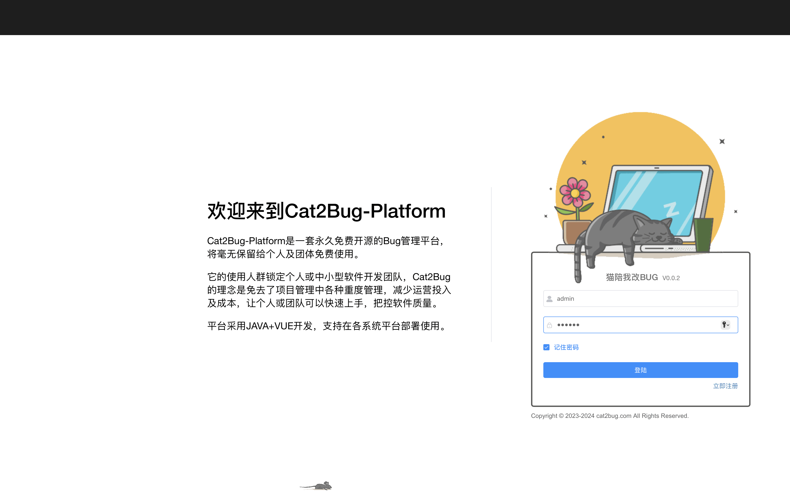
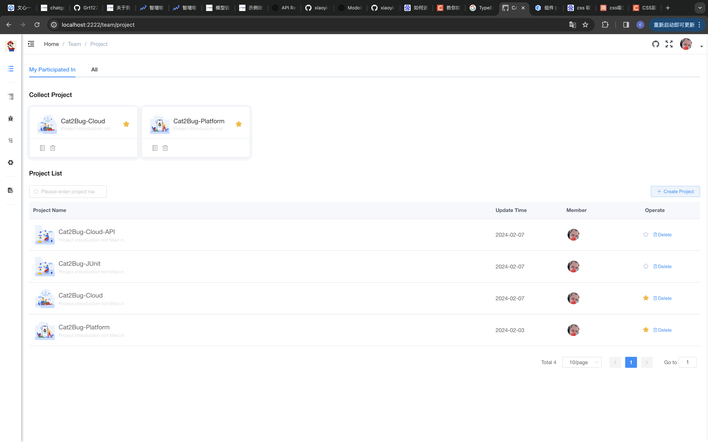
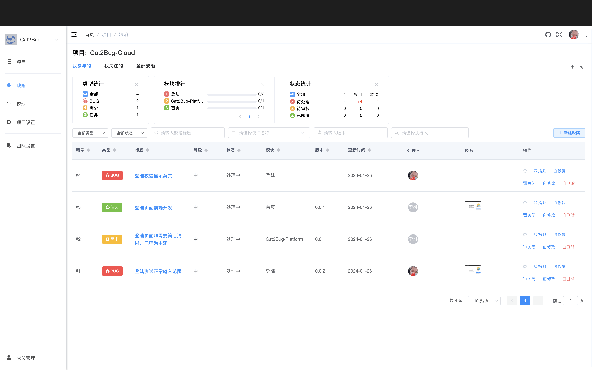
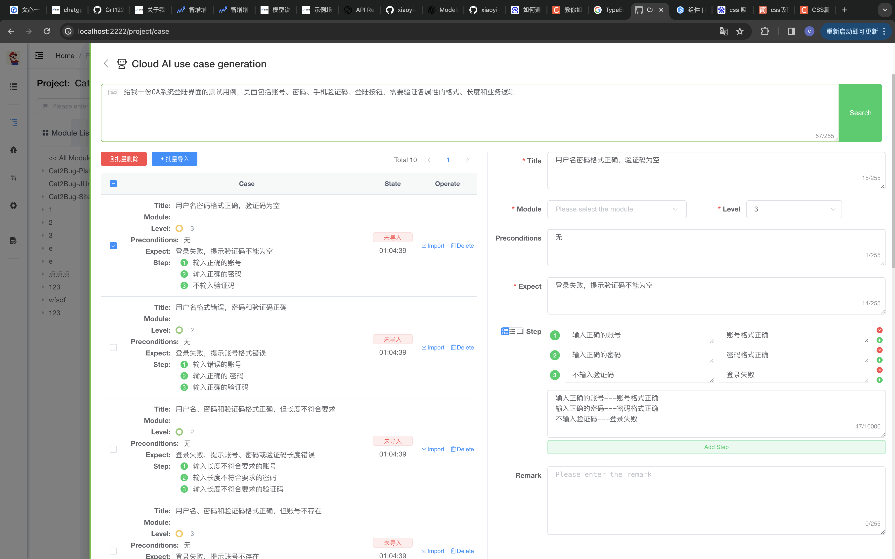
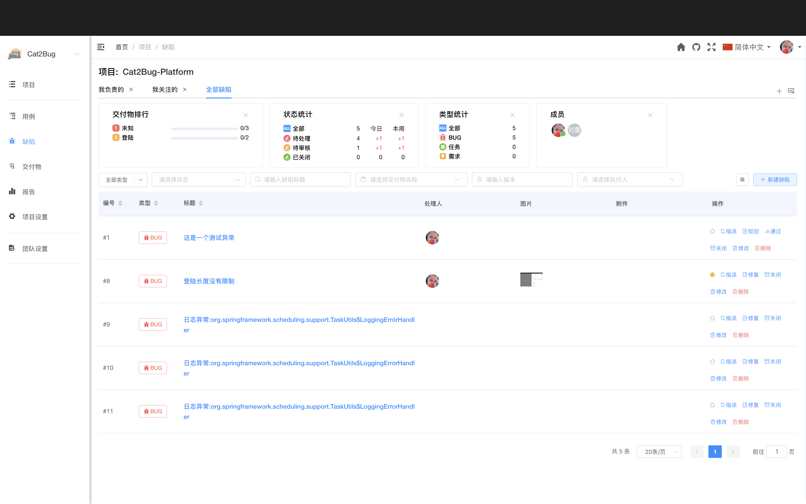
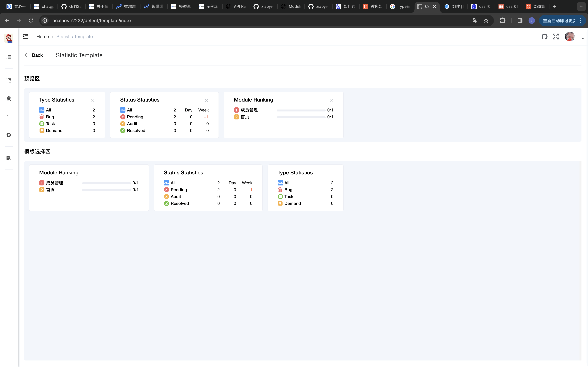
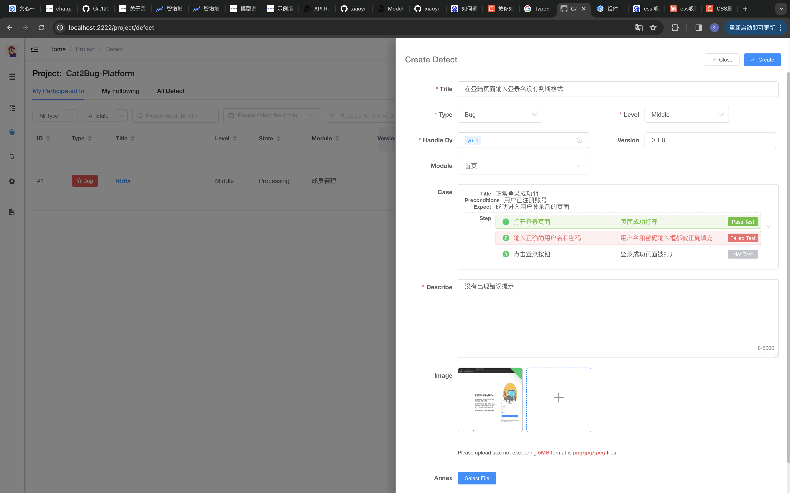
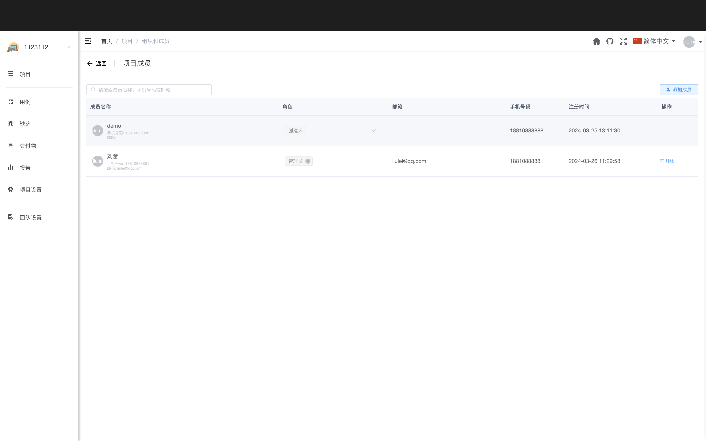

<div align="center">
  <!-- 与登录页 CatIllustration 同源（login-cat-scene-light/dark.jpg） -->
  
</div>
<h1 align="center" style="margin: 30px 0 30px; font-weight: bold;">Cat2Bug-Platform v1.0.0</h1>
<h4 align="center">轻量化智能BUG管理平台</h4>

## 平台简介

Cat2Bug-Platform是一套永久免费开源的Bug管理平台，可以完全私有化部署，它利用目前比较流行的AI大数据模型技术作为辅助，快速提升软件管理的质量，我们将毫无保留给个人及团体免费使用。
它的使用人群锁定个人或中小型软件开发团队，Cat2Bug的理念是免去了项目管理中各种重度管理，让个人或团队可以快速上手，把控软件质量。
平台采用JAVA+VUE前后台分离模式开发，支持在各系统平台部署使用。

## 内置功能

1.  仪表盘：统计缺陷、成员、计划信息。
2.  团队管理：管理团队中的项目、成员。
3.  项目管理：管理项目中的缺陷、成员。
4.  用例管理：管理测试用例。
5.  缺陷管理：管理BUG、需求、任务。
6.  交付物管理：维护项目中的可交付物品。
7.  报告管理：显示团队、项目、测试用例、缺陷、交付物等的相关数据指标。
8.  API管理：用于管理API接口密钥
9.  文档管理：留备项目中所用到的各种文档
10. 通知管理：发送系统业务通知到系统内部、邮件、钉钉等平台中。
11. 安装向导：一站式图形化安装配置，引导用户完成数据库、缓存、文件存储、AI及初始管理员账号的设置。

## 最新版本更新说明

当前最新版本是1.0.0

**运行时要求（1.0.0 后端）**：构建与运行后端需 **JDK 17+**、**Spring Boot 3.3.x**；Maven 版本号为 1.0.0。详见 [docs/backend-spring-boot-3.md](docs/backend-spring-boot-3.md) 与 [CHANGELOG.md](CHANGELOG.md)。

* 添加全新的图形化首次安装/升级向导，简化系统部署和数据库/缓存/账号初始化配置
* 添加飞书通知接收
* API KEY中添加权限设置
* 【AI大模型】改为【Ollama模型】，在AI创建测试用例、缺陷AI运用中，可以选择指定模型
* 缺陷页面添加Excel显示模式，删除了日历显示模式
* 缺陷页面表格模式左侧添加交付物列表
* 缺陷页面Tab中添加【已删除缺陷】标签，并在新建中添加【已删除】选项
* 添加AI模型的MCP功能
* 添加系统使用文档
* 优化整体页面

## 特色

* 开源私有化AI+BUG系统部署;
* 通过AI技术自动生成测试用例并录入到系统，解决费时费力录入用例的痛点;
* 已测试平台为生态中心，衍生多种缺陷监控测试框架，可以一站式解决软件生产运维中的诸多痛点；
* 自主研发报告模版，可轻松、快速、动态的生成项目所需管理及交付文档，较免管理人员编写文档的时间成本;
* 专注于软件的缺陷的跟踪管理，简单直接，即开即用，减少学习成本；

## 在线体验

- 体验账号：demo
- 体验密码：123456

演示地址：[https://www.cat2bug.com:8022](https://www.cat2bug.com:8022)

## 关联产品

| 名称                                                       | 类型       | 说明                                                                |
|----------------------------------------------------------|----------|:------------------------------------------------------------------|
| [Cat2Bug-App](https://gitee.com/cat2bug/cat2bug-app)     | BUG手机端   | Cat2Bug-Platform平台的手机端系统                                          |
| [Cat2Bug-JUnit](https://gitee.com/cat2bug/cat2bug-junit) | 单元测试框架   | 自动化单元测试框架，目前可以自动扫描Controller接口，随机提供参数测试，并将测试报告提交到Cat2Bug-Platform |
| [Cat2Bug-JLog](https://gitee.com/cat2bug/cat2bug-jlog)   | 错误日志采集框架 | 获取项目中的异常日志，并将日志报告提交到Cat2Bug-Platform                              |

## 系统架构



## 技术选型

1. 系统环境

* Java 17
* Jakarta Servlet 6
* Apache Maven 3

2. 主框架

* Spring Boot 3.3.x
* Spring Framework 6.x
* Spring Security 6.x

3. 持久层

* Apache MyBatis 3.5.x
* Hibernate Validation 6.0.x
* Alibaba Druid 1.2.x

4. 视图层

* Vue 2.6.x
* Npm 16.16.0
* Axios 0.21.x
* Element 2.15.x

## 模块

````
--cat2bug-platform
------|----cat2bug-platform-admin       # 主程序模块
------|----cat2bug-platform-ai          # 人工智能模块
------|----cat2bug-platform-im          # 通讯模块
------|----cat2bug-platform-api         # Open API模块
------|----cat2bug-platform-common      # 通用模块
------|----cat2bug-platform-framework   # 系统框架
------|----cat2bug-platform-generator   # 代码生成
------|----cat2bug-platform-quartz      # 定时任务
------|----cat2bug-platform-system      # 业务模块
------|----cat2bug-platform-ui          # 前端VUE工程
------|----deploy                       # 部署相关文件
------|----sql                          # 数据库文件
------|----readme                       # 文档
--------------|----development          # 项目开发文档
--------------|----production           # 生成环境使用文档
````

## 部署

### 手动命令行部署

手动部署需要提前安装Java 17+环境，并下载cat2bug-platform发行版程序，执行命令如下：

```shell
nohup java -jar cat2bug-admin.jar>/dev/null 2>&1 &
```

### 手动通过批处理命令部署

将deploy目录中的cat2bug-service.sh或cat2bug-service.bat文件与cat2bug-admin.jar文件拷贝到一个目录下，执行以下命令：

* 启动服务

```shell
cat2bug-service.sh start
```

* 停止服务

```shell
cat2bug-service.sh stop
```

* 查看服务状态

```shell
cat2bug-service.sh status
```

### Docker单容器部署

以下提供的是Docker官网容器化的部署方案，执行命令如下：

```docker
docker run -it -d -p 8022:8022 --name cat2bug-platform docker.cat2bug.com/cat2bug/cat2bug-platform/single:latest
```

### 本地通过Docker-Compose容器化部署

将后台服务./cat2bug-platform-admin/target/cat2bug-admin.jar、前台打包后的文件夹./cat2bug-platform-admin/src/main/resources/static、数据库sql文件./data/cat2bug_platform.sql拷贝到./deploy/docker目录下，执行以下命令：

```shell
docker-compose up -d
```

部署成功后，打开浏览器访问 [http://127.0.0.1:8022](http://127.0.0.1:8022)，系统在首次启动时会引导至 **图形化首次安装向导 (`/setup`)**：

*   **配置向导**：支持可视化完成数据库（嵌入式 H2 或 MySQL）、缓存（Caffeine 或 Redis）、文件存储路径、Ollama AI 机器人以及超级管理员账号等配置。
*   **重启生效**：提交配置后，**需要重启系统进程**，使新的数据源和系统运行配置完全生效。重启后即可使用您刚刚在向导中设置的超级管理员账号进行登录。
*   **默认/推荐账号**：系统管理员默认建议为 `admin`，密码为 `cat2bug`（可在向导中进行自定义修改）。
*   **静默/自动部署**：若通过 Docker 或 CI/CD 自动部署且需要跳过配置向导，可在启动前配置环境变量 `CAT2BUG_INSTALL_SKIP=true`，系统将直接跳过向导并以默认 H2 配置启动。

此部署方式为单容器最精简方式部署，如需多容器分布式或复杂生产环境部署方案，请查看 [系统使用文档中的管理员指南](readme/production/admin-guide/install-wizard.md) 或 [官网文档](https://www.cat2bug.com/download/cat2bug-platform/#%E9%83%A8%E7%BD%B2)。

## 演示图

<table>
    <tr>
        <td></td>
        <td></td>
    </tr>
    <tr>
        <td></td>
        <td></td>
    </tr>
    <tr>
        <td></td>
        <td></td>
    </tr>
    <tr>
        <td></td>
        <td></td>
    </tr>
</table>

## 未来计划

目前Cat2Bug还在持续成长中，后续我们将在测试工具、自动化、AI几个方向持续投入，完善平台的功能。2026计划如下：

* cat2bug-platform: 功能叠加，完善系统统计管理功能；
* cat2bug-app：完善移动端APP；
* cat2bug-cloud：cat2bug云平台的建设；

## Cat2Bug交流群

| QQ群： [731462000](https://qm.qq.com/cgi-bin/qm/qr?k=G_vJa478flcFo_1ohJxNYD0mRKafQ7I1&jump_from=webapi&authKey=EL0KrLpnjYWqNN9YXTVksNlNFrV9DHYyPMx2RVOhXqLzfnmc+Oz8oQ38aBOGx90t) | 微信群：Cat2Bug                                                                 |
|--------------------------------------------------------------------------------------------------------------------------------------------------------------------------------|-----------------------------------------------------------------------------|
|                                                                                                         |  |
