# 测试用例

测试用例是软件工程及 BUG 管理中不可或缺的元素，在实际工作中，编写测试用例又一直消耗测试人员大量的时间和精力。

因此，Cat2Bug-Platform 从 0.1.0 开始，将支持测试用例的使用，并在后续工作中将提高测试用例的质量、减少测试用例的维护时间为目标，不断优化系统及使用方式，为大家提供更为轻松便捷的测试环境。

## 用例列表

在测试用例列表页，上侧的是数据查找选项区；左侧是模块筛选区；中间为用例列表数据展示区。我们可以通过点击左侧模块或上方的筛选项对用例数据进行筛选查找，如下图：

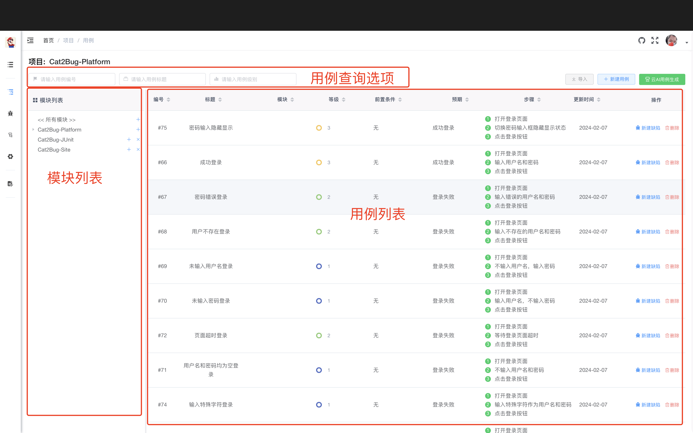

**列表功能：**

- **模块筛选** - 点击左侧模块树进行筛选
- **条件筛选** - 通过用例级别、状态、创建人等条件筛选
- **搜索功能** - 快速搜索用例标题和内容
- **批量操作** - 批量删除、导出用例
- **自定义列** - 自定义显示的列

## 修改用例

当点击用例列表中的某条数据时，会从右侧弹出用例详情，可以对其进行查看和编辑操作，如下图：

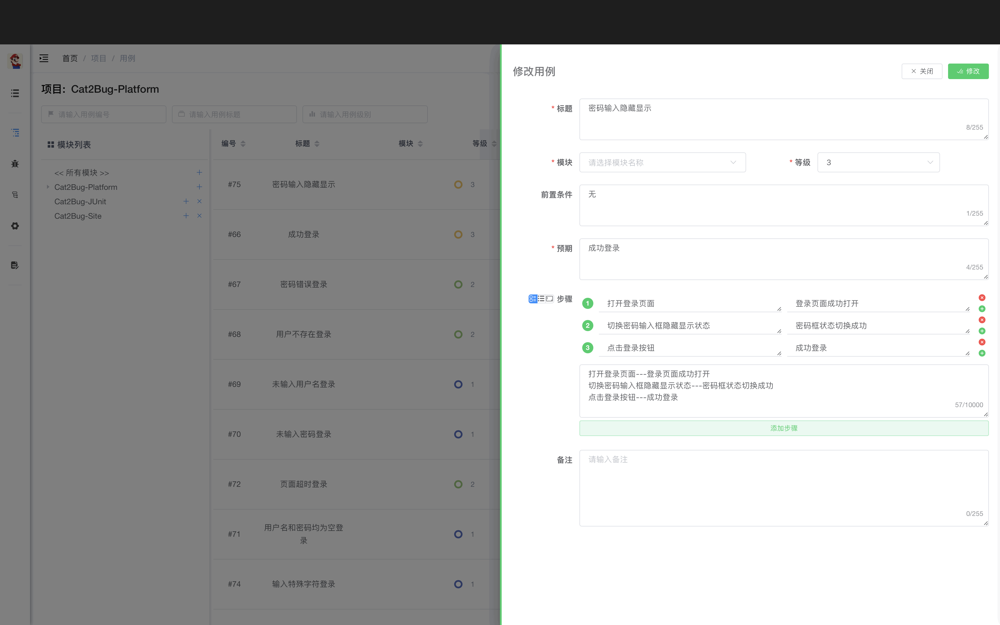

**可修改内容：**
- 用例标题
- 用例描述
- 前置条件
- 测试步骤
- 预期结果
- 用例级别
- 关联交付物

## 手动创建测试用例

手动创建用于直接在 Cat2Bug-Platform 平台中录入测试用例数据，操作步骤如下：

### 1. 打开创建界面

首先点击页面右上侧的【新建用例】按钮，将从右侧打开测试用例新建界面，如下图：

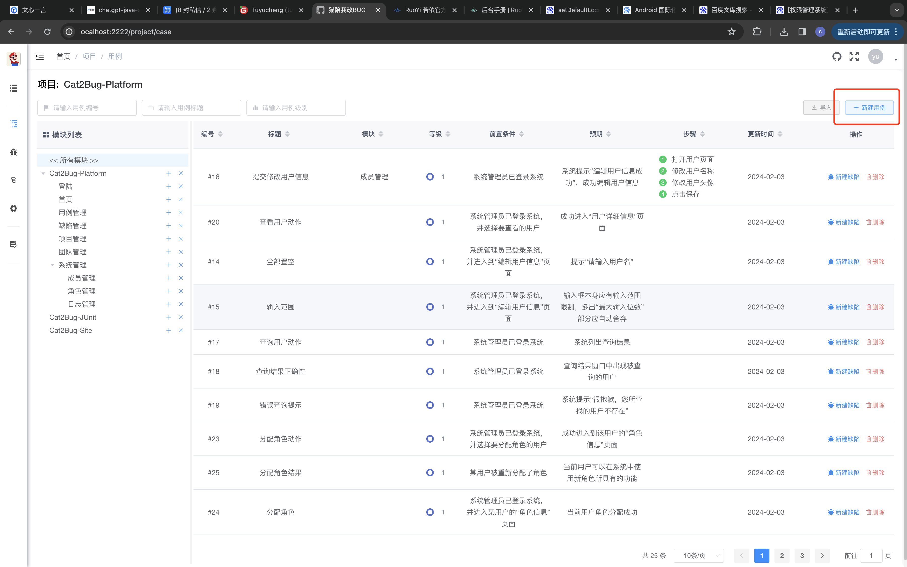

### 2. 连续创建设置

在下图的新建用例界面中，红框标注的第一个选项用于连续创建用例而用，默认是选中状态。

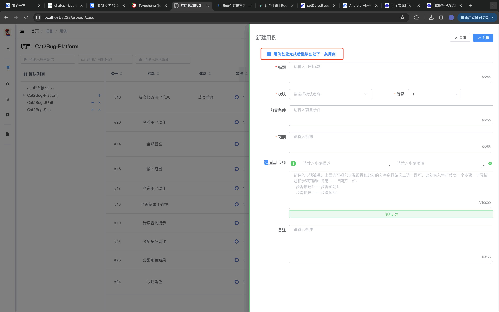

### 3. 关联交付物

在 Cat2Bug-Platform 中，所有用于测试的软件系统结构都是基于交付物体现的，所以测试用例也需要关联交付物，下图就是展示交付物的选择示例。如当前不存在某个交付物，也可以通过交付物下拉组件中的添加功能快速创建交付物。

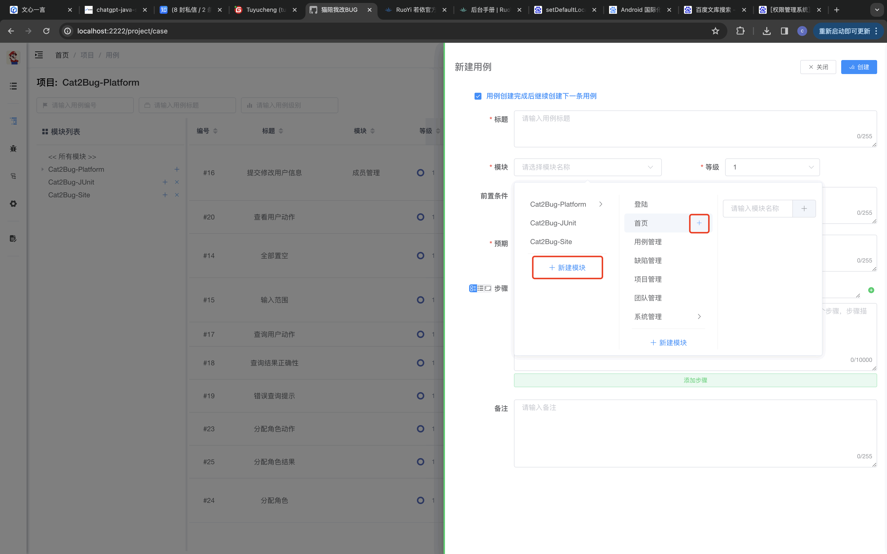

### 4. 设置测试步骤

在测试步骤选项中，系统提供了两种录入方式：

**方式一：列表模式**

- 以列表形式显示步骤
- 用户可通过点击【添加步骤】按钮或每行步骤后面的【添加】【删除】图标按钮调整步骤内容
- 并可通过鼠标拖动方式改变步骤的顺序

**方式二：文本模式**

- 以文本方式显示步骤
- 用户可根据规范的格式统一快速录入所有步骤
- 在文本模式中，规定每行为一条步骤
- 每条步骤的【描述】和【预期】属性通过 `---` 来分隔

**文本模式示例：**
```
把冰箱门打开---冰箱有个门
把大象放进去---大象真的能放进去
把冰箱门关上
```

**模式切换：**

在步骤左侧有三个图标小按钮，用来切换步骤的不同模式：
- 第一个图标按钮：同时显示列表和文本模式
- 第二个图标按钮：显示列表模式
- 第三个图标按钮：显示文本模式

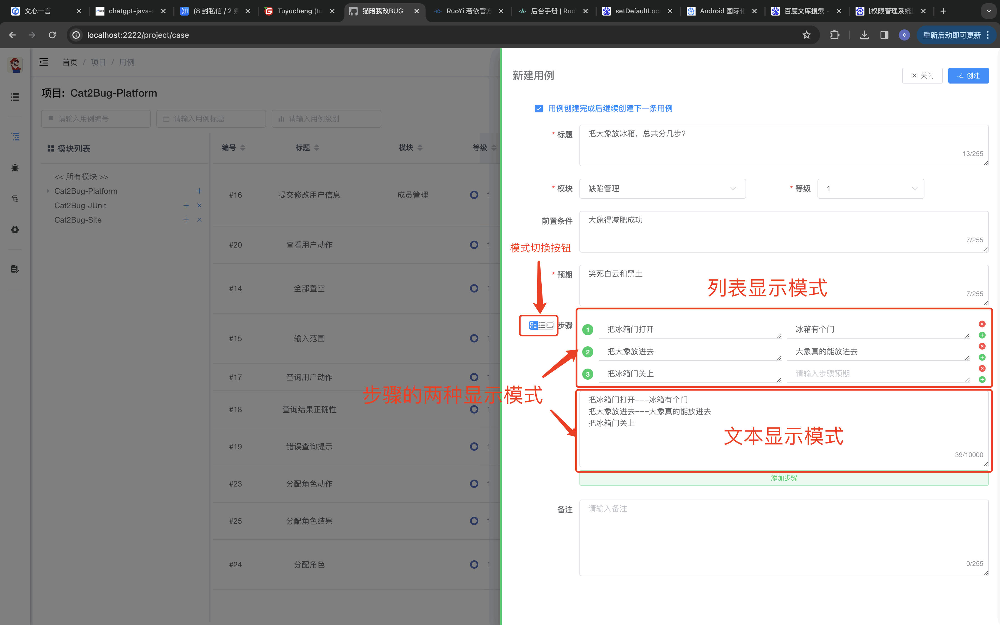

### 5. 完成创建

当输入完所有数据后，点击右上角的【创建】按钮创建完成新用例。

## Excel 导入测试用例

和其它传统缺陷管理系统相同，我们提供了从 Excel 导入测试用例的功能，此方式主要考虑到用户可以从一些正在进行的项目中快速转移项目数据。

### 1. 下载测试用例模版

我们提供了一套标准的测试用例模版格式，点击【导入用例】对话框中的【下载模版】链接按钮，即可下载 Excel 模版文件。

值得注意的是，此模版中交付物选项是非必填的（系统中，测试用例的交付物属性是必填项），此处主要考虑到在没有完全维护好模块结构的时候，也可以畅通无阻的完成测试用例的导入工作。操作如下图：

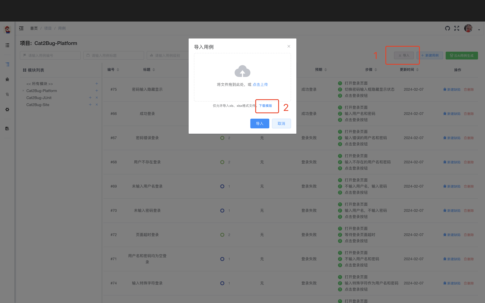

::: tip 提示
模块与测试用例的关联不会影响其它操作，只会影响根据模块筛选用例的功能
:::

### 2. 在 Excel 模版中录入数据

在 Excel 模版中，红色标题的列是必填项；模块、用例级别等是下拉选项，目前 Excel 最大支持 65536 条数据的录入。

值得一提的是，导入的【步骤】属性，格式规则如下：

- 一行算一个步骤
- 步骤的描述与预期用 `---` 分割

**示例：**
```
打开登录页---页面已经打开
在用户名输入框输入中文"刘德华"---应提示只能输入英文及数字
```


### 3. 导入数据

将维护好的 Excel 文件导入到系统，如录入的数据无误，系统将提示导入成功，如下图：

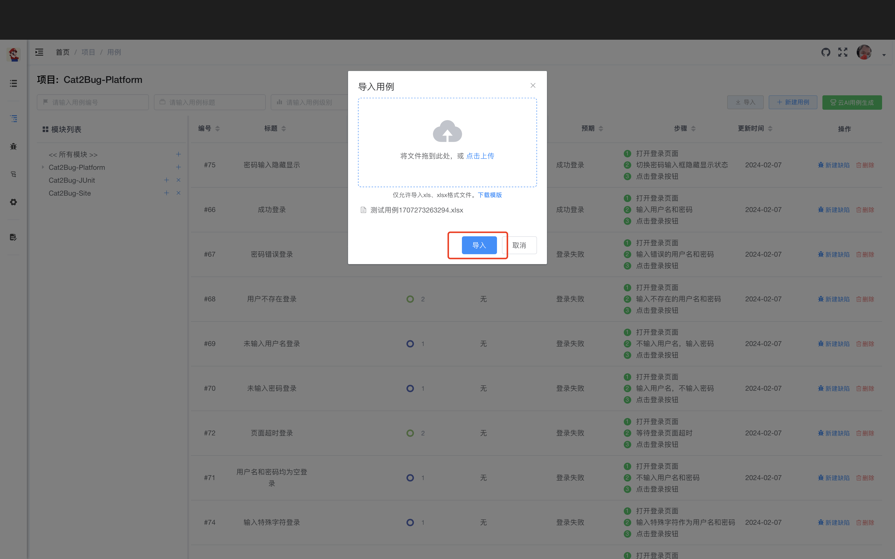

## AI 创建测试用例

如今比较火的 ChatGPT 等人工智能大数据模型技术确实给人们的生活带来了质的改变，它在自然语义理解、图像生成方面有着突出的表现，因此我们也在 Cat2Bug-Platform 0.1.1 版本中尝试将其引入到测试工作中。

首先考虑的就是将它做为测试用例的生成助手，因为就在 2023 年的 10 月初，我所在的公司接到一个棘手的项目，由于项目交付周期短，甲方验收标准比较严苛，加之系统功能比较多，公司安排了 5 个人十一休假期间持续加班来编写项目的测试用例，以便消除任何影响交付的问题，那种持续的工作强度我想只有现场的同事才能体会到。

因此，通过 AI 帮我们自动生成测试用例，是测试工作中的首要目标，也是一个基本需求。

### AI 创建测试用例

目前市面上通过 ChatGPT、微软 Copilot、百度文心等创建测试用例的第三方平台不少，但是他们大部分只能通过聊天方式给出各种格式的文字描述，然后需要使用者自己修改格式并存入项目管理或 BUG 系统。

我们在开发的时候考虑到这点的不便，因此将其封装到了 Cat2Bug 生态里，让测试人员输入描述查找后，自动就可以录入到系统里，下面我来介绍一下 Cat2Bug AI 创建测试用例的过程及使用技巧。

在 Cat2Bug-Platform V0.1.1 版本中，测试用例界面右上角多了一个【云 AI 用例生成】按钮，点击将会从右侧划出【云 AI 用例生成】界面，如下图：

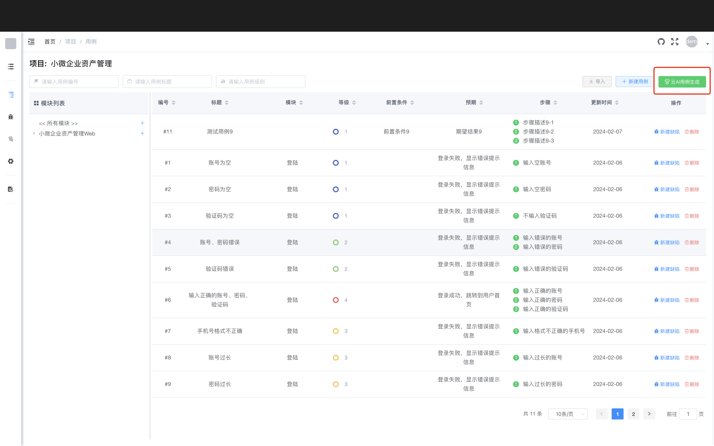

在【云 AI 用例生成】界面中，分为三个区域，上侧是查询区、左侧是查询用例结果列表、右侧是单个用例编辑区，见下图：

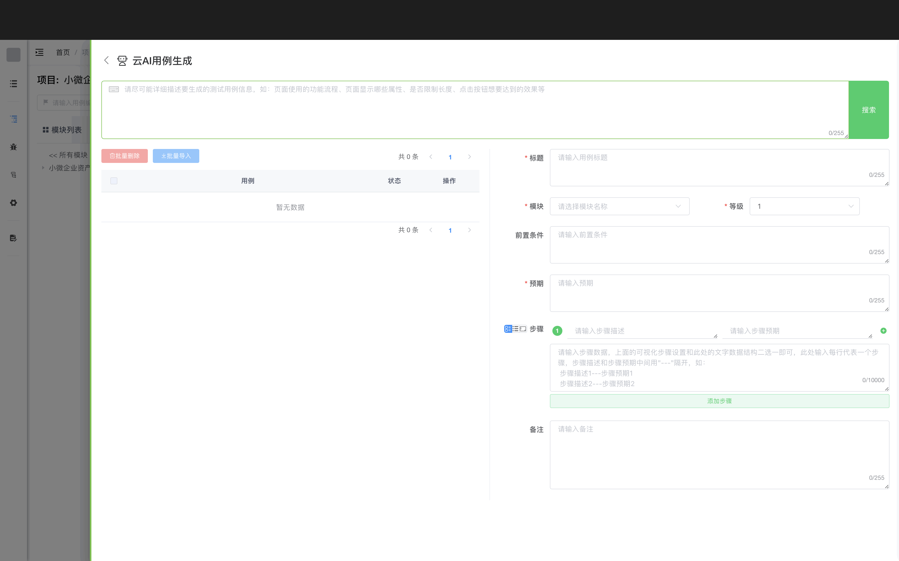

在最上面的输入框中，输入【想要生成的测试用例描述】，点击【搜索】按钮后，等待 5 至 60 秒，即可在下方显示 AI 创建的用例数据，目前版本一次查询通常会生成 10 条测试用例，如下图：

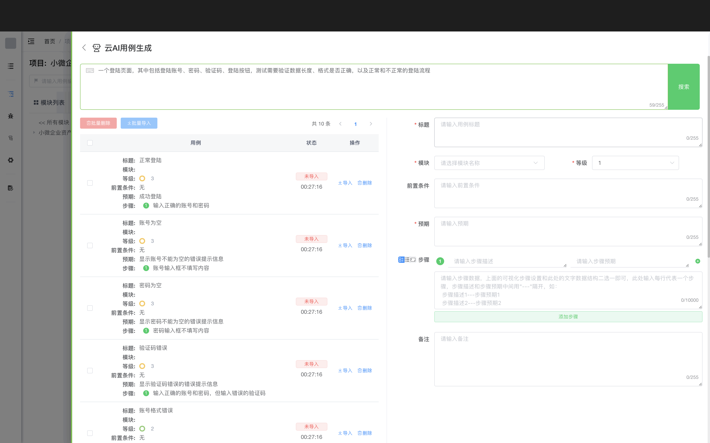

在输入测试用例需求时，应尽可能详细描述所要测试的载体信息，如业务流程、用途、显示的关键内容、每个内容的属性、测试的标准和预期等，越是精准的描述，机器人越能给出更加详细的答案。

另外需要注意的是，目前点击【搜索】有一定概率生成用例失败，当出现这种情况后，继续再搜索一次即可。

### 优化 AI 生成的测试用例

点击左侧【测试用例列表】中的任意一条【测试用例】，可以在右侧对其属性进行修改，以便通过人为干预优化 AI 生成的数据（注意：右侧没有保存按钮，所有更改会实时体现在左侧列表中）。

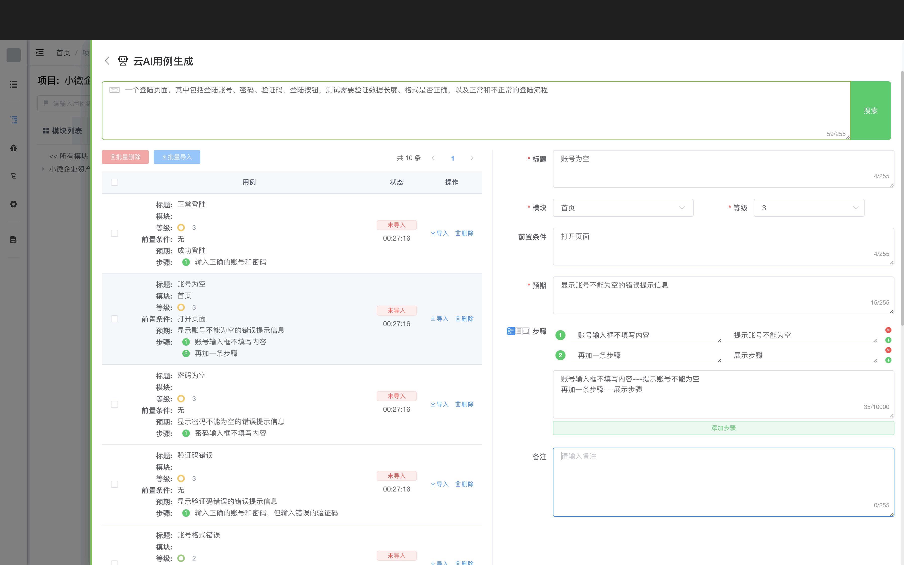

### 导入测试用例到系统

#### 1. 单独导入一条测试用例

在【测试用例列表】中，点击某条测试用例右侧的【导入】按钮，会直接将其导入系统，并在状态列显示【已导入】的标识。导入同一用例多次点击【导入】按钮，后续只会修改此用例，不会在系统中生成多条。如下图：

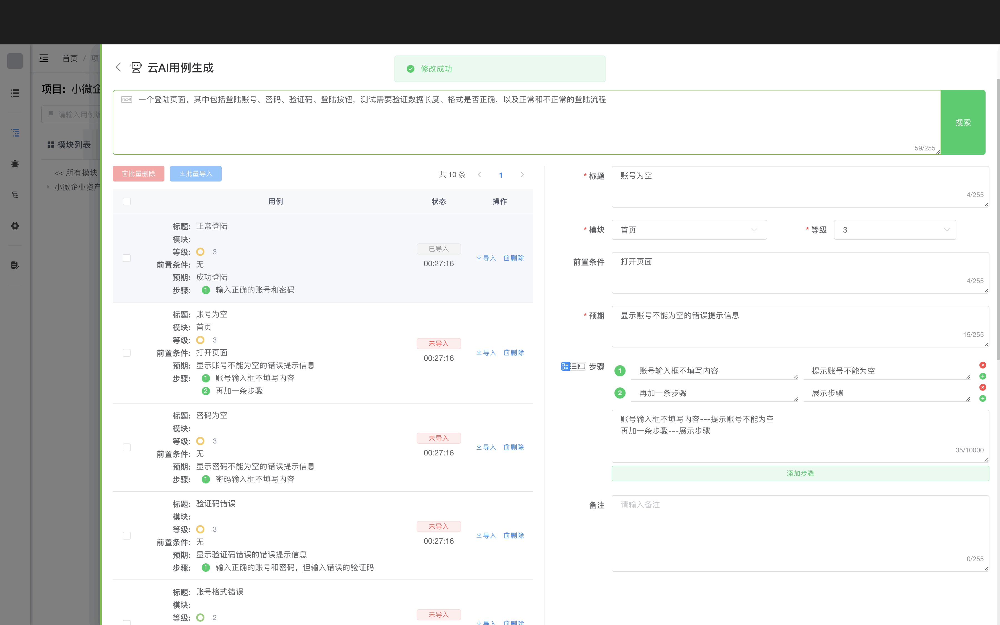

#### 2. 批量导入测试用例

在【测试用例列表】左侧，勾选需要导入系统的多个用例，点击列表上方的【批量导入】按钮，这时会显示【导入对话框】，用于批量设置测试用例所关联的模块，之后点击【确认】按钮，会将所勾选的所有用例导入到系统中。

::: tip 提示
如果之前已经单独设置过用例的关联模块，将不会在此处覆盖关联关系
:::

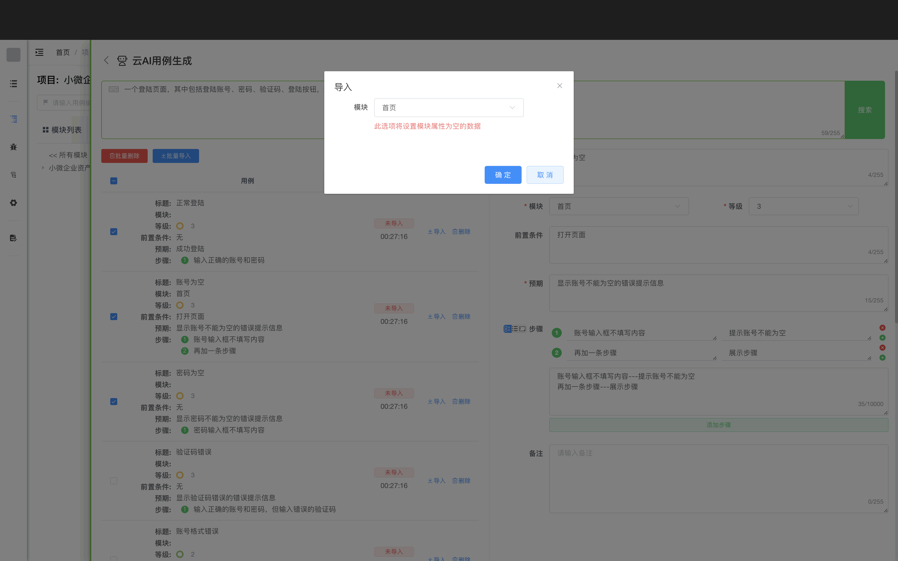

有了 AI 的加持，可以让我们编写测试用例减少 80% 以上的时间，这就是科技给我们每个人带来的福音吧。曾经有个老师问过我，什么是创新，他的答案是："信息重组"。

是呀，这个世界，很难再短时间发现更多的未知新元素，而绝大部分的新鲜事物，都是已知元素不断重新组合的结果，我们做软件，也是在前人的基础上不断创新，这，就是一个开发者的乐趣吧。

## 最佳实践

### 用例编写规范

**好的测试用例应该：**

1. **标题清晰** - 一眼就能看出测试什么
2. **步骤明确** - 每个步骤都可以独立执行
3. **预期明确** - 清楚地描述预期结果
4. **可重复** - 任何人都能按照步骤重现
5. **独立性** - 不依赖其他用例的执行结果

### 用例级别划分

- **P0（核心）** - 核心业务流程，必须通过
- **P1（重要）** - 重要功能，影响用户体验
- **P2（一般）** - 一般功能，可以延后修复
- **P3（次要）** - 优化建议，不影响使用

### 用例维护建议

- 定期 review 用例，删除过时的用例
- 及时更新用例，反映最新的需求变化
- 使用标签和分类，便于管理和查找
- 关联缺陷，追踪用例执行情况

## 常见问题

### Q: 如何批量导入测试用例？

A: 下载 Excel 模版，按照模版格式填写数据，然后在用例列表页点击【导入】按钮上传 Excel 文件。

### Q: AI 生成的用例质量如何？

A: AI 生成的用例质量取决于输入的描述是否详细准确。建议提供详细的业务流程、测试点、预期结果等信息，生成后再人工review和优化。

### Q: 用例可以关联多个交付物吗？

A: 不可以。一个用例只能关联一个交付物。如果需要在多个模块使用，可以复制用例。

### Q: 如何查看用例的执行历史？

A: 在测试计划中执行用例后，可以在用例详情页查看执行历史记录。

### Q: 用例可以导出吗？

A: 可以。在用例列表页点击【导出】按钮，可以导出为 Excel 格式。
