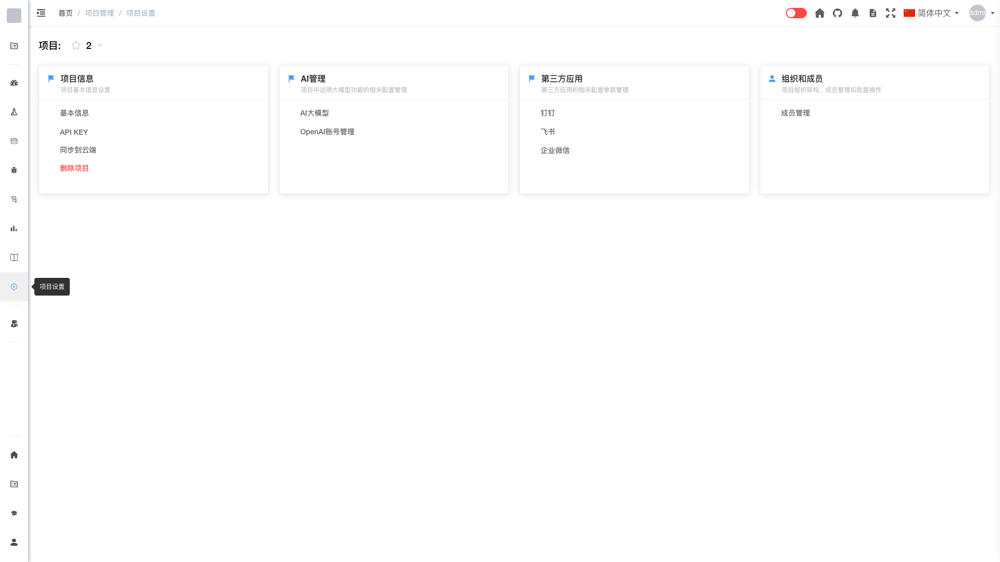

# 项目信息

## 概述

项目信息是项目管理员用于管理项目基础配置的功能模块。通过项目信息设置，可以修改项目基本信息、管理API密钥、同步数据到云端以及删除项目。

## 功能说明

### 基本信息

查看和编辑项目的基本信息。

**包含内容：**
- **项目名称**：项目的显示名称
- **项目描述**：项目的详细说明
- **项目图标**：项目的标识图标
- **创建时间**：项目的创建日期

**操作步骤：**
1. 点击"基本信息"
2. 修改项目名称、描述等信息
3. 点击"保存"完成修改

### API KEY

管理项目的API访问密钥，用于第三方系统集成。

**功能：**
- 查看当前API密钥
- 重新生成API密钥
- 复制API密钥

> **安全提示**：API密钥具有项目访问权限，请妥善保管，不要泄露给未授权人员。

**操作步骤：**
1. 点击"API KEY"
2. 查看或复制当前密钥
3. 如需更换，点击"重新生成"

### 同步到云端

将项目数据同步到云端存储。

**功能：**
- 配置云端同步设置
- 启用/禁用自动同步
- 手动触发同步

**操作步骤：**
1. 点击"同步到云端"
2. 配置同步选项
3. 点击"开始同步"

### 删除项目

永久删除当前项目及其所有数据。

> **警告**：删除项目是不可逆操作，将永久删除项目下的所有数据，包括缺陷、用例、文档等。

**操作步骤：**
1. 点击"删除项目"
2. 确认删除操作
3. 输入项目名称进行二次确认
4. 点击"确定"完成删除

## 权限说明

只有项目管理员才能访问和修改项目信息设置。

## 常见问题

**Q: API密钥泄露了怎么办？**  
A: 立即在"API KEY"中点击"重新生成"，旧密钥将立即失效。

**Q: 删除项目后能恢复吗？**  
A: 不能。删除项目是永久性操作，请在删除前确保已备份重要数据。

**Q: 修改项目名称会影响已有数据吗？**  
A: 不会。修改项目名称只是更改显示名称，不会影响项目下的任何数据。
