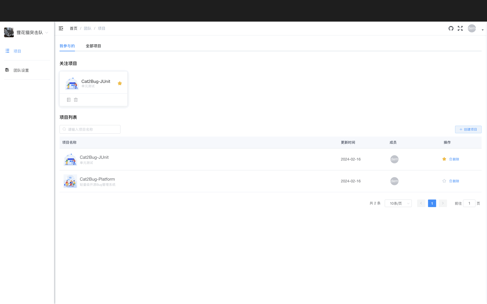
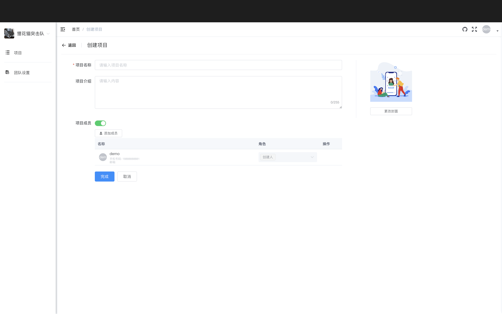
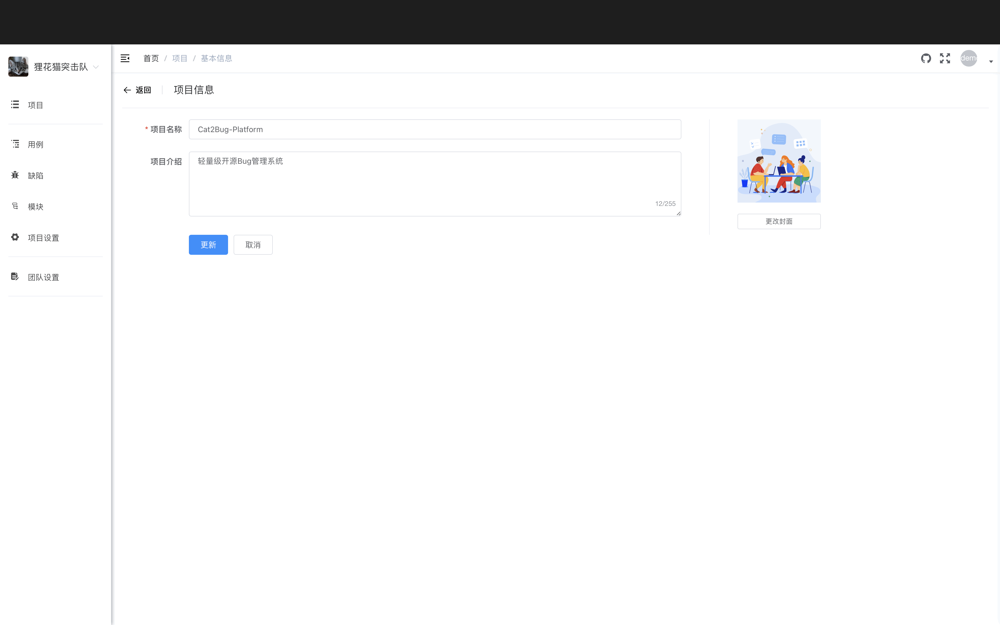
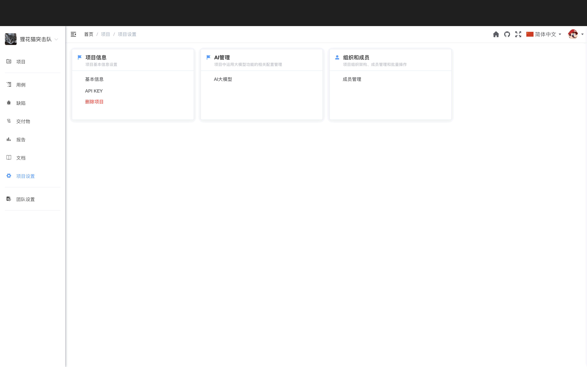

# 项目管理

项目是项目管理的基础单元，在 Cat2Bug-Platform 中，我们所有的工作都将围绕在项目下进行。

## 项目列表

项目列表中展示了当前团队中所有的项目，上侧的 Tab 标签通过"我参与的"、"全部项目"来分组项目。

可对列表中的每条项目信息进行[收藏](#收藏)、[删除](#删除)操作，当点击【收藏】按钮时，会在上方醒目的地方显示已收藏的项目，如下图：

::: tip 提示
目前项目的【编辑】操作放到了[项目设置](#项目设置)里
:::

## 创建项目

点击【创建项目】按钮，跳转到创建项目页面，在此页面可录入项目基础信息。当点击【项目成员】开关按钮时，可从团队中选择加入项目的成员，如下图：

**创建步骤：**

1. 填写项目基本信息
   - 项目名称（必填）
   - 项目描述
   - 项目图标
   - 项目状态

2. 添加项目成员
   - 点击【项目成员】开关按钮
   - 从团队中选择加入项目的成员
   - 为成员分配角色（项目管理员、开发、测试、外部人员）

3. 点击【创建】按钮完成创建

## 修改项目

项目的修改在[项目设置](#项目设置)菜单页面的【项目信息】中，点击进去后便可对项目基础信息进行修改，如下图：

**可修改内容：**
- 项目名称
- 项目描述
- 项目图标
- 项目状态

## 删除项目

删除功能在[项目列表](#项目列表)、[项目设置](#项目设置)中都可以执行。

**注意事项：**
- 删除项目会同时删除项目下的所有数据（缺陷、测试用例、文档等）
- 删除操作不可恢复，请谨慎操作
- 只有项目创建人有权限删除项目

## 收藏项目

收藏功能用于设置我关心的项目，此功能在列表中体现，可点击列表中的【收藏】按钮设置，并在列表上方以卡片形式显示收藏信息。

## 项目成员

根据不同的工作需求，项目中的成员分为项目创建人、项目管理员、开发、测试、外部人员等多个角色，每个角色具有不同的权限，详细说明请参阅[团队设置文档](./team-setting.md#项目中的成员权限)。

### 角色说明

- **项目创建人** - 拥有当前项目所有权限，可以理解为项目管理中的"项目发起人"
- **项目管理员** - 拥有除删除外的所有项目权限
- **开发** - 拥有修复缺陷的权限
- **测试** - 拥有测试用例、缺陷的所有权限
- **外部人员** - 用于查看项目进度，一般设定为甲方客户

::: tip 提示
项目中的成员只能从团队成员中选取
:::

## 项目设置

项目设置包含项目基础信息及关联功能的设置，其中包含：[基本信息](#修改项目)、[API KEY](./api.md)、[删除项目](#删除项目)、[成员管理](./team-setting.md)，如下图：

### 基本信息

在项目设置的【项目信息】标签中，可以修改项目的基本信息：

- 项目名称
- 项目描述
- 项目图标
- 项目状态

### API KEY

在项目设置的【API KEY】标签中，可以管理项目的 Open API 密钥。详细说明请参考 [API 文档](./api.md)。

### AI 配置

在项目设置的【AI】标签中，可以配置 AI 大模型相关设置，用于 AI 生成测试用例等功能。

### 成员管理

在项目设置的【成员管理】标签中，可以添加、移除项目成员，分配角色。详细说明请参考[团队设置文档](./team-setting.md)。

### 删除项目

在项目设置的【删除项目】标签中，可以删除当前项目。

**删除前请注意：**
- 删除操作不可恢复
- 会同时删除项目下的所有数据
- 建议先导出重要数据

## 最佳实践

### 项目命名建议

- 使用清晰、简洁的项目名称
- 包含项目类型或版本号，如"电商系统 v2.0"
- 避免使用特殊字符

### 成员分配建议

- 明确每个成员的角色和职责
- 测试人员负责创建测试用例和提交缺陷
- 开发人员负责修复缺陷
- 项目管理员负责整体协调和进度把控

### 项目组织建议

- 按产品或系统划分项目
- 大型项目可以拆分为多个子项目
- 定期归档已完成的项目

## 常见问题

### Q: 如何修改项目信息？

A: 在项目设置页面的【项目信息】标签中可以修改项目的基本信息。

### Q: 如何添加项目成员？

A: 在项目设置页面的【成员管理】标签中可以添加项目成员。成员必须先是团队成员才能添加到项目中。

### Q: 项目创建人可以转让吗？

A: 目前不支持转让项目创建人角色。如果需要转让，请联系系统管理员。

### Q: 删除项目后可以恢复吗？

A: 不可以。删除项目会永久删除所有数据，且不可恢复。建议在删除前导出重要数据。

### Q: 外部人员可以做什么？

A: 外部人员可以查看项目信息、查看和创建缺陷，但不能执行测试用例、不能删除缺陷。主要用于让甲方客户查看项目进度。
