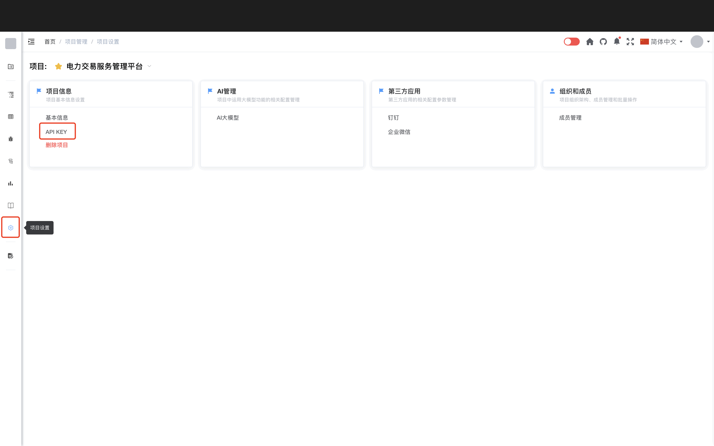
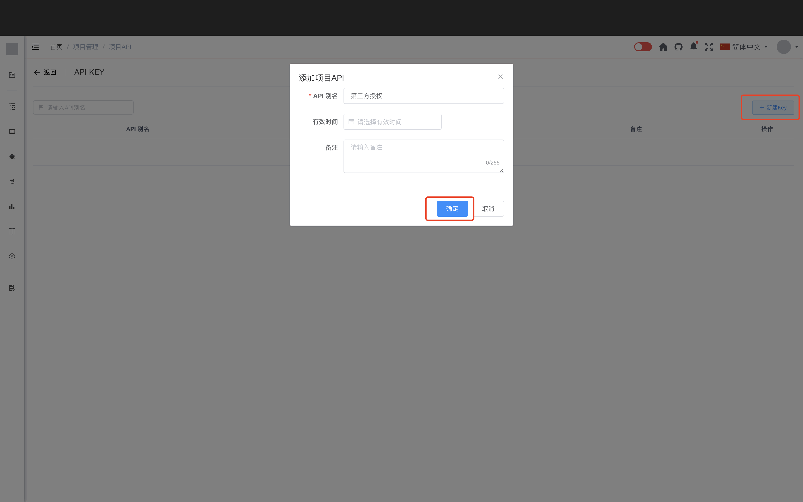
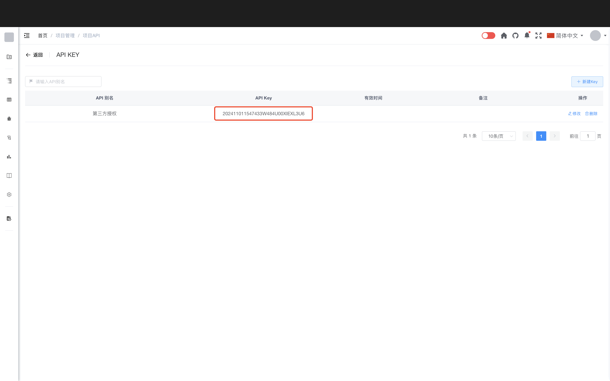

# API 接口说明

## API授权配置

第三方访问API接口数据需要先在Cat2Bug-Platform系统配置授权API_KEY(注意:每个项目需要单独配置API_KEY，API_KEY和项目是一对一的关系)。

1. 点击项目中的【项目设置】->【API KEY】选项，进入API授权页面；



2. 点击右侧【新建Key】按钮打开【添加项目API】对话框创建新的授权信息；



3. 创建保存后，可以在【API KEY】列表中查看授权码；



## 接口调用

第三方系统调用Cat2Bug-Platform接口时，需要在接口请求头部添加之前创建的【API KEY】，如下示例：

````shell
curl --location -X POST 'http://localhost:2020/api/defect' \
-H 'Content-Type: application/json' \
-H 'CAT2BUG-API-KEY: 202411011547433W484U00XIEXL3U6' \
-d '{"defectType": 1, "defectName":"defectName", "defectDescribe":"defectDescribe", "defectLevel":2 }'
````

## 业务接口说明

### 查看缺陷列表

方法：GET

路径：/api/defect

请求参数：

| 参数名             |   类型   | 是否必填 | 说明       |
|-----------------|:------:|:----:|:---------|
| pageNum         |   整数   |  否   | 默认1，页码   |
| pageSize        |   整数   |  否   | 默认10，页尺寸 |
| defectName      |  字符型   |  是   | 项目名称     |
| defectType      |   整数   |  否   | 缺陷类型     |
| moduleVersion   |  字符型   |  否   | 版本       |
| defectState     |  字符型   |  否   | 缺陷状态     |
| defectLevel     |   字符型   |  否   | 缺陷级别     |
| handleBy        |   长整型   |  否   | 处理人ID    |
| defectDescribe | 字符型  |  否   | 缺陷描述     |

返回值：

* 返回主体说明

| 参数名             | 类型  | 是否必返 | 说明          |
|-----------------|:---:|:----:|:------------|
| total           | 长整型 |  是   | 缺陷总数        |
| rows            | 数组  |  是   | 缺陷对象数组      |
| code            | 字符型  |  否   | 返回码，正常返回200 |
| msg             | 字符型  |  否   | 接口返回消息      |

* 缺陷对象格式说明

| 参数名            |  类型  | 是否必返 | 说明       |
|----------------|:----:|:----:|:---------|
| defectId       | 长整型  |  是   | 缺陷ID     |
| projectNum     |  长整型  |  是   | 缺陷编号     |
| defectType     |  整数  |  是   | 缺陷类型     |
| defectName     | 字符型  |  是   | 项目名称     |
| defectState    | 字符型  |  是   | 缺陷状态     |
| defectLevel    | 字符型  |  否   | 缺陷级别     |
| moduleId       | 长整型  |  否   | 交付物ID    |
| moduleName     | 字符型  |  否   | 交付物名称    |
| moduleVersion  | 字符型  |  否   | 版本       |
| createTime     |  日期  |  否   | 创建时间     |
| updateTime     |  整数  |  否   | 更新时间     |
| handleBy       | 长整型  |  否   | 处理人ID集合  |
| handleByList   | 用户对象 |  否   | 处理人对象集合  |
| handleByNames  | 字符型  |  否   | 处理人名称    |
| imgUrls        |  数组  |  否   | 缺陷图片路径集合 |
| annexUrls      |  数组  |  否   | 缺陷附件路径集合 |
| projectId      | 长整型  |  否   | 项目ID     |
| projectName    | 字符型  |  否   | 项目名称     |
| collect        | 布尔型  |  否   | 当前用户是否收藏 |
| defectGroupKey | 字符型  |  否   | 缺陷组标识    |
| defectKey      | 字符型  |  否   | 缺陷唯一标识   |
| defectDescribe | 字符型  |  否   | 缺陷描述     |

### 创建缺陷

方法：POST

路径：/api/defect

请求参数：

返回值：

### 查看缺陷详情

方法：GET

路径：/api/defect/{缺陷ID}

请求参数：

返回值：

### 修复缺陷

方法：POST

路径：/api/defect/{缺陷ID}/repair

请求参数：

返回值：

### 通过缺陷

方法：POST

路径：/api/defect/{缺陷ID}/pass

请求参数：

返回值：

### 修复缺陷

方法：POST

路径：/api/defect/{缺陷ID}/reject

请求参数：

返回值：

### 指派缺陷

方法：POST

路径：/api/defect/{缺陷ID}/assign

请求参数：

返回值：

### 关闭缺陷

方法：POST

路径：/api/defect/{缺陷ID}/close

请求参数：

返回值：

### 开启缺陷

方法：POST

路径：/api/defect/{缺陷ID}/open

请求参数：

返回值：