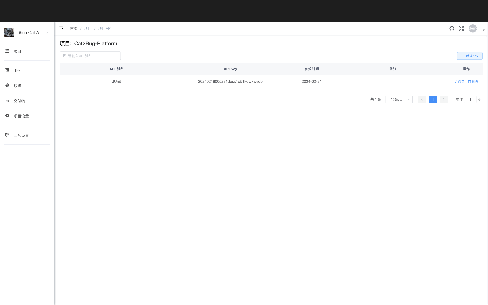

# API 文档

## API 介绍

从 0.2.0 版本开始，系统提供了 Open API 接口，主要用于自动化测试后，将测试结果转化为缺陷，持续跟踪管理。

## 如何调用

第三方软件可通过 Http 接口形式访问系统，系统中为不同接入方提供一个密钥，每次调用，需在 Header 头中加入此密钥，如下形式所示：

```javascript
var myHeaders = new Headers();
myHeaders.append("CAT2BUG-API-KEY", "202402110748485l2ug97j471ul9wq");
myHeaders.append("User-Agent", "Apifox/1.0.0 (https://apifox.com)");
myHeaders.append("Accept", "*/*");
myHeaders.append("Host", "127.0.0.1:2020");
myHeaders.append("Connection", "keep-alive");

var requestOptions = {
   method: 'GET',
   headers: myHeaders,
   redirect: 'follow'
};

fetch("http://127.0.0.1:2020/api/defect", requestOptions)
   .then(response => response.text())
   .then(result => console.log(result))
   .catch(error => console.log('error', error));
```

上面调用接口代码中的第二行，就是我们提到的 API 密钥，调用接口时，必须以 `CAT2BUG-API-KEY` 为名称，它的值是在系统中申请获取的。

::: tip 提示
每个 API 密钥只对一个项目有效
:::

## 创建密钥

在[项目设置](./project-manage.md#项目设置)中，选择 API KEY，进入密钥设置界面。密钥可以设置失效，当失效过期后，密钥将无法使用。



**创建步骤：**

1. 进入项目设置页面
2. 选择【API KEY】标签
3. 点击【创建密钥】按钮
4. 填写密钥信息
   - 密钥名称（必填）
   - 失效时间（可选）
   - 备注说明（可选）
5. 点击【确定】生成密钥
6. 复制密钥保存到安全的地方

**注意事项：**

- 密钥创建后只显示一次，请妥善保管
- 密钥泄露后请立即删除并重新创建
- 可以为同一个项目创建多个密钥
- 密钥过期后需要重新创建

## 报告接口

### 推送缺陷报告

* 接口路径: `/api/report/defect`

* 方法: POST

* 请求参数

```json
{
    "handler": "demo",
    "reportTitle": "单元测试报告:com.cat2bug.junit.demo.Cat2BugRunnerTest",
    "reportTime": 1711546667143,
    "reportDescription": "报告描述",
    "reportData": [
        {
            "defectName": "[testRuleFalse(com.cat2bug.junit.demo.Cat2BugRunnerTest)]",
            "defectDescribe": "缺陷描述",
            "defectState": "PROCESSING",
            "defectType": "BUG",
            "defectLevel": "middle",
            "moduleVersion":"0.0.1",
            "groupKey": "com.cat2bug.junit.demo.Cat2BugRunnerTest",
            "key": "com.cat2bug.junit.demo.Cat2BugRunnerTest.testRuleFalse"
        }
    ]
}
```

**请求参数说明：**

| 参数 | 类型 | 范围 | 说明 |
|------|------|------|------|
| handler | 字符型 | 非必填，0至30个字节 | 处理人 |
| reportTitle | 字符型 | 必填，1至255个字节 | 报告标题 |
| reportTime | 长整型 | 必填 | 报告时间 |
| reportDescription | 字符型 | 必填，1至65536个字节 | 报告描述 |
| reportData | JSON数组 | 非必填 | 缺陷数组 |

**reportData 数组中的格式属性说明：**

| 参数 | 类型 | 范围 | 说明 |
|------|------|------|------|
| defectName | 字符型 | 必填，1至128个字节 | 缺陷名称 |
| defectDescribe | 字符型 | 必填，1至65536个字节 | 缺陷描述 |
| defectState | 字符型 | 非必填，默认PROCESSING；PROCESSING(待处理)、AUDIT(待审核)、REJECTED(已驳回)、CLOSED(已关闭) | 缺陷状态 |
| defectType | 字符型 | 非必填，默认BUG；BUG(错误)、TASK(任务)、DEMAND(需求) | 缺陷类型 |
| defectLevel | 字符型 | 非必填，默认MIDDLE；LOW(低)、MIDDLE(中)、HEIGHT(高)、URGENT(急) | 缺陷级别 |
| moduleVersion | 字符型 | 非必填，1至128个字节 | 交付物的版本号 |
| groupKey | 字符型 | 非必填，1至255个字节 | 缺陷唯一关键组，通过此属性查找相同组的缺陷。如将某个类的类名作为groupKey，当测试后没有发现此类有问题，可通过这个groupKey属性来改变所有此类关联的缺陷状态。 |
| key | 字符型 | 非必填，1至255个字节 | 缺陷唯一关键字 |

* 返回值，code 返回 200 代表推送成功。

```json
{
    "msg":"操作成功",
    "code":200
}
```

* 示例

```bash
curl --location -X POST 'https://www.cat2bug.com:8022/prod-api/api/report/defect' \
-H 'Content-Type: application/json' \
-H 'CAT2BUG-API-KEY: 20240327001413he1mbyfi6fhnfets' \
-d '{"handler":"demo","reportTitle":"单元测试报告:com.cat2bug.junit.demo.Cat2BugRunnerTest","reportTime":1711546667143,"reportDescription":"报告描述","reportData":[{"defectName":"[testRuleFalse(com.cat2bug.junit.demo.Cat2BugRunnerTest)]","defectDescribe":"缺陷描述","defectState":"PROCESSING","defectType":"BUG","defectLevel":"middle","groupKey":"com.cat2bug.junit.demo.Cat2BugRunnerTest","key":"com.cat2bug.junit.demo.Cat2BugRunnerTest.testRuleFalse"}]}'
```

::: tip 提示
请更换示例中的接口 IP、端口和 CAT2BUG-API-KEY 密钥
:::

## 缺陷接口

### 创建缺陷

::: warning 提示
此接口在 Cat2Bug-Platform 0.3.0 中已废弃，提交缺陷请转到[报告接口](#推送缺陷报告)
:::

* 接口路径: `/api/defect`

* 方法: POST

* 请求参数

```json
{
    "defectType":1,
    "defectName":"登陆账号长度没有限制",
    "defectDescribe":"账号长度应设置最大32位，目前输入33位依然可以提交通过",
    "defectLevel":2
}
```

**请求参数说明：**

| 参数 | 类型 | 范围 | 说明 |
|------|------|------|------|
| defectType | 数值型 | 必填，BUG(错误)、TASK(任务)、DEMAND(需求) | 缺陷类型 |
| defectName | 字符型 | 必填，1至128位字节 | 缺陷名称 |
| defectDescribe | 字符型 | 必填，1至65536位字节 | 缺陷描述 |
| defectLevel | 数值型 | 必填，1至5 | 缺陷等级 |

* 返回值

```json
{
    "msg":"操作成功",
    "code":200,
    "data":{
        "createBy":"robot",
        "createTime":"2024-02-18 01:13:34",
        "updateBy":"robot",
        "updateTime":"2024-02-18 01:13:34",
        "defectNumber":16,
        "defectType":"TASK",
        "defectName":"登陆账号长度没有限制",
        "defectDescribe":"账号长度应设置最大32位，目前输入33位依然可以提交通过",
        "annexList":null,
        "imgList":null,
        "project":"Cat2Bug-Platform",
        "module":"Cat2Bug-Platform\\登陆",
        "moduleVersion":"0.5.1",
        "defectState":"PROCESSING",
        "defectLevel":"2"
    }
}
```

**返回值说明：**

| 参数 | 类型 | 范围 | 说明 |
|------|------|------|------|
| createBy | 字符型 | | 创建成员名 |
| createTime | 字符型 | | 创建时间 |
| updateBy | 字符型 | | 更新成员名 |
| updateTime | 字符型 | | 更新时间 |
| defectNumber | 数值型 | | 缺陷编号，同一项目中的编号不能重复 |
| defectType | 字符型 | BUG(错误)、TASK(任务)、DEMAND(需求) | 缺陷类型 |
| defectName | 字符型 | 1至128位字节 | 缺陷名称 |
| defectDescribe | 字符型 | 1至65536位字节 | 缺陷描述 |
| annexList | 字符型 | | 附件路径数组 |
| imgList | 字符型 | | 图片路径数组 |
| project | 字符型 | | 所属项目名 |
| deliverable | 字符型 | | 交付物名称 |
| deliverableVersion | 字符型 | | 交付物版本 |
| defectState | 字符型 | PROCESSING(待处理)、AUDIT(待审核)、RESOLVED(已解决)、REJECTED(已驳回)、CLOSED(已关闭) | 缺陷状态 |
| defectLevel | 数值型 | | 缺陷等级 |

* 示例

```bash
curl --location -X POST 'http://localhost:2020/api/defect' \
-H 'Content-Type: application/json' \
-H 'CAT2BUG-API-KEY: 202402110748485l2ug97j471ul9wq' \
-d '{"defectType": 1, "defectName":"defectName", "defectDescribe":"defectDescribe", "defectLevel":2 }'
```

::: tip 提示
请更换示例中的接口 IP、端口和 CAT2BUG-API-KEY 密钥
:::

## 使用场景

### 集成自动化测试

将 API 集成到自动化测试流程中，测试失败时自动创建缺陷。

**示例流程：**

1. 执行自动化测试
2. 收集测试结果
3. 将失败的测试用例转换为缺陷数据
4. 调用 API 推送缺陷报告
5. 在 Cat2Bug 中查看和处理缺陷

### 集成 CI/CD

在 CI/CD 流程中集成 API，实现持续测试和缺陷跟踪。

**示例流程：**

1. 代码提交触发 CI/CD
2. 执行构建和测试
3. 测试失败时调用 API 创建缺陷
4. 通知相关人员处理
5. 缺陷修复后重新触发测试

### 集成第三方工具

将 Cat2Bug API 与其他测试工具集成，如 JUnit、TestNG、Selenium 等。

**示例：**

- [Cat2Bug-JUnit](https://github.com/cat2bug/cat2bug-junit) - JUnit 集成插件
- Jenkins 插件（开发中）
- Postman 集成（开发中）

## 最佳实践

### 安全建议

1. **保护 API 密钥**
   - 不要在代码中硬编码密钥
   - 使用环境变量或配置文件存储
   - 定期更换密钥

2. **使用 HTTPS**
   - 生产环境使用 HTTPS 协议
   - 避免密钥在网络传输中泄露

3. **权限控制**
   - 为不同的集成创建不同的密钥
   - 及时删除不再使用的密钥
   - 监控 API 调用日志

### 错误处理

1. **重试机制**
   - 网络错误时自动重试
   - 设置合理的重试次数和间隔
   - 记录重试日志

2. **异常处理**
   - 捕获并记录所有异常
   - 提供友好的错误提示
   - 不要因为 API 调用失败而中断主流程

3. **日志记录**
   - 记录所有 API 调用
   - 记录请求和响应数据
   - 便于问题排查

## 常见问题

### Q: 如何获取 API 密钥？

A: 在项目设置的【API KEY】标签中可以创建密钥。密钥创建后只显示一次，请妥善保管。

### Q: API 密钥忘记了怎么办？

A: 密钥无法找回，只能删除旧密钥并创建新密钥。

### Q: 一个项目可以有多个 API 密钥吗？

A: 可以。可以为不同的集成场景创建不同的密钥，便于管理和追踪。

### Q: API 调用频率有限制吗？

A: 目前没有频率限制。但建议合理控制调用频率，避免对系统造成压力。

### Q: 如何测试 API 是否可用？

A: 可以使用 Postman、curl 等工具测试 API。确保请求头中包含正确的 API 密钥。

### Q: API 返回 401 错误怎么办？

A: 401 错误表示认证失败，请检查：
- API 密钥是否正确
- 密钥是否已过期
- 请求头中是否包含 CAT2BUG-API-KEY
