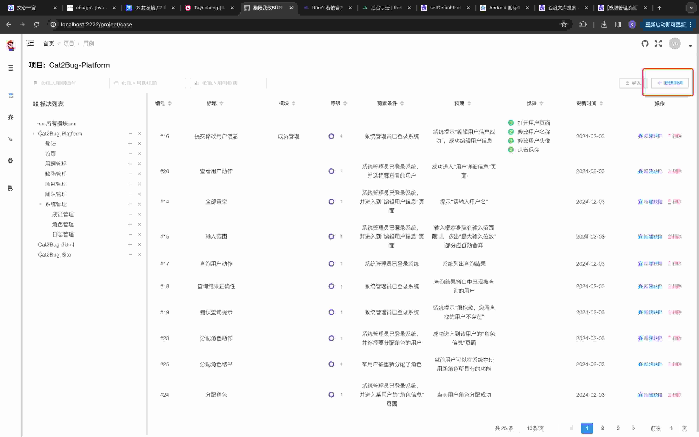
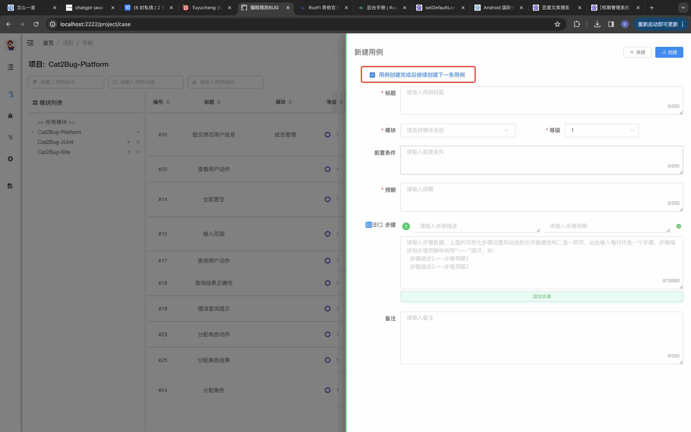
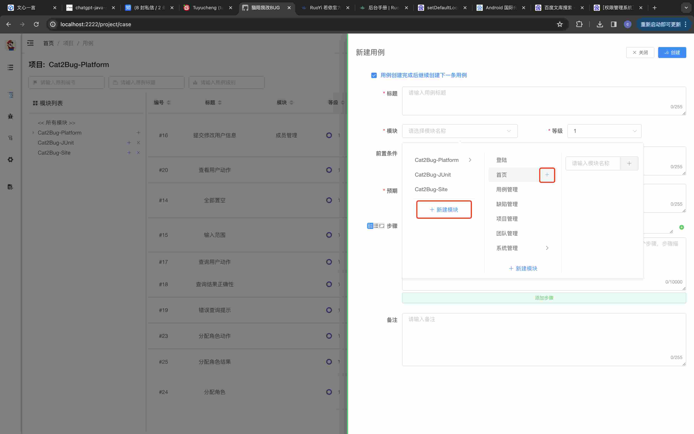

# Cat2Bug-Platform系统中测试用例的使用

测试用例是软件工程及BUG管理中不可或缺的元素，在实际工作中，编写测试用例又一直消耗测试人员大量的时间和精力。
因此，Cat2Bug-Platform从0.1.0开始，将支持测试用例的使用，并在后续工作中将提高测试用例的质量、减少测试用例的维护时间为目标，不断优化系统及使用方式，为大家提供更为轻松便捷的测试环境。

## 测试用例功能的介绍

目前Cat2Bug-Platform支持系统手动录入、Excel导入两种方式创建，在后续版本中，还支持AI大数据模型自动生成等方式。

### 测试用例的创建

一. 手动创建测试用例

1. 首先点击页面右上侧的【新建用例】按钮，将从右侧打开测试用例新建界面，如下图：



2. 在新建用例界面，下图中红框标注的第一个选项用于连续创建用例而用，默认是选中状态。



3. 模块下拉选中框是用于关联用例与系统模块的关系，如当前不存在某个模块，可通过模块下拉组件中的添加功能快速创建模块。



4. 设置测试步骤，在测试步骤选项中，系统提供了两种录入方式：

* 第一种已列表形式显示，用户可通过点击【添加步骤】按钮或每行步骤后面的【添加】【删除】按钮调整步骤内容，并可通过鼠标拖动方式改变步骤的顺序；
* 第二种以文本方式显示，用户可根据规范的格式统一快速录入所有步骤。在文本模式中，规定每行为一条步骤，每条步骤的【描述】和【预期】属性通过“---”来分隔，示例如下：

````
把冰箱门打开---冰箱有个门
把大象放进去---大象真的能放进去
把冰箱门关上
````

在步骤左侧有三个小按钮，用来切换步骤的不同模式：
* 第一个按钮是同时显示列表和文本模式；
* 第二个按钮是显示列表模式；
* 第三个按钮是显示文本模式；


5 当输入完所有数据后，点击右上角的【创建】按钮保存用例。

二. Excel导入测试用例


