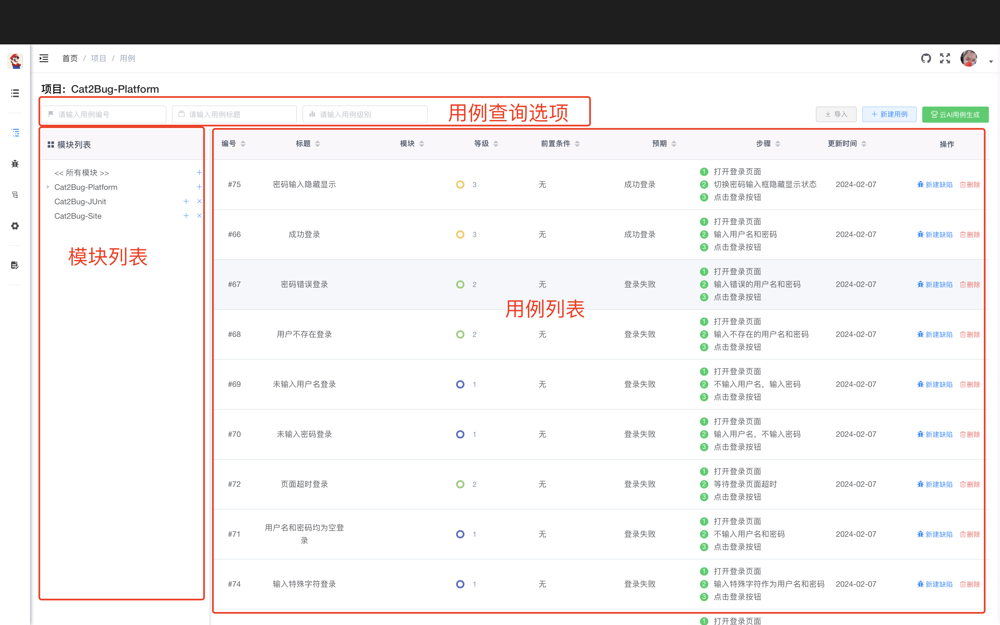
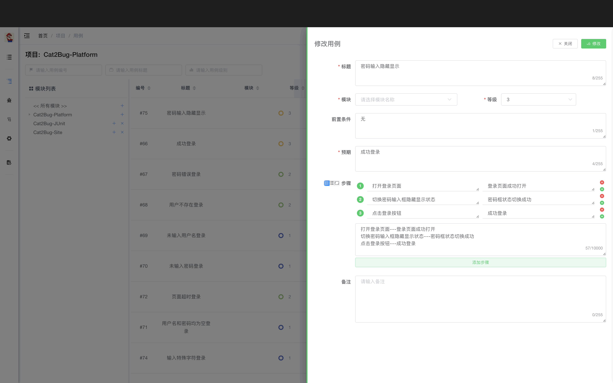
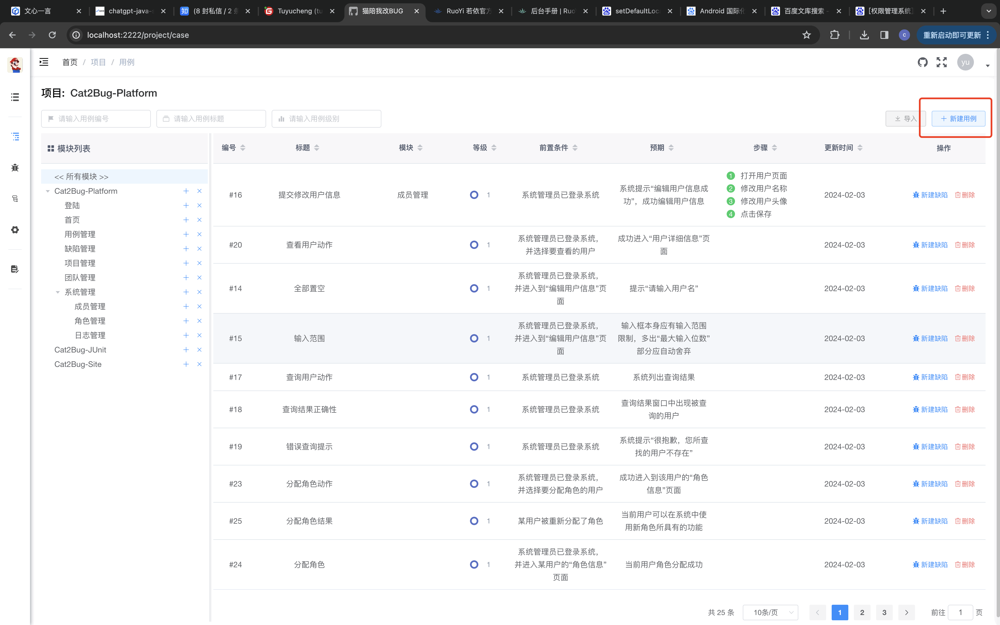
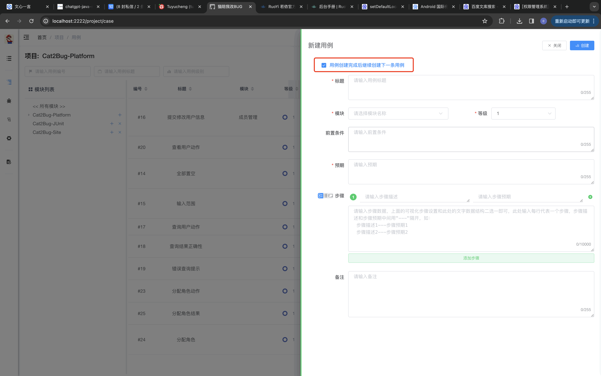
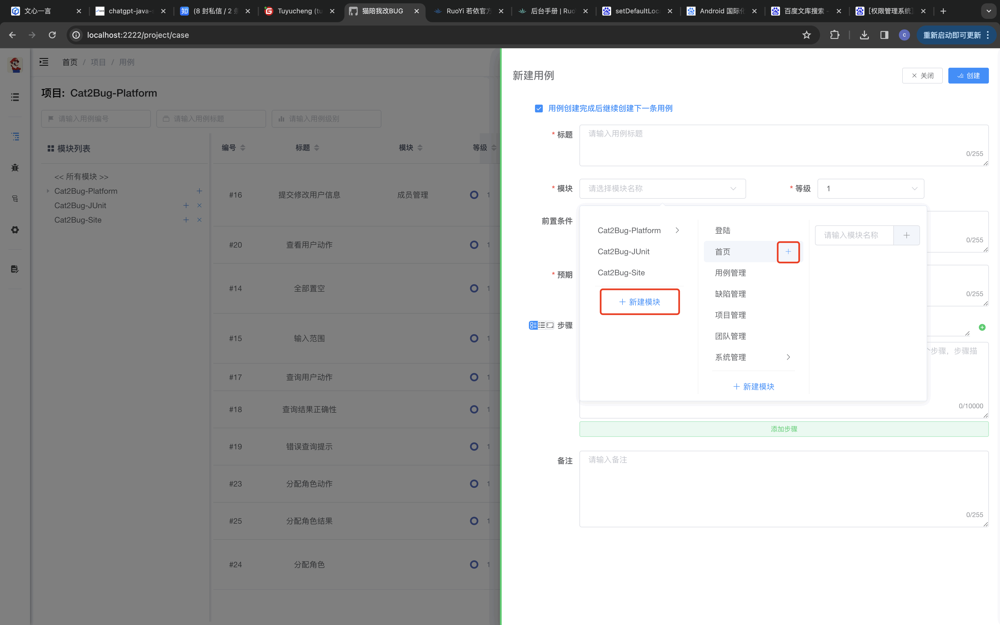
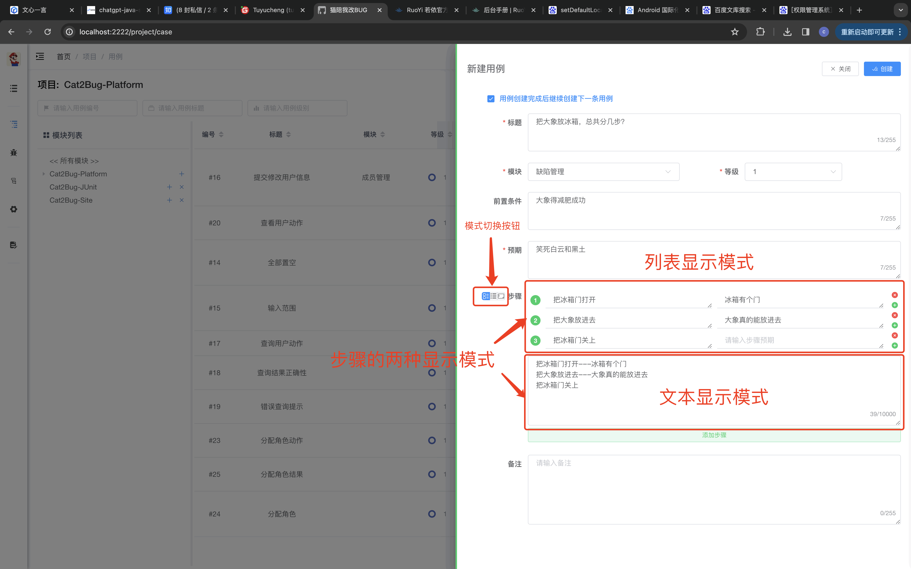
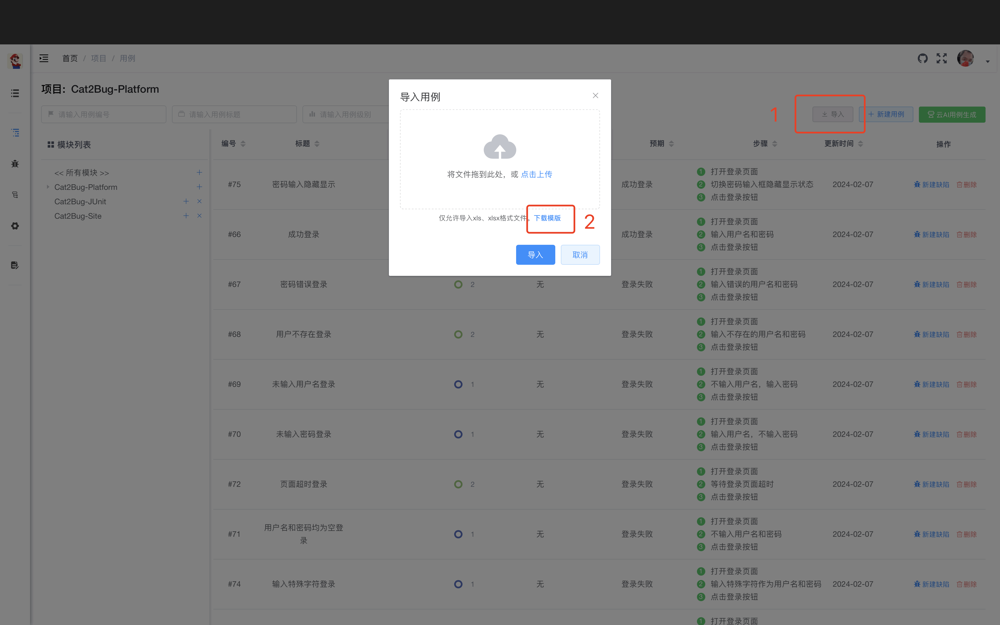
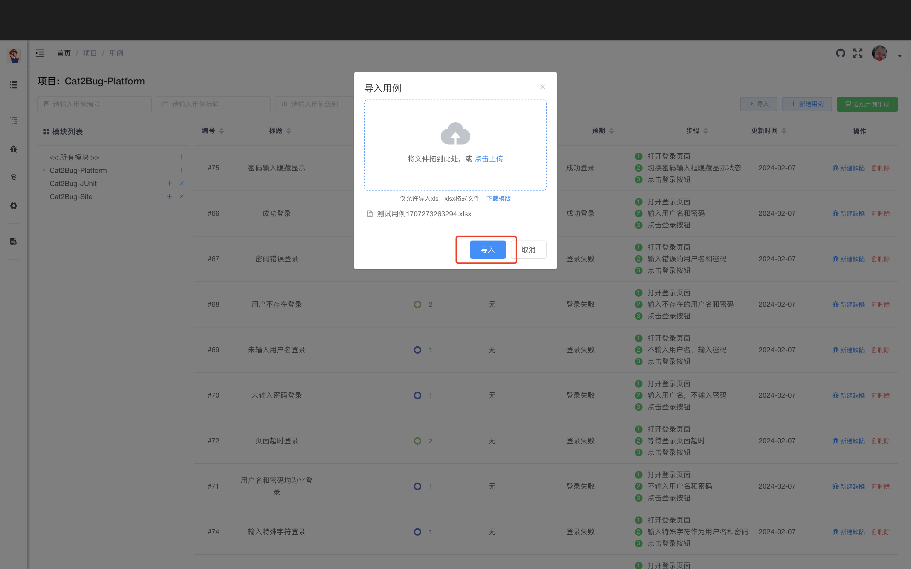

# Cat2Bug-Platform系统中测试用例的使用

测试用例是软件工程及BUG管理中不可或缺的元素，在实际工作中，编写测试用例又一直消耗测试人员大量的时间和精力。
因此，Cat2Bug-Platform从0.1.0开始，将支持测试用例的使用，并在后续工作中将提高测试用例的质量、减少测试用例的维护时间为目标，不断优化系统及使用方式，为大家提供更为轻松便捷的测试环境。

## 测试用例功能的介绍

目前Cat2Bug-Platform支持系统手动录入、Excel导入两种方式创建，在后续版本中，还将支持AI自动生成等方式。

### 测试用例的维护

在测试用例列表页，上侧的是数据查找选项区；左侧是模块筛选区；中间为用例列表数据展示区。我们可以通过点击左侧模块或上方的筛选项对用例数据进行筛选查找。



当点击用例列表中的某条数据时，会从右侧弹出用例详情，可以对其进行查看和编辑操作，如下图：



### 测试用例的创建

一. 手动创建测试用例

手动创建用于直接在Cat2Bug-Platform平台中录入测试用例数据，操作步骤如下：

1. 首先点击页面右上侧的【新建用例】按钮，将从右侧打开测试用例新建界面，如下图：



2. 在下图的新建用例界面中，红框标注的第一个选项用于连续创建用例而用，默认是选中状态。



3. 在Cat2Bug-Platform中，所有用于测试的软件系统结构都是基于模块体现的，所以测试用例也需要关联模块，下图就是展示模块的选择示例。如当前不存在某个模块，也可以通过模块下拉组件中的添加功能快速创建模块（注：添加、删除模块需要有管理员或测试人员的权限）。



4. 设置测试步骤，在测试步骤选项中，系统提供了两种录入方式：

* 第一种以列表形式显示，用户可通过点击【添加步骤】按钮或每行步骤后面的【添加】【删除】图标按钮调整步骤内容，并可通过鼠标拖动方式改变步骤的顺序；


* 第二种以文本方式显示，用户可根据规范的格式统一快速录入所有步骤。在文本模式中，规定每行为一条步骤，每条步骤的【描述】和【预期】属性通过“---”来分隔，示例如下：

````
把冰箱门打开---冰箱有个门
把大象放进去---大象真的能放进去
把冰箱门关上
````

在步骤左侧有三个图标小按钮，用来切换步骤的不同模式：
* 第一个图标按钮是同时显示列表和文本模式；
* 第二个图标按钮是显示列表模式；
* 第三个图标按钮是显示文本模式；



5 当输入完所有数据后，点击右上角的【创建】按钮创建完成新用例。

二. Excel导入测试用例

和其它传统缺陷管理系统相同，我们提供了从Excel导入测试用例的功能，此方式主要考虑到用户可以从一些正在进行的项目中快速转移项目数据。

1. 下载测试用例模版

我们提供了一套标准的测试用例模版格式，点击【导入用例】对话框中的【下载模版】链接按钮，即可下载Excel模版文件。
值得注意的是，此模版中模块选项是非必填的（系统中，测试用例的模块属性是必填项），此处主要考虑到在没有完全维护好模块结构的时候，也可以畅通无阻的完成测试用例的导入工作（模块与测试用例的关联不会影响其它操作，只会影响根据模块筛选用例的功能）。操作如下图：



2. 在Excel模版中录入数据

在Excel模版中，红色标题的列是必填项；模块、用例级别等是下拉选项，目前Excel最大支持65536条数据的录入。

值得一提的是，导入的【步骤】属性，格式规则如下

* 一行算一个步骤
* 步骤的描述与预期用【---】分割；

````
打开登录页---页面已经打开
在用户名输入框输入中文“刘德华”---应提示只能输入英文及数字
````


3. 导入数据

将维护好的Excel文件导入到系统,如录入的数据无误，系统将提示导入成功，如下图：



## 总结

至此，Cat2Bug-Platform V0.1.0的测试用例功能就介绍完了，您可以从使用中体会到我们在每个操作细节中，进行了有别于传统系统的优化和创新，使系统可以更好的服务于大家。
我们更希望在今后可以得到大家的反馈，用于不断优化系统，为大家和中国的软件事业做一份贡献。


