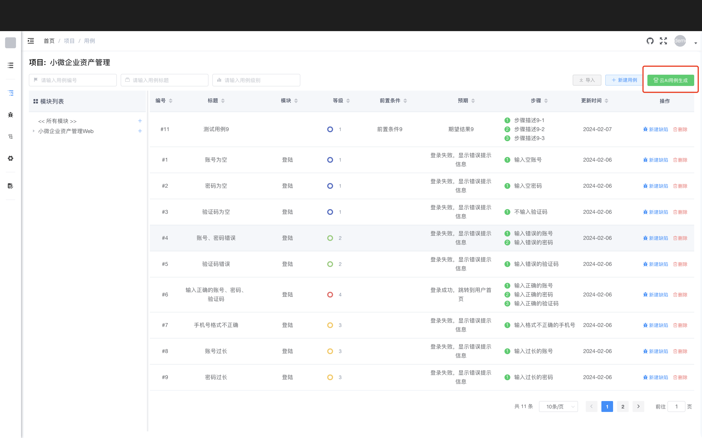
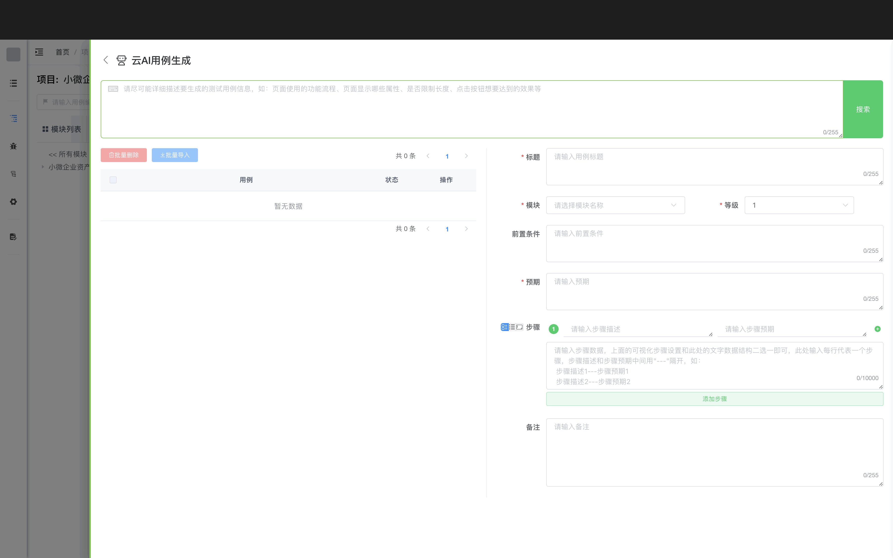
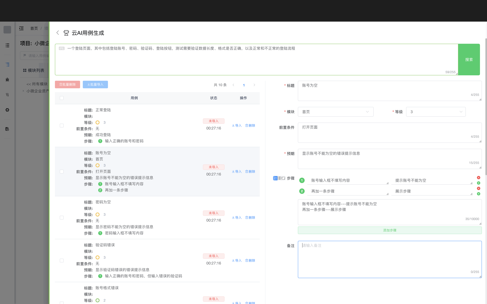
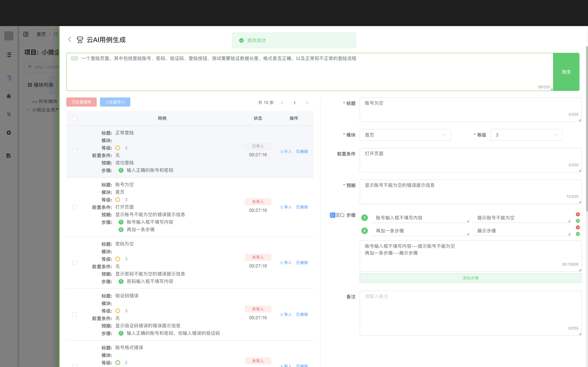
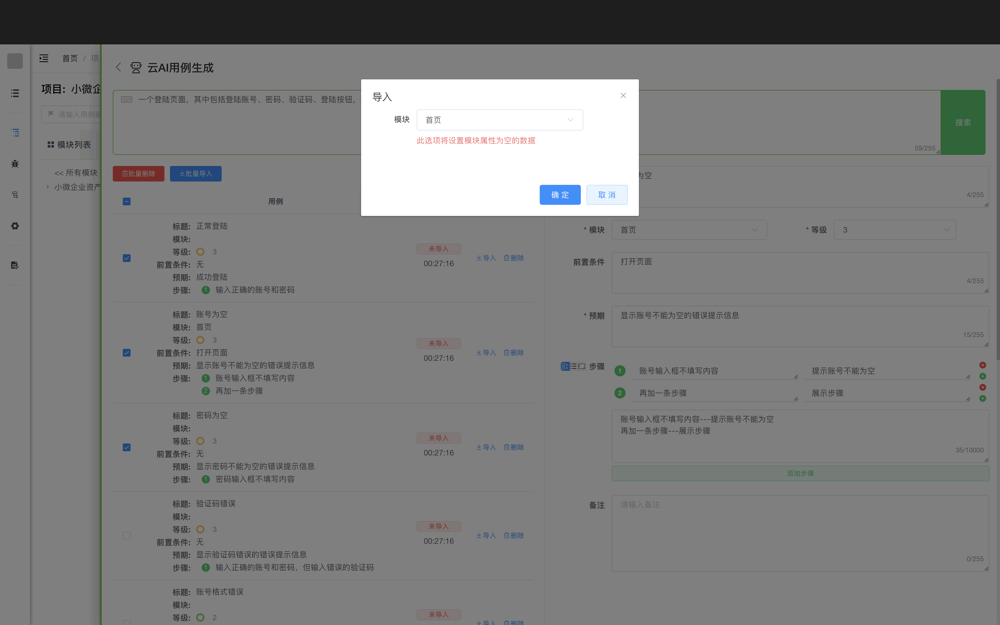

# 介绍一下ChatGPT AI大数据模型技术在Cat2Bug-Platform系统中自动创建测试用例的应用

如今比较火的ChatGPT等人工智大数据模型技术确实给人们的生活带来了质的改变，它在自然语义理解、图像生成方面有着突出的表现，因此我们也在Cat2Bug-Platform 0.1.1版本中尝试将其引入到测试工作中。
首先考虑的就是将它做为测试用例的生成助手，因为就在2023年的10月初，我所在的公司接到一个棘手的项目，由于项目交付周期短，甲方验收标准比较严苛，加之系统功能比较多，公司安排了5个人十一休假期间持续加班来编写项目的测试用例，以便消除任何影响交付的问题，那种持续的工作强度我想只有现场的同事才能体会到。
因此，通过AI帮我们自动生成测试用例，是测试工作中的首要目标，也是一个基本需求。

## AI创建测试用例生成技巧

目前市面上通过ChatGPT、微软Copilot、百度文心等创建测试用例的第三方平台不少，但是他们大部分只能通过聊天方式给出各种格式的文字描述，然后需要使用者自己修改格式并存入项目管理或BUG系统，
我们在开发的时候考虑到这点的不便，因此将其封装到了Cat2Bug生态里，让测试人员输入描述查找后，自动就可以录入到系统里，下面我来介绍一下Cat2Bug AI创建测试用例的过程及使用技巧。

在Cat2Bug-Platform V0.1.1版本中，测试用例界面右上角多了一个【云AI用例生成】按钮，点击将会从右侧划出【云AI用例生成】界面，如下图：

在【云AI用例生成】界面中，分为三个区域，上侧是查询区、左侧是查询用例结果列表、右侧是单个用例编辑区，见下图：

在最上面的输入框中，输入【想要生成的测试用例描述】，点击【搜索】按钮后，等待5至60秒，即可在下方显示AI创建的用例数据，目前版本一次查询通常会生成10条测试用例，如下图：

在输入测试用例需求时，应尽可能详细描述所要测试的载体信息，如业务流程、用途、显示的关键内容、每个内容的属性、测试的标准和预期等，越是精准的描述，机器人越能给出更加详细的答案。

另外需要注意的是，目前点击【搜索】有一定概率生成用例失败，当出现这种情况后，继续再搜索一次即可。

## 优化AI生成的测试用例

点击左侧【测试用例列表】中的任意一条【测试用例】，可以在右侧对其属性进行修改，以便通过人为干预优化AI生成的数据（注意：右侧没有保存按钮，所有更改会实时体现在左侧列表中）；

## 导入测试用例导到Cat2Bug-Platform系统

### 单独导入一条测试用例

在【测试用例列表】中，点击某条测试用例右侧的【导入】按钮,会直接将其导入系统，并在状态列显示【已导入】的标识。导入同一用例多次点击【导入】按钮，后续只会修改此用例，不会在系统中生成多条。如下图：

### 批量导入测试用例

在【测试用例列表】左侧，勾选需要导入系统的多个用例，点击列表上方的【批量导入】按钮，这时会显示【导入对话框】，用于批量设置测试用例所关联的模块，之后点击【确认】按钮，会将所勾选的所有用例导入到系统中。

需要注意：如果之前已经单独设置过用例的关联模块，将不会在此处覆盖关联关系。

## 总结

有了AI的加持，可以让我们编写测试用例减少80%以上的时间，这就是科技给我们每个人带来的福音吧。曾经有个老师问过我，什么是创新，他的答案是：“信息重组”。
是呀，这个世界，很难再短时间发现更多的未知新元素，而绝大部分的新鲜事物，都是已知元素不断重新组合的结果，我们做软件，也是在前人的基础上不断创新，这，就是一个开发者的乐趣吧。

AI测试用例的生成算法还会不断升级演进，希望大家在使用中将奇思妙想或问题反馈于我，让Cat2Bug-Platform可以不断强大，更好的为大家服务。。。。。。

## 在线体验

- 体验账号：demo
- 体验密码：123456

演示地址：[http://www.cat2bug.com:8022](http://www.cat2bug.com:8022)

Git官网地址: [https://gitee.com/cat2bug/cat2bug-platform](https://gitee.com/cat2bug/cat2bug-platform)