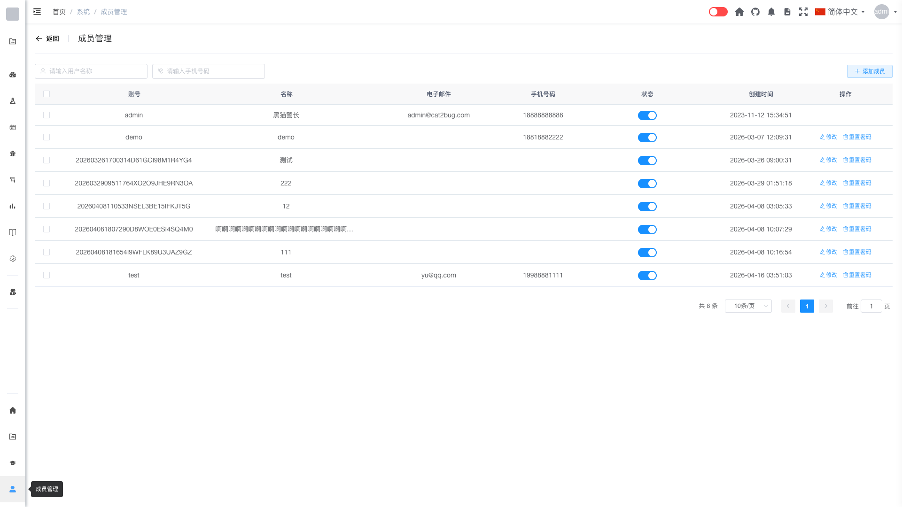

# 成员管理 [/system/user](/system/user)

## 概述

成员管理是管理员用于管理系统中所有用户的功能模块。管理员可以查看成员列表，编辑用户信息，重置密码，以及管理用户的账号状态。

## 功能说明

### 搜索成员

管理员可以通过多种条件快速查找成员：

1. **按成员名称搜索**：在成员名称搜索框中输入关键字
2. **按手机号码搜索**：在手机号码搜索框中输入关键字
3. 系统会自动筛选匹配的成员

### 成员列表

成员列表展示了系统中所有注册用户的信息，包括：

- **用户名**：用户的登录账号
- **姓名**：用户的真实姓名
- **邮箱**：用户的电子邮箱地址
- **手机号**：用户的联系电话
- **角色**：用户拥有的角色列表
- **状态**：用户账号的状态（正常/禁用）
- **最后登录时间**：用户最近一次登录的时间
- **创建时间**：用户账号的创建日期

### 编辑用户

管理员可以编辑用户的基本信息：

1. 在成员列表中找到目标用户
2. 点击"修改"按钮
3. 修改用户信息：
   - 姓名
   - 邮箱
   - 手机号
   - 角色分配
4. 点击"确定"保存更改

### 重置密码

管理员可以为用户重置密码：

1. 在成员列表中找到目标用户
2. 点击"重置密码"按钮
3. 输入新密码或使用系统生成的密码
4. 点击"确定"完成重置

> **安全提示**：重置密码后，请通过安全渠道通知用户新密码。

### 用户状态管理

管理员可以通过状态开关管理用户账号的状态：

#### 禁用用户
1. 在成员列表中找到目标用户
2. 点击状态开关，将其设置为禁用
3. 确认操作

禁用后的用户：
- 无法登录系统
- 用户数据和权限配置保留
- 可以随时恢复为正常状态

#### 启用用户
1. 在成员列表中找到被禁用的用户
2. 点击状态开关，将其设置为启用
3. 用户恢复正常登录权限

## 权限说明

只有系统管理员（admin 角色）才能访问成员管理功能。

## 常见问题

**Q: 如何批量查找某个团队的成员？**  
A: 可以通过成员名称或手机号码进行搜索筛选。

**Q: 重置密码后用户需要做什么？**  
A: 用户使用新密码登录后，建议立即修改为自己的密码。

**Q: 禁用用户和删除用户有什么区别？**  
A: 禁用用户保留所有数据和配置，可以恢复；删除用户会永久删除用户数据，不可恢复。

**Q: 如何为用户分配角色？**  
A: 点击用户的"修改"按钮，在编辑界面中可以为用户分配或移除角色。

**Q: 用户忘记密码怎么办？**  
A: 管理员可以使用"重置密码"功能为用户设置新密码，然后通知用户。
