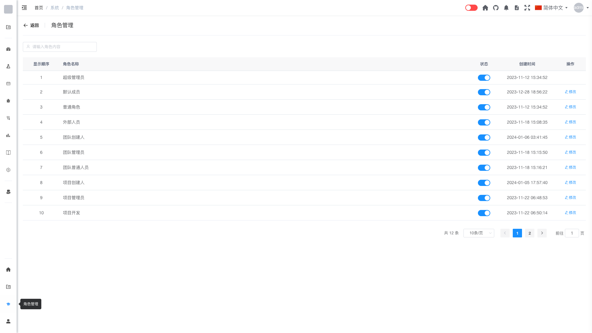

# 角色管理 [/admin/role](/admin/role)

## 概述

角色管理是管理员用于查看和管理系统角色的功能模块。管理员可以通过此功能查看角色列表，编辑角色权限，以及启用或禁用角色。

## 功能说明

### 搜索角色

管理员可以通过角色名称快速查找角色：

1. 在搜索框中输入角色名称关键字
2. 系统会自动筛选匹配的角色

### 角色列表

角色列表展示了系统中所有已定义的角色，包括：

- **角色名称**：角色的显示名称
- **角色标识**：角色的唯一标识符
- **角色描述**：角色的功能说明
- **创建时间**：角色的创建日期
- **状态**：角色的启用/禁用状态

### 编辑角色

管理员可以编辑角色的信息和权限：

1. 在角色列表中找到目标角色
2. 点击"修改"按钮
3. 修改角色信息：
   - 角色名称
   - 角色描述
4. 配置角色权限：
   - 勾选或取消勾选权限菜单
   - 可以按模块选择权限
5. 点击"确定"保存更改

> **提示**：修改角色权限后，拥有该角色的所有用户权限会立即生效。

### 禁用角色

管理员可以通过状态开关禁用角色：

1. 在角色列表中找到目标角色
2. 点击状态开关，将其设置为禁用
3. 确认操作

禁用后的角色：
- 拥有该角色的用户将暂时失去该角色的权限
- 角色配置和分配关系保留
- 可以随时解锁恢复

### 解锁角色

管理员可以解锁被禁用的角色：

1. 在角色列表中找到被禁用的角色
2. 点击状态开关，将其设置为启用
3. 角色恢复正常状态

## 权限配置

系统权限按功能模块划分，管理员可以在编辑角色时选择需要授予的权限菜单，主要包括：

- 团队管理权限
- 项目管理权限
- 缺陷管理权限
- 测试用例权限
- 测试计划权限
- 文档管理权限
- 报告权限
- 系统管理权限

## 权限说明

只有系统管理员（admin 角色）才能访问角色管理功能。

## 常见问题

**Q: 修改角色权限后，需要用户重新登录吗？**  
A: 不需要，权限修改会立即生效。

**Q: 禁用角色会影响已分配该角色的用户吗？**  
A: 会。禁用角色后，拥有该角色的用户将暂时失去该角色的权限。

**Q: 如何为角色添加新的权限？**  
A: 点击角色的"修改"按钮，在权限菜单中勾选需要添加的权限，然后保存即可。
