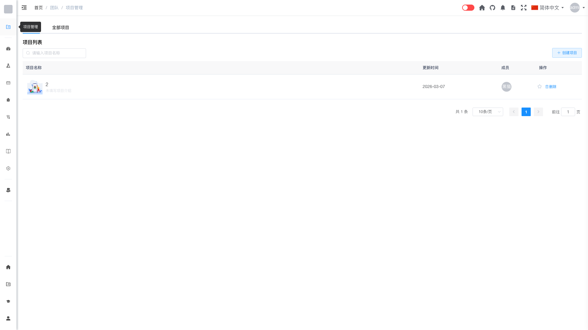

# 团队管理 [/system/team](/system/team)

## 概述

团队管理是管理员用于查看和管理系统中所有团队的功能模块。管理员可以通过此功能查看团队列表，并对团队进行禁用或解锁操作。

## 功能说明

### 搜索团队

管理员可以通过团队名称快速查找团队：

1. 在搜索框中输入团队名称关键字
2. 系统会自动筛选匹配的团队

### 团队列表

团队列表展示了系统中所有已创建的团队信息，包括：

- **团队名称**：团队的显示名称
- **团队描述**：团队的简要说明
- **创建时间**：团队的创建日期
- **成员数量**：团队当前的成员总数
- **项目数量**：团队下的项目总数
- **状态**：团队的启用/禁用状态

### 禁用团队

管理员可以禁用团队：

1. 在团队列表中找到目标团队
2. 点击"禁用"按钮
3. 确认禁用操作

禁用后的团队：
- 团队成员将无法访问团队资源
- 团队数据仍然保留
- 可以随时解锁恢复

### 解锁团队

管理员可以解锁被禁用的团队：

1. 在团队列表中找到被禁用的团队
2. 点击"解锁"按钮
3. 团队恢复正常状态

## 权限说明

只有系统管理员（admin 角色）才能访问团队管理功能。

## 常见问题

**Q: 禁用团队会影响团队数据吗？**  
A: 禁用团队不会删除任何数据，只是暂时限制团队成员的访问权限。

**Q: 如何恢复被禁用的团队？**  
A: 在团队列表中找到被禁用的团队，点击"解锁"按钮即可恢复。

**Q: 禁用团队后，团队下的项目还能访问吗？**  
A: 禁用团队后，团队成员将无法访问团队及其下的所有项目。
