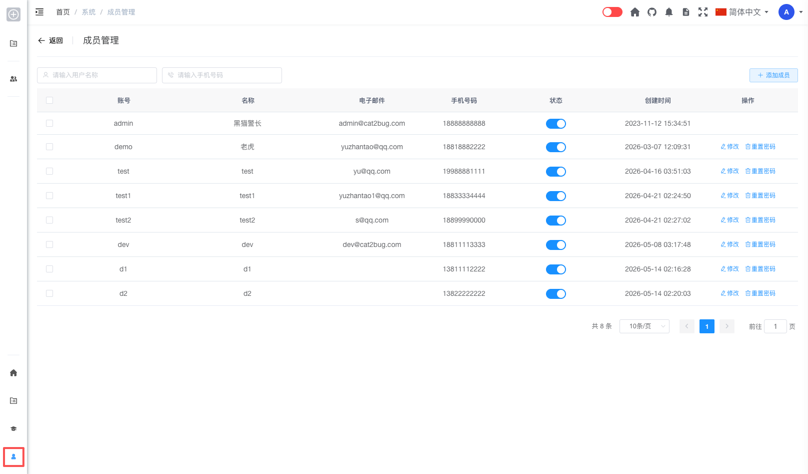

# 成员管理 [/admin/member](/admin/member)

## 概述

成员管理是系统管理员用于查看和管理平台中**所有用户**的功能模块。管理员可以在此浏览成员列表、按条件搜索用户、添加新成员，以及对成员进行修改、重置密码及启用/停用等操作。

## 功能说明

### 搜索成员

管理员可以通过以下条件快速查找成员：

1. **按用户名称搜索**：在「请输入用户名称」输入框中输入关键字
2. **按手机号码搜索**：在「请输入手机号码」输入框中输入关键字
3. 输入后系统会实时筛选匹配的成员

### 成员列表

成员列表展示平台中所有已注册的用户，主要字段包括：

- **账号**：用户的登录账号
- **名称**：用户的显示名称
- **电子邮件**：用户的邮箱地址
- **手机号码**：用户的联系电话
- **状态**：通过开关控制账号为启用或停用
- **创建时间**：用户账号的创建日期与时间
- **操作**：修改成员信息、重置密码（系统内置 `admin` 账号不提供上述操作）

### 添加成员

管理员可以创建新的系统用户：

1. 点击页面右上角的「添加成员」按钮
2. 在弹出的对话框中填写：
   - 名称
   - 登录账号（新建时必填）
   - 手机号码
   - 电子邮件
   - 登录密码（新建时必填，也可使用系统默认初始密码）
   - 状态（正常 / 停用）
   - 备注（可选）
3. 点击「确定」完成创建

### 修改成员

管理员可以编辑已有成员的基本信息：

1. 在成员列表中找到目标用户（非 `admin` 账号）
2. 点击「修改」
3. 在对话框中调整名称、手机号码、电子邮件、状态及备注等
4. 点击「确定」保存，或点击「取消」放弃修改

> **说明**：修改时不可更改登录账号；账号名称在创建后固定。

### 重置密码

管理员可以为用户重置登录密码：

1. 在成员列表中找到目标用户
2. 点击「重置密码」
3. 在弹出的输入框中填写新密码（长度 5～20 位）
4. 点击「确定」完成重置

> **安全提示**：重置密码后，请通过安全渠道将新密码告知用户，并建议用户登录后尽快修改为个人密码。

### 启用 / 停用成员

管理员可在列表中直接切换成员账号状态：

1. 在成员列表中找到目标用户
2. 点击「状态」列中的开关
3. 在确认对话框中确认启用或停用

停用后的用户：

- 无法登录系统
- 用户数据仍然保留
- 可随时重新启用恢复

## 权限说明

只有系统管理员（admin 角色）才能访问成员管理功能。

## 常见问题

**Q: 为什么 admin 账号没有「修改」和「重置密码」？**  
A: `admin` 是系统内置的超级管理员账号，为保障系统安全，不允许通过本页修改信息或重置密码。

**Q: 重置密码后用户需要做什么？**  
A: 使用管理员设置的新密码登录后，建议尽快在个人设置中修改为自己的密码。

**Q: 用户忘记密码怎么办？**  
A: 管理员可在成员列表中对该用户执行「重置密码」，设置新密码后通知用户登录。
