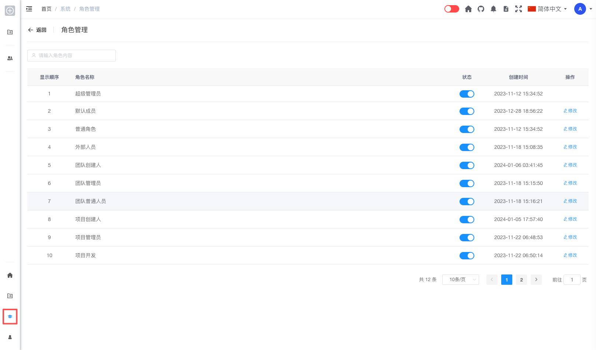
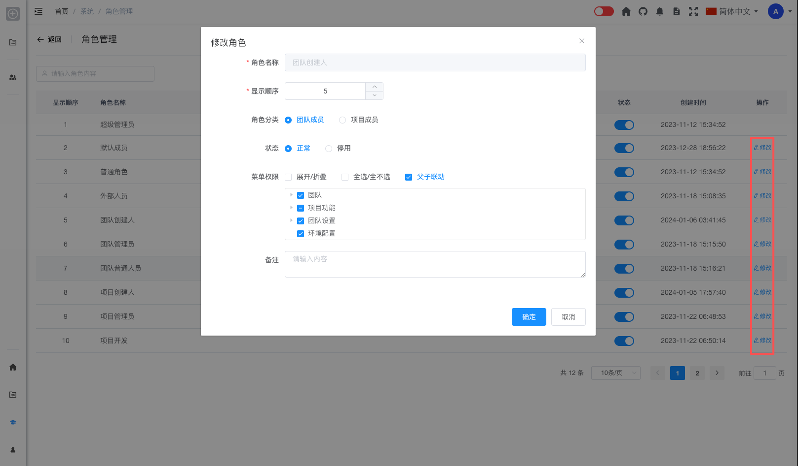

# 角色管理 [/admin/role](/admin/role)

## 概述

角色管理是系统管理员用于查看和配置平台中所有角色的功能模块。管理员可以在此查看角色列表、通过状态开关启用或停用角色，并通过「修改」操作调整角色的显示顺序、角色分类、状态及菜单权限等配置。

## 功能说明

### 搜索角色

管理员可以通过角色名称或相关内容快速查找角色：

1. 在页面顶部的搜索框中输入「请输入角色内容」
2. 系统会实时筛选匹配的角色

### 角色列表

角色列表展示平台中所有已定义的角色，主要字段包括：

- **显示顺序**：角色在列表中的排序序号
- **角色名称**：角色的显示名称（如超级管理员、团队创建人、项目管理员等）
- **状态**：通过开关控制角色为启用或停用
- **创建时间**：角色的创建日期与时间
- **操作**：修改角色配置（超级管理员不提供修改入口）

> **说明**：「超级管理员」为系统内置角色，列表中不显示「修改」操作，不可通过本页编辑。

### 启用 / 停用角色

管理员可在列表中直接切换角色状态：

1. 在角色列表中找到目标角色
2. 点击「状态」列中的开关
3. 在确认对话框中确认启用或停用

停用后的角色：

- 已分配该角色的用户将暂时失去该角色对应的权限
- 角色配置与分配关系仍然保留
- 可随时重新启用恢复

### 修改角色

点击操作列中的「修改」按钮，打开「修改角色」对话框，可调整角色配置。

对话框中的配置项包括：

- **角色名称**：当前角色名称（只读，不可修改）
- **显示顺序**：调整角色在列表中的排序，数值越小越靠前
- **角色分类**：选择「团队成员」或「项目成员」，用于区分角色适用的成员范围
- **状态**：选择「正常」或「停用」
- **菜单权限**：通过权限树勾选该角色可访问的菜单与功能
  - **展开/折叠**：一键展开或折叠权限树
  - **全选/全不选**：快速选中或清空全部权限
  - **父子联动**：勾选父节点时自动关联子节点（默认开启）
- **备注**：填写角色相关说明

**操作步骤：**

1. 在角色列表中找到目标角色（非超级管理员）
2. 点击「修改」
3. 在对话框中调整显示顺序、角色分类、状态及菜单权限等
4. 点击「确定」保存，或点击「取消」放弃修改

> **提示**：修改角色权限后，拥有该角色的用户权限会立即生效，无需重新登录。

## 权限说明

只有系统管理员（admin 角色）才能访问角色管理功能。

## 常见问题

**Q: 为什么超级管理员没有「修改」按钮？**  
A: 超级管理员是系统内置的最高权限角色，为保障系统安全，不允许通过界面修改其权限配置。

**Q: 修改角色权限后，需要用户重新登录吗？**  
A: 不需要，权限修改会立即生效。

**Q: 停用角色会影响已分配该角色的用户吗？**  
A: 会。停用后，拥有该角色的用户将暂时失去该角色对应的权限；重新启用后即可恢复。

**Q: 「团队成员」和「项目成员」角色分类有什么区别？**  
A: 用于区分角色主要作用于团队层面还是项目层面，便于在配置菜单权限时按不同场景管理权限范围。
