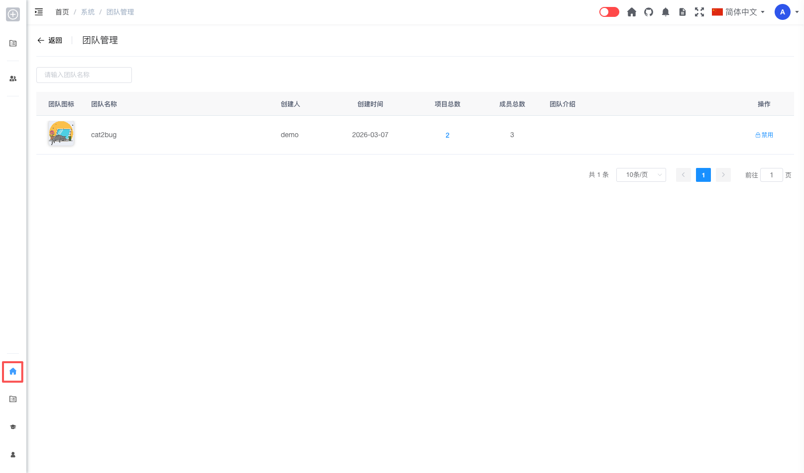

# 团队管理 [/admin/team](/admin/team)

## 概述

团队管理是系统管理员用于查看和管理平台中所有团队的功能模块。管理员可以在此查看全部团队列表，了解各团队的项目总数与成员总数，并通过项目数量快速跳转到该团队下的项目列表，或对团队进行锁定与解锁操作。

## 功能说明

### 搜索团队

管理员可以通过团队名称快速查找团队：

1. 在页面顶部的搜索框中输入团队名称关键字
2. 系统会实时筛选匹配的团队

### 团队列表

团队列表展示平台中所有已创建的团队，主要字段包括：

- **团队图标**：团队的展示图标
- **团队名称**：团队的显示名称
- **创建人**：团队的创建者
- **创建时间**：团队的创建日期
- **项目数量**：该团队下的项目总数（可点击）
- **成员数量**：该团队的成员总数
- **团队介绍**：团队的简要说明
- **操作**：锁定或解锁团队

### 查看团队下的项目

点击某一行中的**项目数量**（蓝色链接），系统会跳转到**项目管理**页面，并自动按该团队名称筛选，展示该团队下的全部项目列表。

**操作步骤：**

1. 在团队列表中找到目标团队
2. 点击该团队「项目数量」列中的数字
3. 进入项目管理页面，查看该团队下的所有项目

### 锁定团队

管理员可以锁定团队，限制团队成员访问：

1. 在团队列表中找到目标团队
2. 点击操作列中的「锁定」按钮
3. 在弹出的对话框中填写锁定说明
4. 点击「确定」完成锁定

锁定后的团队：

- 团队成员将无法访问团队资源
- 团队数据仍然保留
- 可以随时解锁恢复

### 解锁团队

管理员可以解锁已被锁定的团队：

1. 在团队列表中找到被锁定的团队
2. 点击操作列中的「解锁」按钮
3. 在弹出的对话框中填写解锁说明
4. 点击「确定」完成解锁

## 权限说明

只有系统管理员（admin 角色）才能访问团队管理功能。

## 常见问题

**Q: 点击项目数量后跳转到哪里？**  
A: 会跳转到项目管理页面（`/admin/project`），并自动填入该团队名称作为筛选条件，只显示该团队下的项目。

**Q: 锁定团队会删除团队数据吗？**  
A: 不会。锁定团队只是暂时限制团队成员的访问权限，所有数据都会保留。

**Q: 如何恢复被锁定的团队？**  
A: 在团队列表中找到被锁定的团队，点击「解锁」按钮，填写解锁说明后确认即可恢复。
