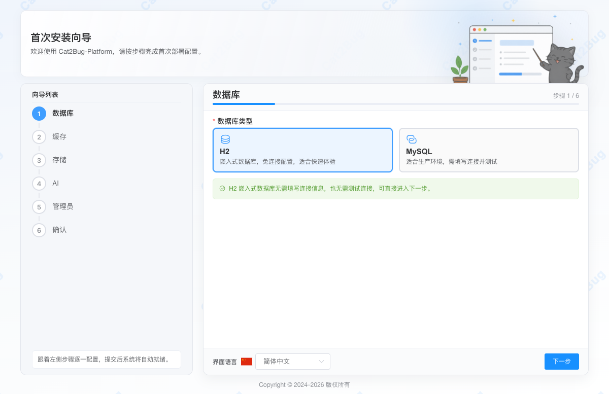
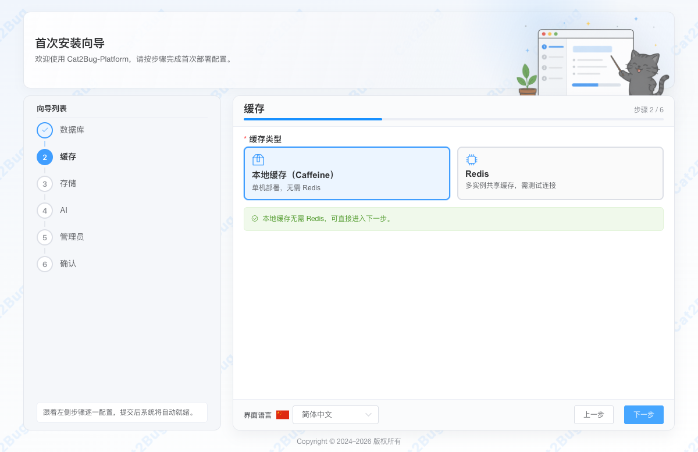
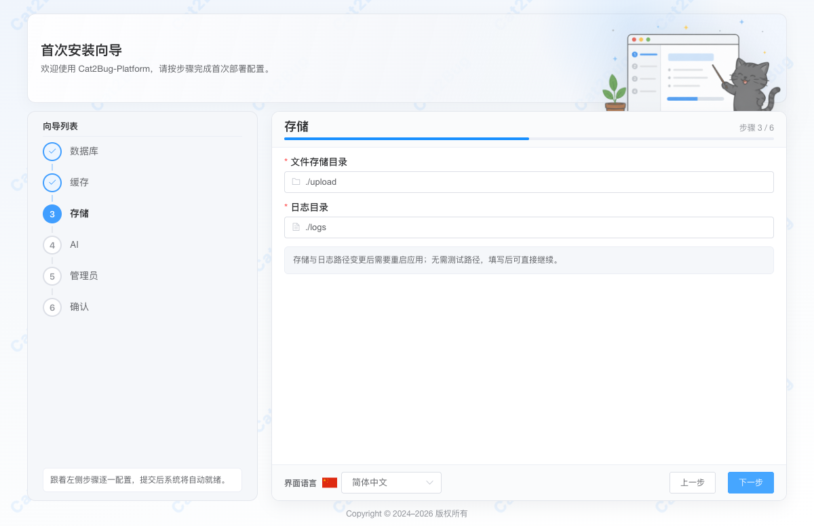
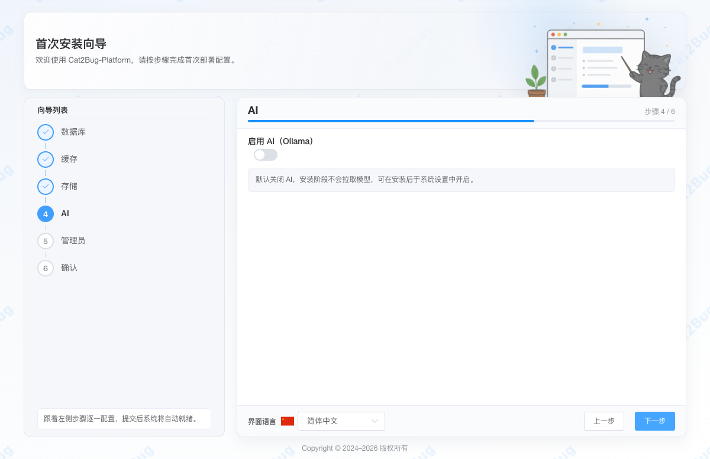
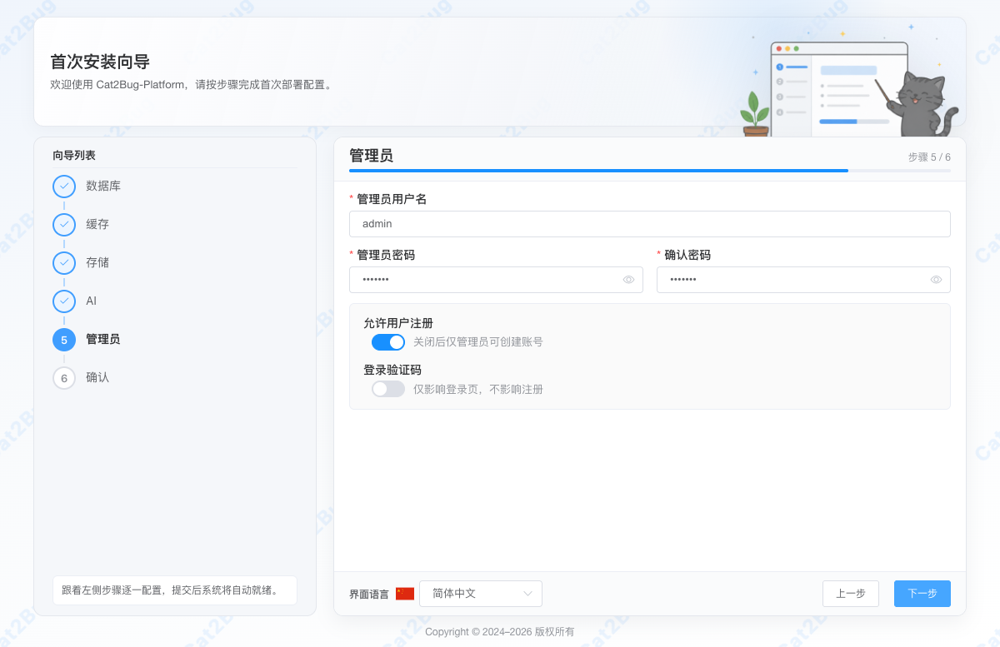
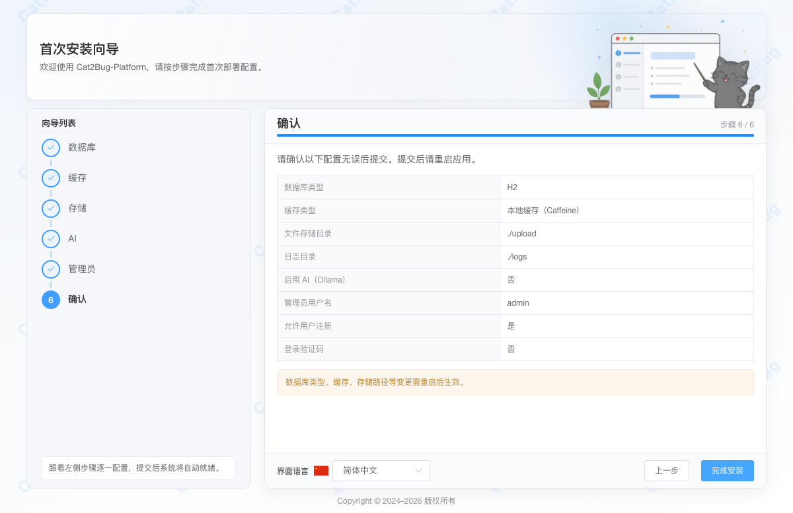

# 系统安装向导 [/setup](/setup)

## 概述

Cat2Bug-Platform 支持在首次部署或全新启动时提供图形化的 **首次安装向导**，引导系统管理员快速完成数据库、缓存、文件存储、AI 等系统核心配置。

向导通过 6 个直观的配置步骤来生成本地运行配置文件 `./config/install/application-install.yml`：

- **数据库配置**：支持轻量级 H2 数据库或生产环境 MySQL。
- **缓存配置**：支持本地 Caffeine 缓存或企业级 Redis 缓存。
- **存储与日志**：配置附件上传路径及日志输出路径，确保系统具备可靠的文件写入权限。
- **AI 助手**：可选择性启用本地 Ollama 服务以驱动缺陷 AI 机器人。
- **管理员与安全设置**：自定义初始超级管理员账号密码，以及配置公开注册与登录验证码（可爱的 2D 像素风小蜗牛夕阳动画验证码）。
- **确认并提交**：汇总所有配置参数，一键初始化系统并在重启后生效。

---

## 步骤详解与截图

### 步骤 1：数据库配置

系统启动所需的运行期数据库与连接池，支持嵌入式 H2 数据库和 MySQL。

- **H2 (默认)**：无需安装外部数据库，免连接配置，适合开发调试或单机轻量快速体验。
- **MySQL**：适合团队协作和生产环境，需填写数据库主机、端口、用户名和密码。
- **测试连接**：选择 MySQL 并填写连接参数后，可点击「测试连接」按钮实时验证数据库服务是否可用。



### 步骤 2：缓存配置

控制系统会话及配置缓存的存放介质。

- **Caffeine (默认)**：使用本地 Caffeine 在内存中进行缓存，单机部署无需 Redis。
- **Redis**：适合多实例共享缓存或集群/主备部署，需填写 Redis 主机、端口、密码及数据库索引。
- **测试连接**：选择 Redis 后，可点击「测试连接」实时向 Redis 发送 PING 指令，确保连通性。



### 步骤 3：存储与日志配置

配置系统存储本地附件文件和写入诊断日志的目标物理磁盘目录。

- **文件存储目录** (`cat2bug.profile`)：用户上传的头像、缺陷图片、附件等存放根目录。
- **日志目录**：Java 后端与系统的日志输出路径。
- **路径说明**：文件存储和日志目录在变更后都需要重启应用才能生效，支持相对路径和绝对路径。



### 步骤 4：AI 配置

设置 AI 缺陷智能助手的运行端点。

- **启用 AI (Ollama)**：默认关闭，可在安装后于系统设置中开启。开启后，用户在创建或修改用例、缺陷时，可让 AI 缺陷机器人协助分析并自动填充内容。
- **服务地址**：默认 `http://127.0.0.1:11434`。
- **测试连接**：测试连通性，检测本地 Ollama 实例。



### 步骤 5：管理员与安全配置

创建系统的首个超级管理员账号，并配置登录和注册的基础安全访问策略。

- **用户名**：默认 `admin`。
- **密码**：默认 `cat2bug`（强烈建议在生产环境部署时进行修改）。
- **允许用户注册**：开启后允许普通用户在登录页进行自助账号注册；关闭后仅管理员可创建账号。
- **登录验证码**：是否开启可爱的 2D 像素风小蜗牛夕阳动画验证码。此配置仅影响登录页，不影响账号注册。



### 步骤 6：确认并安装

在此页面汇总预览前 5 步配置的所有参数项。

- **完成安装**：确认无误后点击「完成安装」，系统会将配置持久化并自动执行初始化脚本。
- **重启应用**：安装提交成功后，系统将提示重启，后台将锁定 `/setup` 并完成引导任务，重启服务后即可使用刚刚创建的超级管理员账号进行登录。



---

## 命令行与自动化配置

除了图形化的安装向导，Cat2Bug-Platform 也完美支持面向 Docker、K8s 或自动化部署的零人工干预安装方案：

### 方案 A：跳过向导

配置以下系统环境变量后，系统在首次启动时将**完全跳过安装向导页面**，并自动视为安装已完成（此方式极适合 Docker 预定义数据源场景）：

```bash
export CAT2BUG_INSTALL_SKIP=true
```

### 方案 B：直接挂载配置文件

在容器运行或 JAR 包启动时，直接在工作目录中创建或挂载文件 `./config/install/application-install.yml`。只要该文件存在且包含：

```yaml
cat2bug:
  install:
    completed: true
```

系统将直接加载该文件中的数据库与缓存定义，直接进入登录页面，而不会重定向至向导 `/setup` 页面。
