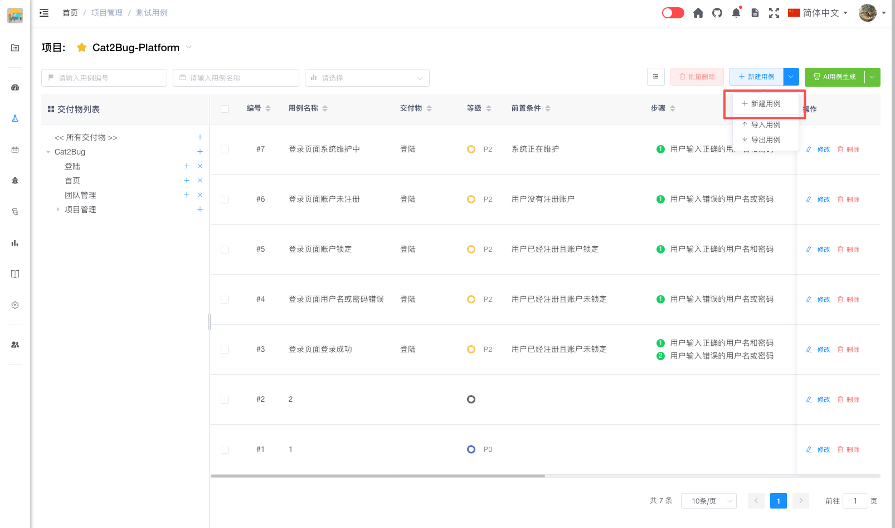
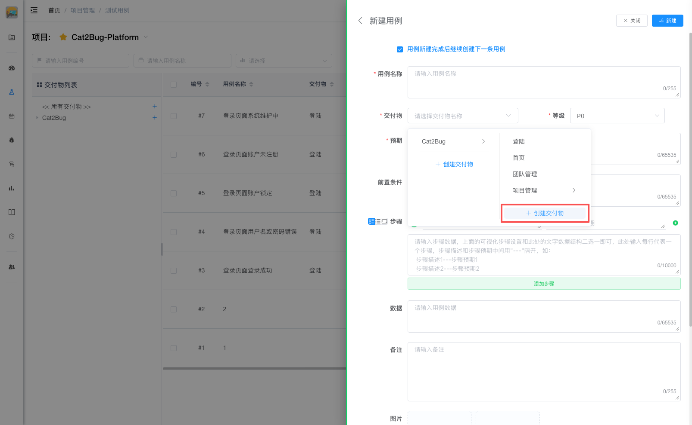
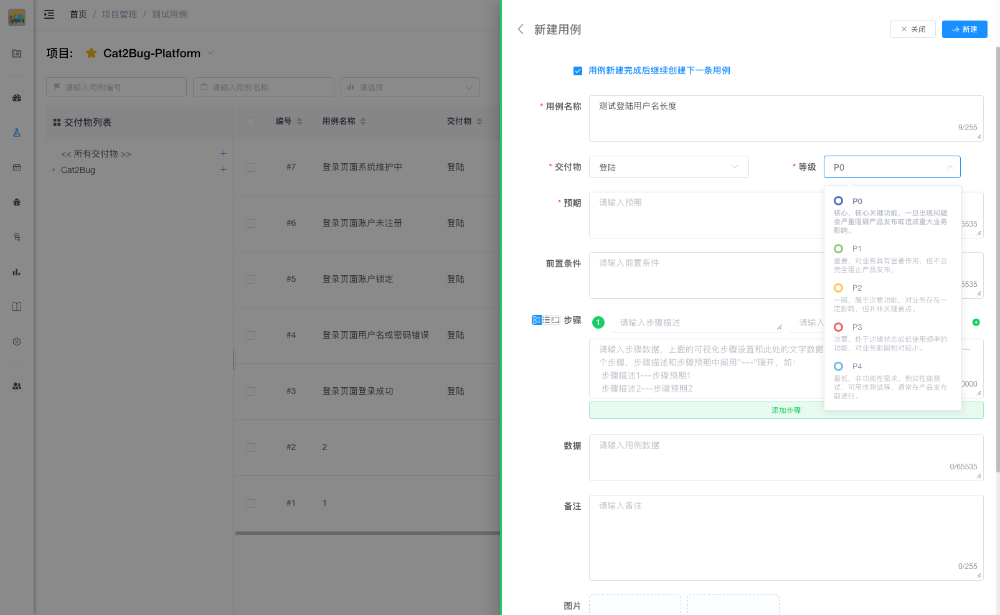
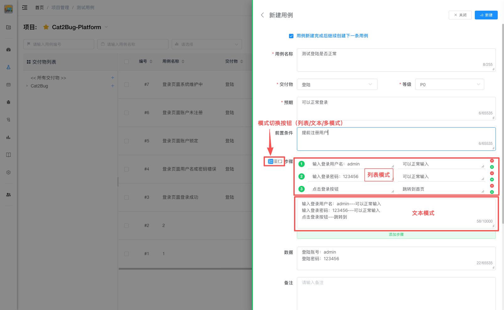
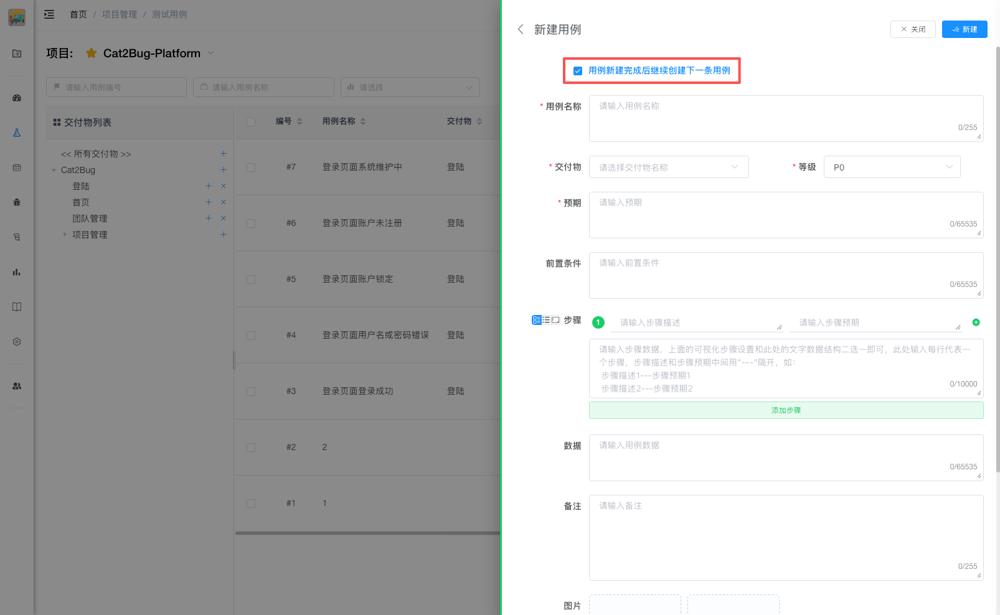

# 新建用例

新建用例用于直接在 Cat2Bug-Platform 平台中录入测试用例数据，操作步骤如下：

## 1. 打开创建界面

首先点击页面右上侧的【新建用例】按钮，将从右侧打开测试用例新建界面，如下图：



## 2. 选择关联交付物

在 Cat2Bug-Platform 中，所有用于测试的软件系统结构都是基于交付物体现的，所以测试用例也需要关联交付物，下图就是展示交付物的选择示例。如当前不存在某个交付物，也可以通过交付物下拉组件中的添加功能快速创建交付物。



## 3. 选择等级

根据用例重要程度选择等级，等级根据重要性降序从 P0 到 P4，默认选择"P0"。



## 4. 输入预期

预期是指执行测试后期望得到的结果。它描述了在正常情况下，系统应该表现出的行为或输出。

一个好的预期应该：
- **明确具体** - 清楚描述期望的结果，避免模糊表述
- **可验证** - 能够通过观察或测试来验证是否达到
- **符合需求** - 与产品需求或设计规格保持一致

**示例：**
- ✅ 好的预期："页面显示'登录成功'提示，并跳转到首页"
- ❌ 不好的预期："系统正常工作"

## 5. 输入前置条件（非必填）

前置条件是指执行测试前需要满足的条件或准备工作。它确保测试能够在正确的环境和状态下进行。

**前置条件的作用：**
- 明确测试的起始状态，避免因环境不一致导致测试失败
- 帮助测试人员快速准备测试环境
- 减少测试执行中的不确定性
- 便于问题定位，区分是环境问题还是功能问题

**常见的前置条件包括：**
- 用户已登录系统
- 数据库中已存在特定测试数据
- 系统处于特定状态（如已完成某个流程）
- 已配置特定的系统参数
- 已准备好测试所需的文件或资源

**示例：**
- "用户已使用管理员账号登录系统"
- "数据库中已存在编号为001的订单"
- "系统已开启邮件通知功能"

## 6. 输入测试步骤（非必填）

测试步骤是执行测试的详细操作指南，它将测试过程分解为一系列可执行的具体动作。每个步骤通常包含：
- **步骤描述** - 需要执行的具体操作
- **步骤预期** - 该步骤执行后应该看到的结果

**测试步骤的作用：**
- 确保测试的可重复性，任何人都能按照步骤重现测试
- 便于定位问题，明确在哪个步骤出现了异常
- 提高测试效率，避免遗漏关键操作
- 方便测试用例的维护和更新

在测试步骤选项中，系统提供了两种录入方式：

**方式一：列表模式**

- 以列表形式显示步骤
- 用户可通过点击【添加步骤】按钮或每行步骤后面的【添加】【删除】图标按钮调整步骤内容
- 并可通过鼠标拖动方式改变步骤的顺序

**方式二：文本模式**

- 以文本方式显示步骤
- 用户可根据规范的格式统一快速录入所有步骤
- 在文本模式中，规定每行为一条步骤
- 每条步骤的【描述】和【预期】属性通过 `---` 来分隔

**文本模式示例：**
```
把冰箱门打开---冰箱有个门
把大象放进去---大象真的能放进去
把冰箱门关上
```

**模式切换：**

在步骤左侧有三个图标小按钮，用来切换步骤的不同模式：
- 第一个图标按钮：同时显示列表和文本模式
- 第二个图标按钮：显示列表模式
- 第三个图标按钮：显示文本模式



## 7. 输入数据（非必填）

测试数据是执行测试时需要使用的具体数据信息。它可以包括：
- 输入的测试数据值
- 测试账号信息
- 测试环境配置参数
- 其他测试所需的数据

**示例：**
- "测试账号：test001，密码：123456"
- "订单金额：1000元"
- "测试文件：test.xlsx（大小：2MB）"

## 8. 输入备注（非必填）

备注用于记录测试用例的补充说明或注意事项，帮助测试人员更好地理解和执行测试。

**常见的备注内容：**
- 特殊的测试注意事项
- 已知的问题或限制
- 与其他用例的关联关系
- 测试环境的特殊要求
- 执行频率或优先级说明

**示例：**
- "此用例仅在生产环境执行"
- "需要在每次版本发布前执行"
- "与用例TC001存在依赖关系"

## 9. 添加图片（非必填）

可以上传测试相关的截图或示意图，用于：
- 展示预期的界面效果
- 说明复杂的操作步骤
- 记录测试过程中的关键界面
- 提供参考示例

支持常见的图片格式（如 JPG、PNG、GIF 等）。

## 10. 添加附件（非必填）

可以上传测试相关的文档或其他文件，例如：
- 测试所需的数据文件（Excel、CSV 等）
- 相关的需求文档或设计文档
- 测试脚本或配置文件
- 其他辅助测试的资料

支持多种文件格式，方便测试人员获取完整的测试资料。

## 11. 完成创建

当输入完所有数据后，点击右上角的【新建】按钮创建完成新用例。

## 批量录入免填小技巧

在新建用例界面中，红框标注的第一个选项用于连续创建用例而用，默认是选中状态，选中此项后，创建完用例还会停留在创建页面，并保留上一次"交付物"、"等级"的选择选项，便于持续录入多条用例。


