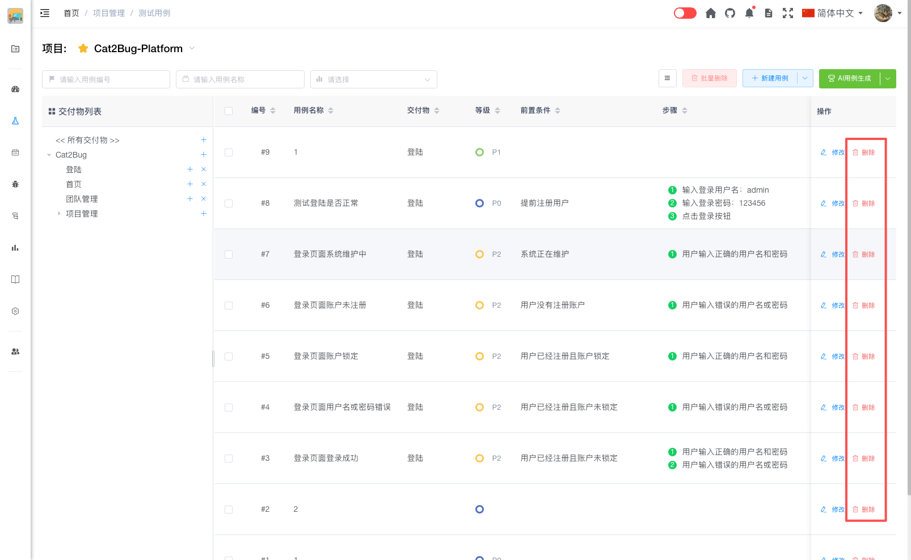
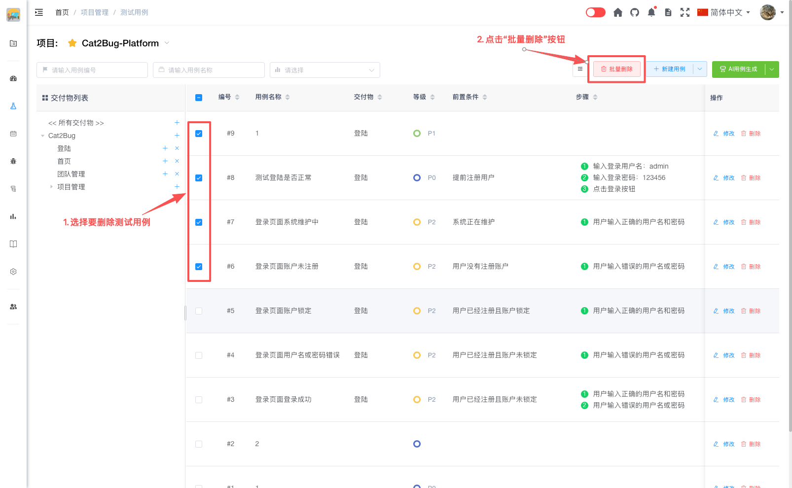

# 删除用例

测试用例支持单个删除和批量删除两种方式。

## 单个删除

在用例列表中，点击某条用例右侧的【删除】按钮，确认后即可删除该用例。

## 批量删除

1. 在用例列表中，勾选需要删除的多个用例
2. 点击列表上方的【批量删除】按钮
3. 在弹出的确认对话框中点击【确认】按钮
4. 系统将批量删除所选的所有用例

> **注意：** 删除操作不可恢复，并影响关联的测试计划、缺陷等模块，请谨慎操作。建议在删除前确认用例是否还需要使用。
