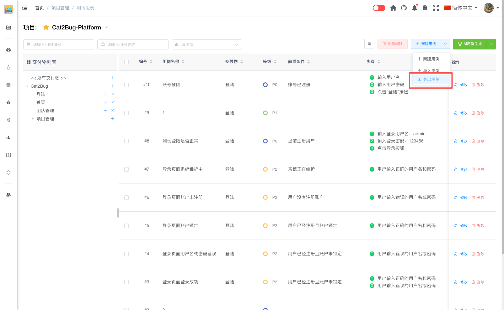

# 导出用例

测试用例支持导出为 Excel 格式，方便用户进行数据备份、分享或在其他系统中使用。

## 导出操作

1. 在用例列表页，可以选择导出全部用例或部分用例
2. 点击列表上方的【导出用例】按钮
3. 系统将自动生成 Excel 文件并下载到本地

## 导出内容

导出的 Excel 文件包含以下信息：

- 用例编号
- 用例名称
- 交付物
- 等级
- 预期
- 前置条件
- 测试步骤
- 测试数据
- 备注
- 图片
- 附件
- 更新时间

::: tip 提示
导出的 Excel 文件格式与导入模版格式一致，可以直接用于其他项目的导入操作
:::
