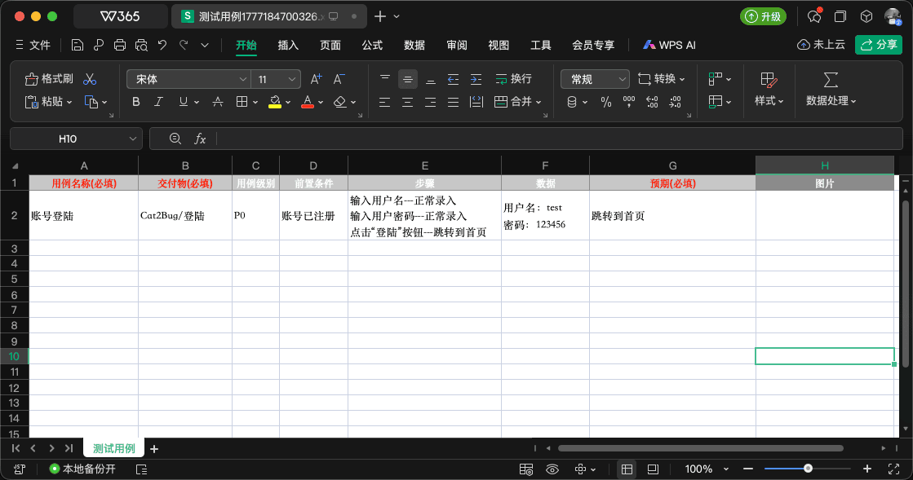

# 导入用例

和其它传统缺陷管理系统相同，我们提供了从 Excel 导入测试用例的功能，此方式主要考虑到用户可以从一些正在进行的项目中快速转移项目数据。

## 1. 下载测试用例模版

我们提供了一套标准的测试用例模版格式，点击「导入用例」对话框中的「下载模版」链接按钮，即可下载 Excel 模版文件。

值得注意的是，此模版中交付物选项是非必填的（系统中，测试用例的交付物属性是必填项），此处主要考虑到在没有完全维护好交付物结构的时候，也可以畅通无阻的完成测试用例的导入工作。操作如下图：


## 2. 在 Excel 模版中录入数据

在 Excel 模版中，红色标题的列是必填项；交付物、用例级别等是下拉选项，目前 Excel 最大支持 65536 条数据的录入。

值得一提的是，导入的「步骤」属性，格式规则如下：

- 一行算一个步骤
- 步骤的描述与预期用 `---` 分割

**示例：**
```
输入用户名---正常录入
输入用户密码---正常录入
点击"登录"按钮---跳转到首页
```



## 3. 导入数据

将维护好的 Excel 文件导入到系统，如录入的数据无误，系统将提示导入成功，如下图：


## 键盘操作

导入对话框打开时：

| 按键 | 行为 |
|------|------|
| **Esc** / **取消** | 未选文件时直接关闭；**已选 Excel 文件时先确认**，确认后关闭并清空文件 |
| **⌘/Ctrl + Enter** | 开始导入（与点击「导入」相同） |
| **⌘/Ctrl + F** | 打开系统文件选择框（与点击上传区相同；按住 ⌘/Ctrl 时上传区右下角显示 **F** 徽标） |
| **Enter** / **Space** | 上传区获得焦点时，打开系统文件选择框 |
| **↓** | 已选文件时，进入下方文件列表并高亮当前文件 |
| **↑** / **↓** | 在已选文件列表中切换高亮（仅一条时 **↑** 回到上传区） |
| **Delete** / **Backspace** | 删除列表中高亮的文件 |

通用快捷键说明见 [键盘快捷键](../../../advanced/keyboard-shortcuts.md)。
