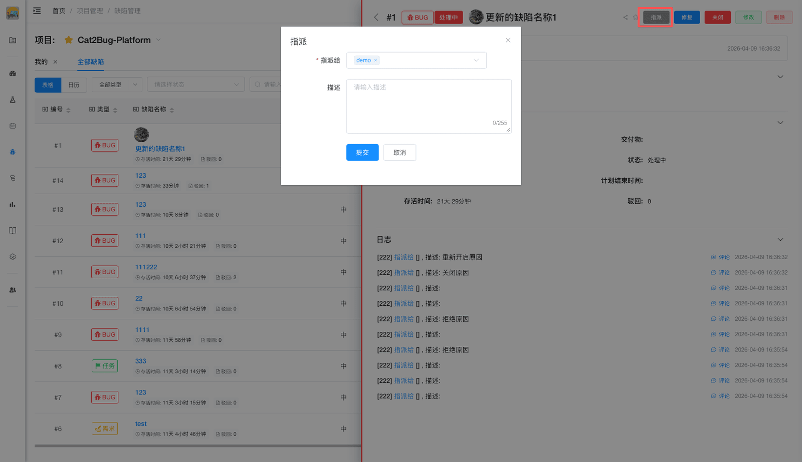

# 指派缺陷

当想改变缺陷处理人时，可通过「指派」功能改变当前处理人。

## 使用场景

- 将缺陷分配给其他开发人员
- 转交给更合适的处理人
- 重新分配工作负载
- 指定专人处理特定问题

## 操作步骤

### 1. 选择缺陷

在缺陷列表中选择要指派的缺陷。

### 2. 点击指派

点击缺陷右侧的「指派」按钮，或在缺陷详情右上角点击「指派」按钮。

### 3. 选择处理人

在弹出的对话框中选择新的处理人。

### 4. 填写说明

填写指派说明（可选），说明指派原因。

### 5. 确认指派

点击「提交」按钮完成指派。

::: tip 提示
1. 指派后会自动通知新的处理人
2. 指派记录会保存在操作历史中
3. 建议在指派说明中注明原因
4. 可以指派给自己
:::
