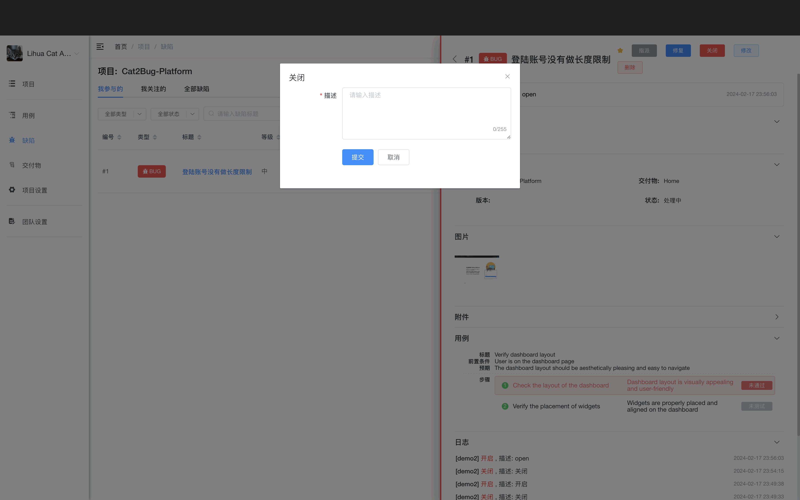

# 关闭缺陷

当缺陷问题已经解决，或者当前不再考虑处理此问题，可直接将其关闭。

## 使用场景

- 缺陷已解决并验证通过
- 不予修复的问题
- 重复的缺陷
- 无法重现的问题
- 需求变更导致缺陷失效

## 操作步骤

### 1. 点击关闭

在缺陷列表或缺陷详情中点击「关闭」按钮。

### 2. 填写关闭说明

填写关闭说明，详细说明关闭原因。

### 3. 确认关闭

点击「提交」按钮完成关闭，缺陷变成「已关闭」状态。

::: tip 提示
1. 关闭的缺陷可以重新开启
2. 关闭记录会保存在操作历史中
3. 建议在关闭说明中详细说明原因
4. 关闭后会自动通知相关人员
:::
