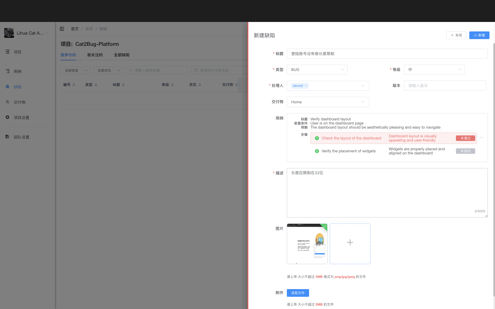

# 新建缺陷

在缺陷列表页面，点击【新建缺陷】按钮，从右侧弹出新建对话框，填写相关数据后点击【新建】按钮保存提交。



## 使用场景

- 测试过程中发现软件 BUG
- 记录产品需求
- 创建工作任务
- 记录待处理问题

## 操作步骤

### 1. 填写基本信息

- **缺陷标题**（必填）- 简明扼要地描述问题
- **缺陷描述**（必填）- 详细说明问题现象、重现步骤等
- **缺陷类型** - 功能、UI、性能、安全等
- **优先级** - 紧急、高、中、低

### 2. 关联信息

- **选择交付物**（必填）- 选择缺陷所属的模块
- **关联测试用例**（可选）- 关联相关的测试用例
- **选择用例步骤**（可选）- 点击选择未通过的测试步骤

::: tip 提示
在新建缺陷中，用例与交付物关联，如没有选择交付物，将无法显示可选择的用例；用例选择后，可【点击】选择任意步骤，代表在此步骤未通过测试。
:::

### 3. 指派处理人

选择负责修复的开发人员。

### 4. 上传附件

上传截图、日志等相关文件，帮助开发人员理解问题。

### 5. 保存提交

点击【新建】按钮保存提交缺陷。

## 缺陷描述规范

好的缺陷描述应包含：

1. **问题现象** - 发生了什么
2. **重现步骤** - 如何重现问题
3. **预期结果** - 应该是什么样
4. **实际结果** - 实际是什么样
5. **环境信息** - 操作系统、浏览器版本等

**示例：**
```
标题：登录页面用户名输入框无法输入中文

描述：
1. 问题现象：在登录页面的用户名输入框中无法输入中文字符
2. 重现步骤：
   - 打开登录页面
   - 点击用户名输入框
   - 切换到中文输入法
   - 尝试输入中文
3. 预期结果：应该能够输入中文字符
4. 实际结果：无法输入任何中文字符
5. 环境：Windows 10, Chrome 120.0
```

## 优先级设置建议

- **紧急** - 系统崩溃、数据丢失、安全漏洞
- **高** - 核心功能无法使用、严重影响用户体验
- **中** - 一般功能问题、可以绕过的问题
- **低** - UI 细节问题、优化建议
