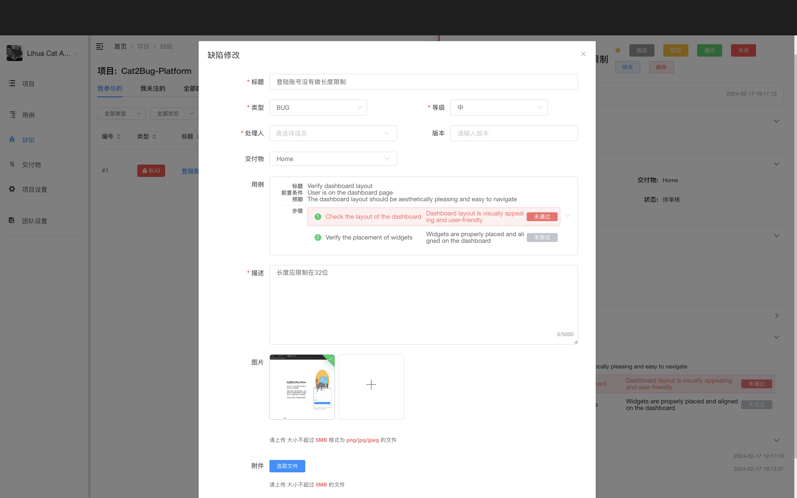

# 修改缺陷

修改用于调整缺陷的信息，一般由缺陷创建人、测试、项目管理员来维护。

## 使用场景

- 补充或修正缺陷描述
- 调整缺陷优先级
- 更改关联的交付物或测试用例
- 更换处理人
- 添加或删除附件

## 操作步骤

### 1. 打开缺陷

在缺陷列表中，点击需要修改的缺陷右侧的【修改】按钮，打开修改界面。

### 2. 修改信息

可修改以下内容：

- **缺陷标题和描述** - 更新问题说明
- **缺陷类型和优先级** - 调整分类和优先级
- **关联的交付物和测试用例** - 更改关联关系
- **处理人** - 更换负责人
- **附件** - 添加或删除相关文件

### 3. 保存修改

确认修改无误后，点击【保存】按钮完成修改。

## 注意事项

> **提示：**
> 1. 只有缺陷创建人、测试人员、项目管理员有修改权限
> 2. 修改缺陷会记录在操作历史中
> 3. 重大修改建议在评论中说明原因
> 4. 修改处理人时建议通知相关人员
