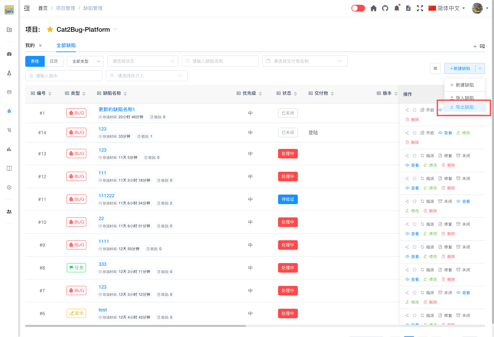

# 导出缺陷

将缺陷数据导出为 Excel 文件，便于数据分析、备份和分享。

## 使用场景

- 生成缺陷报表
- 备份缺陷数据
- 与外部团队分享缺陷信息
- 进行数据分析
- 迁移到其他系统

## 操作步骤

### 1. 筛选缺陷

在缺陷列表中，使用筛选条件选择需要导出的缺陷：
- 使用页标签快速筛选
- 使用搜索框搜索关键字

### 2. 点击导出

点击缺陷列表右上角的【导出缺陷】按钮导出文件。

## 导出格式

### Excel 文件结构

导出的 Excel 文件包含以下内容：
- **工作表名称** - 缺陷列表
- **表头** - 选择的字段名称
- **数据行** - 每行一个缺陷的数据

### 字段说明

| 字段名  | 说明              |
|------|-----------------|
| 编号   | 系统自动生成的唯一编号     |
| 类型   | UI、任务、需求        |
| 缺陷名称 | 缺陷的简短描述         |
| 描述   | 缺陷的详细说明         |
| 优先级  | 紧急、高、中、低        |
| 状态   | 处理中、待验证、已驳回、已关闭 |
| 交付物  | 缺陷所属模块          |
| 版本   | 测试的交付物版本        |
| 图片   | 缺陷截图            |
| 附件   | 相关附件            |

## 导出限制

### 数量限制

- 单次导出最多支持 65535 条缺陷
- 如果超过限制，建议分批导出或使用更精确的筛选条件

### 文件大小

- 导出文件大小取决于缺陷数量和字段数量
- 建议导出时只选择必要的字段，减小文件大小

### 附件处理

- 导出的 Excel 文件不包含附件
- 如需导出附件，请在缺陷详情页单独下载

## 导出技巧

### 按需导出

- 使用页标签快速切换不同的缺陷视图
- 使用筛选精确定位需要导出的缺陷

### 定期备份

- 建议定期导出缺陷数据进行备份
- 可以按月份或版本导出，便于归档管理

### 数据分析

- 导出后可以使用 Excel 的数据透视表功能进行分析
- 可以生成各种统计图表
- 可以与其他数据源进行关联分析

## 常见问题

### Q: 导出的文件在哪里？

A: 导出的文件会自动下载到浏览器的默认下载目录。

### Q: 可以导出缺陷的操作历史吗？

A: 目前不支持导出操作历史。如需查看历史，请在缺陷详情页查看。

### Q: 导出的数据可以重新导入吗？

A: 可以。但需要注意导入模板的格式要求，可能需要调整字段顺序和名称。

### Q: 导出时会包含已删除的缺陷吗？

A: 不会。导出只包含当前存在的缺陷。

### Q: 可以自定义导出模板吗？

A: 目前不支持自定义模板。可以在导出后使用 Excel 进行二次处理。
