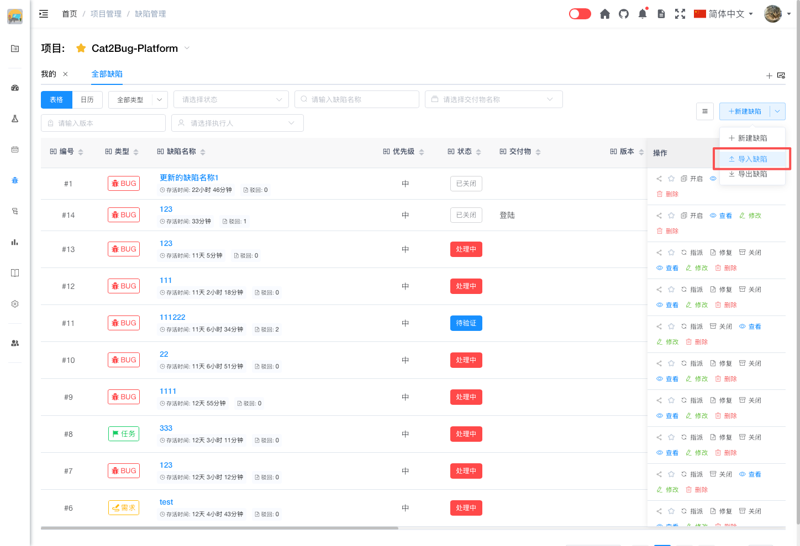
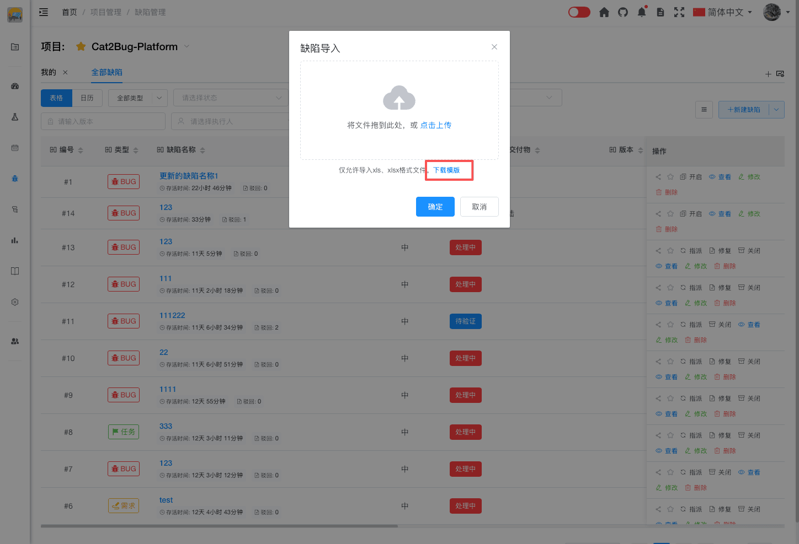
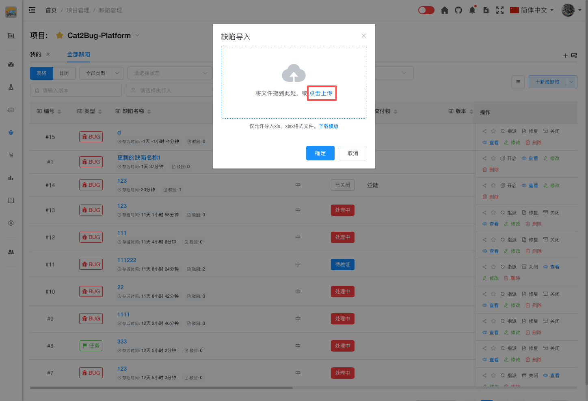

# 导入缺陷

通过 Excel 文件批量导入缺陷，提高缺陷录入效率。

## 使用场景

- 批量录入历史缺陷
- 从其他系统迁移缺陷数据
- 批量创建测试任务
- 导入外部问题清单

## 操作步骤

### 1. 下载导入模板

在缺陷列表页面，点击「导入缺陷」按钮，在弹出的对话框中点击「下载模板」。

### 2. 填写缺陷数据

在 Excel 模板中填写缺陷信息：

**必填字段：**
- **缺陷名称** - 简明扼要地描述问题
- **状态** - 缺陷状态（处理中、待验证、已驳回、已关闭）
- **类型** - 缺陷类型（BUG、任务、需求）
- **处理人** - 负责修复的人员

**可选字段：**
- **描述** - 详细说明问题现象
- **优先级** - 急、高、中、低
- **交付物** - 缺陷所属的模块
- **版本** - 缺陷所属版本号
- **图片** - 缺陷相关截图

### 3. 上传文件

点击「选择文件」按钮，选择填写好的 Excel 文件。

### 4. 确认导入

确认无误后，点击「确定」按钮完成导入。

## 导入规则

### 数据验证

- **必填字段** - 缺陷名称、状态、类型、处理人不能为空
- **字段格式** - 状态、类型、优先级必须是系统预设的值
- **关联数据** - 交付物、处理人、关联用例必须在系统中存在

### 错误处理

- 如果某行数据验证失败，该行不会导入，其他正确的数据继续导入
- 导入完成后会显示导入结果，包括成功数量和失败数量
- 失败的数据会显示错误原因，可以修改后重新导入

### 数据覆盖

- 导入不会覆盖已有缺陷
- 所有导入的缺陷都是新建的缺陷
- 如果需要更新已有缺陷，请使用修改功能

## 模板说明

### 字段说明

| 字段名 | 必填 | 说明 | 示例 |
|--------|------|------|------|
| 缺陷名称 | 是 | 缺陷的简短描述 | 登录页面无法输入中文 |
| 状态 | 是 | 缺陷状态 | 处理中 |
| 类型 | 是 | 缺陷类型 | BUG |
| 处理人 | 是 | 负责人的用户名 | 张三 |
| 描述 | 否 | 缺陷的详细说明 | 在登录页面的用户名输入框中无法输入中文字符... |
| 优先级 | 否 | 急/高/中/低 | 高 |
| 交付物 | 否 | 缺陷所属模块 | 用户管理模块 |
| 版本 | 否 | 缺陷所属版本号 | v1.0.0 |
| 图片 | 否 | 缺陷相关截图 | screenshot.png |

::: tip 提示
1. Excel 文件格式必须是 .xlsx 或 .xls
2. 不要修改模板的表头
3. 交付物名称必须与系统中的完全一致
4. 处理人必须是项目成员
5. 单次导入建议不超过 500 条数据
:::

## 导入结果

导入完成后，系统会显示：
- **成功数量** - 成功导入的缺陷数量
- **失败数量** - 导入失败的缺陷数量
- **失败详情** - 每条失败数据的错误原因

## 常见问题

### Q: 导入失败怎么办？

A: 查看失败详情中的错误原因，修改 Excel 文件后重新导入。常见错误包括：必填字段为空、交付物不存在、处理人不是项目成员等。

### Q: 可以导入附件吗？

A: 目前不支持通过 Excel 导入附件。如需添加附件，请在导入后手动编辑缺陷添加。

### Q: 可以导入历史操作记录吗？

A: 不可以。导入只能创建新缺陷，不包含历史操作记录。
