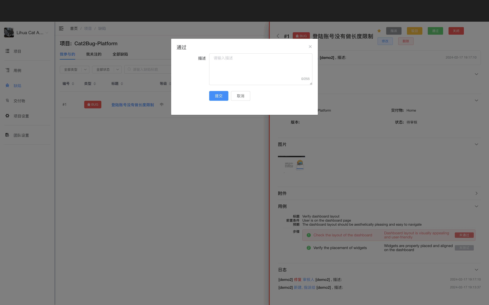

# 通过缺陷

当开发人员修复缺陷后，测试人员进行回归测试，如发现问题已经解决，将会通过此缺陷。

## 使用场景

- 修复后问题已完全解决
- 验证通过所有测试场景
- 符合预期的修复效果

## 操作步骤

### 1. 验证修复

测试人员按照缺陷描述和修复说明进行回归测试。

### 2. 确认解决

确认问题已完全解决，符合预期。

### 3. 点击通过

在缺陷详情页或列表中点击【通过】按钮。

### 4. 填写验证说明

填写验证说明（可选），记录：
- 验证的测试场景
- 验证结果
- 其他相关说明

### 5. 确认通过

点击【确认】按钮完成通过，缺陷状态变更为"已解决"。

## 注意事项

> **提示：**
> 1. 通过前要充分验证，避免遗漏问题
> 2. 建议验证相关的边界场景
> 3. 通过后会自动通知相关人员
> 4. 通过的缺陷可以在后续发现问题时重新开启
