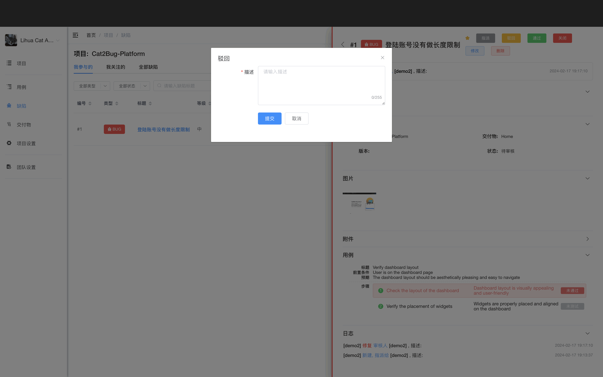

# 驳回缺陷

当开发人员修复缺陷后，测试人员进行回归测试，如发现问题依旧没有解决，将会驳回此缺陷。

## 使用场景

- 修复后问题仍然存在
- 修复不完整或不正确
- 引入了新的问题
- 未按照预期方式修复

## 操作步骤

### 1. 验证修复

测试人员按照缺陷描述和修复说明进行回归测试。

### 2. 发现问题

确认问题未解决或修复不符合预期。

### 3. 点击驳回

在缺陷详情页或列表中点击【驳回】按钮。

### 4. 填写驳回原因

填写驳回原因（必填），详细说明：
- 问题仍然存在的现象
- 验证步骤
- 与预期的差异
- 建议的修复方向

### 5. 上传验证截图

上传验证截图（可选），提供问题证据。

### 6. 确认驳回

点击【确认】按钮完成驳回，缺陷重新分配给开发人员。

## 注意事项

> **提示：**
> 1. 驳回原因要详细具体，便于开发人员定位问题
> 2. 驳回次数会被统计，影响缺陷质量评估
> 3. 驳回后会自动通知开发人员
> 4. 建议提供详细的验证步骤和截图
