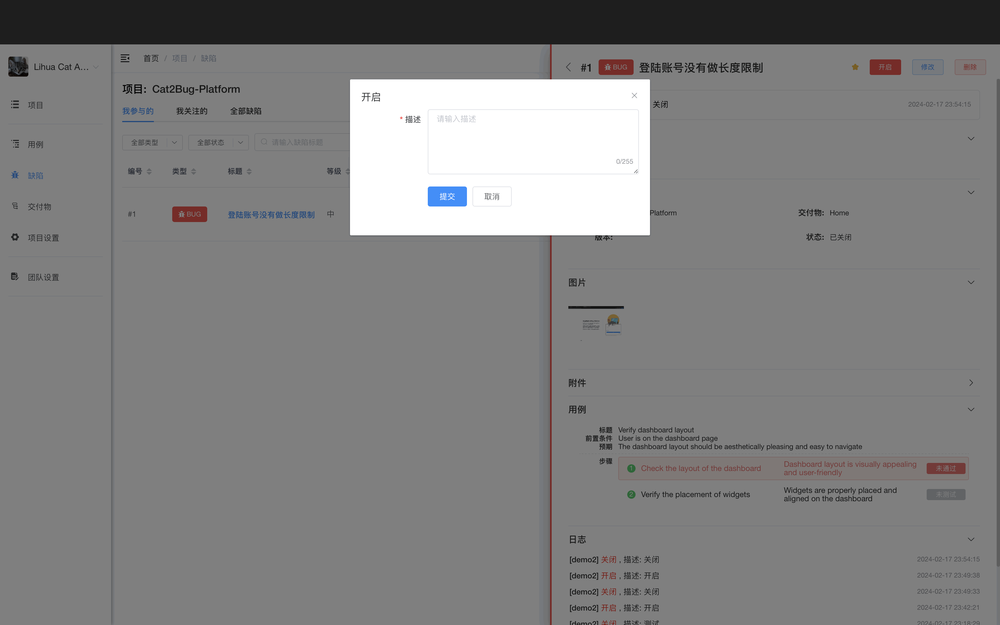

# 开启缺陷

当一个缺陷处理完被关闭后，在后续测试过程中，又再次发现，可改变其状态，使之变成开启状态。

## 使用场景

- 已关闭的缺陷再次出现
- 修复后的问题在新版本中复现
- 之前无法重现的问题现在可以重现
- 需求变更导致需要重新处理

## 操作步骤

### 1. 点击开启

在缺陷详情页或列表中点击「开启」按钮。

### 2. 填写开启原因

填写开启原因，说明：
- 问题再次出现的情况
- 重现步骤
- 与之前的差异
- 其他相关信息

### 4. 确认开启

点击「提交」按钮完成开启，缺陷变成「处理中」状态。

::: tip 提示
1. 开启后会自动通知相关人员
2. 开启记录会保存在操作历史中
3. 开启原因要详细，便于追溯问题
4. 开启后的缺陷会重新进入处理流程
:::
