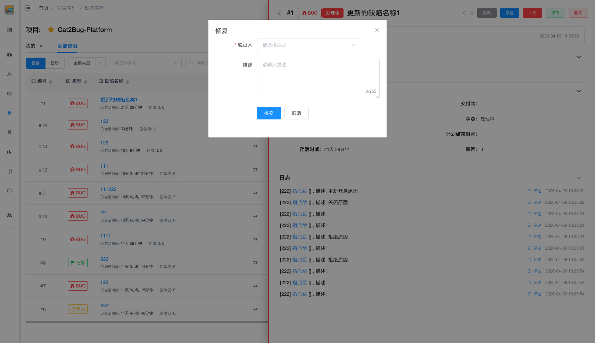

# 修复缺陷

当缺陷被提出后，根据缺陷提示修复完缺陷后，点击「修复」按钮，将修复后的缺陷转给测试人员。

## 使用场景

- 开发人员完成代码修复
- 问题已解决待测试验证
- 提交修复供测试人员回归测试

## 操作步骤

### 1. 修复代码

开发人员根据缺陷描述修复代码问题。

### 2. 点击修复

点击缺陷右侧的「修复」按钮，或在缺陷详情页或列表中点击「修复」按钮。

### 3. 填写修复说明

填写修复说明，描述：
- 问题原因分析
- 修复方案
- 修改的代码位置
- 需要注意的测试点

### 4. 选择测试人员

选择负责验证的测试人员。

### 5. 提交修复

点击「提交」按钮提交修复，缺陷变成「待验证」状态。

::: tip 提示
1. 修复说明要详细，便于测试人员验证
2. 提交修复后会自动通知测试人员
3. 确保代码已提交到版本库
4. 建议注明修复的版本号或提交记录
:::
