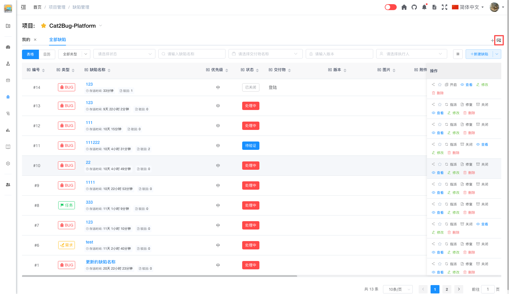
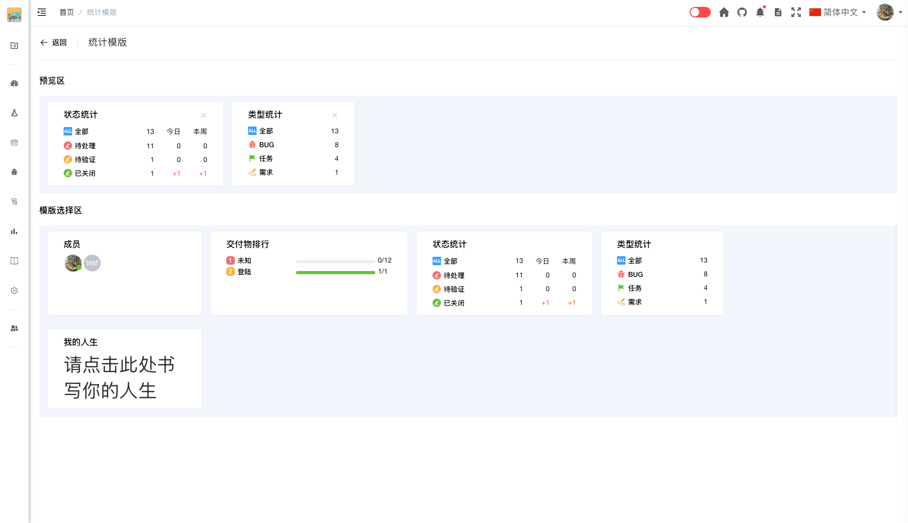
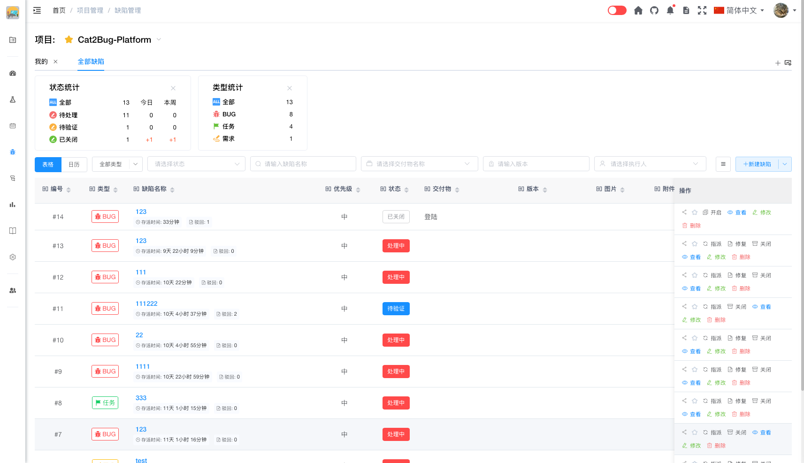

# 数据统计

系统提供了多种缺陷统计模版，帮助团队直观了解缺陷分布和趋势。

## 使用场景

- 查看缺陷整体情况
- 分析缺陷分布趋势
- 评估项目质量状况
- 生成统计报表

## 设置统计模版

### 1. 打开模版设置

点击缺陷列表右上角的【统计】图标，跳转到缺陷模版页面。

### 2. 选择统计模版

在模版页面中，分为【预览区】和【模版选择区】，点击【模版选择区】中的模块，会显示在【预览区】。

### 3. 调整显示顺序

在【预览区】可通过拖动操作调整模版显示顺序

### 4. 查看效果

设置完成后，无需保存，点击页面【返回】按钮返回缺陷列表页面，即可显示所有选择的统计数据模块。

## 统计模版类型

### 1. 成员

显示现有项目成员及是否在线。

**显示内容：**
- 成员头像和姓名
- 在线状态（在线/离线）
- 成员角色

**用途：** 了解团队成员在线情况，便于沟通协作

### 2. 交付物排行

统计每种交付物未处理和缺陷总数的排行。

**显示内容：**
- 交付物名称
- 未处理缺陷数量
- 缺陷总数
- 按数量排序

**用途：** 识别问题模块，重点关注和测试

### 3. 状态统计

按状态分类统计缺陷数量，支持多个时间维度。

**状态分类：**
- 全部 - 所有状态的缺陷
- 待处理 - 包含处理中、已驳回状态的缺陷
- 待验证 - 等待测试人员验证的缺陷
- 已关闭 - 包含已通过和手动关闭状态的缺陷

**时间维度：**
- 全部 - 统计所有时间的缺陷
- 今日 - 统计今天的缺陷
- 本周 - 统计本周的缺陷

**用途：** 了解缺陷处理进度和趋势

### 4. 类型统计

按缺陷类型统计缺陷总数。

**类型分类：**
- 全部
- BUG
- 任务
- 需求

**显示内容：**
- 各类型缺陷数量

**用途：** 分析缺陷类型分布，了解工作重点

### 5. 我的人生

自定义文字的励志板，用于个性化展示。

**功能：**
- 自定义显示文字
- 个性化励志语录
- 工作提醒

**用途：** 激励自己，个性化工作界面

::: tip 提示：
1. 统计数据实时更新，反映当前最新状态
2. 统计模版设置是个人配置，不影响其他成员
3. 建议根据角色选择合适的统计模版
4. 定期查看统计数据，及时发现问题
:::