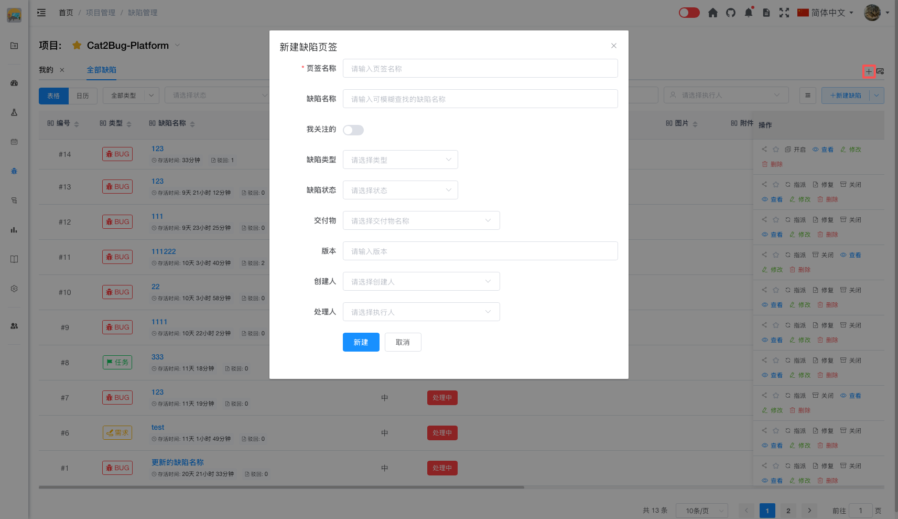

# 页标签

页标签用于查看筛选需要显示的缺陷列表，默认有「我的」和「全部缺陷」两个页标签，用户也可以根据自己需求自定义添加。

## 使用场景

- 快速切换不同的缺陷视图
- 自定义常用的筛选条件
- 提高缺陷查找效率
- 个性化工作界面

## 默认页标签

系统提供内置页标签（不可删除）：

- **我的** - 新建项目时自动创建的自定义页签，显示与我相关的缺陷（处理人 = 我），可手动删除
- **全部缺陷** - 显示项目中所有**未删除**的缺陷
- **已删除缺陷** - 显示项目中所有已软删除的缺陷；列表操作列仅提供「查看」与「恢复」

各内置页签带有区分图标；用户自定义页签使用统一图标。

## 自定义页标签

### 1. 点击添加按钮

点击缺陷页面最右侧的「+」按钮，打开添加页标签对话框。

### 2. 设置标签名称

输入页标签的名称，如：我关注的、我负责的、我待处理的、高优先级等。

### 3. 配置筛选条件

设置筛选条件，可以按以下维度筛选：

- **缺陷名称** - 按缺陷名称模糊筛选（必填）
- **我关注的** - 按我关注的筛选
- **缺陷类型** - 按缺陷类型筛选（BUG、任务、需求）
- **缺陷状态** - 按缺陷状态筛选（处理中、待验证、已驳回、已关闭）
- **交付物** - 按交付物筛选
- **版本** - 按版本号筛选
- **创建人** - 按创建人筛选
- **处理人** - 按处理人筛选
- **已删除** - 开关，默认关闭（仅显示未删除）；开启后该页签仅显示已软删除的缺陷，可与其他筛选条件组合

### 4. 保存标签

点击「新建」按钮保存页标签。

## 删除页标签

点击页标签右侧的删除图标，可以删除自定义的页标签。

::: tip 提示
内置页标签「全部缺陷」「已删除缺陷」不能删除；「我的」等自定义页签可删除
:::

## 常用页标签示例

### 我负责的

- 筛选条件：处理人 = 我

### 我待处理的

- 筛选条件：处理人 = 我 且 状态 = 处理中

### 高优先级缺陷

- 筛选条件：优先级 = 紧急 或 高

### 本周新增

- 筛选条件：创建时间 = 本周

### 待验证缺陷

- 筛选条件：状态 = 待验证

::: tip 提示：

1. 页标签的筛选条件会保存，下次打开时自动应用
2. 可以创建多个页标签，方便快速切换
3. 页标签是个人设置，不会影响其他成员
4. 建议根据工作习惯创建常用的页标签

:::