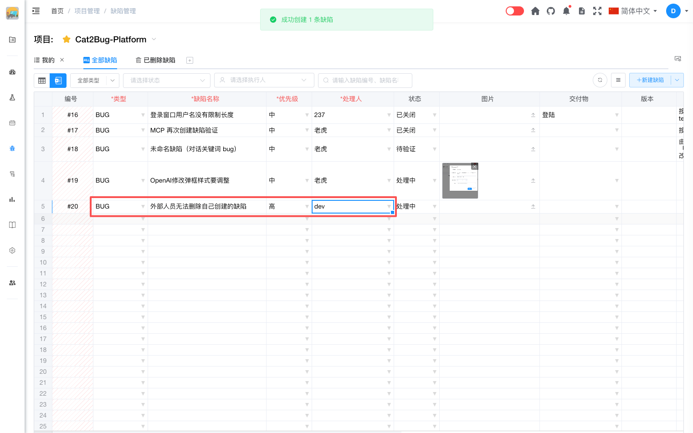

# 新建缺陷（Excel模式）

在 Excel 模式中，无需点击「新建缺陷」按钮打开对话框，可在表格底部的**空白行**直接录入。

## 操作步骤

1. 切换到 [Excel 模式](excel-mode-intro.md)，滚动到表格末尾的空白行。
2. 依次填写带 `*` 的**必填列**：
   - **类型**（BUG / 任务 / 需求）
   - **缺陷名称**
   - **优先级**
   - **处理人**
3. 当该行所有必填项均已填写后，系统会**自动创建**一条新缺陷；状态列可能短暂显示「创建排队中」「创建中…」，成功后分配编号并写入列表。

## 说明

- 仅填写部分必填项时不会提交，需补全后才会创建。
- 无新建权限时创建会失败并提示保存失败。
- 可选列（交付物、版本、描述等）可在创建后继续在同一行补充，修改会随单元格保存同步到服务器。
