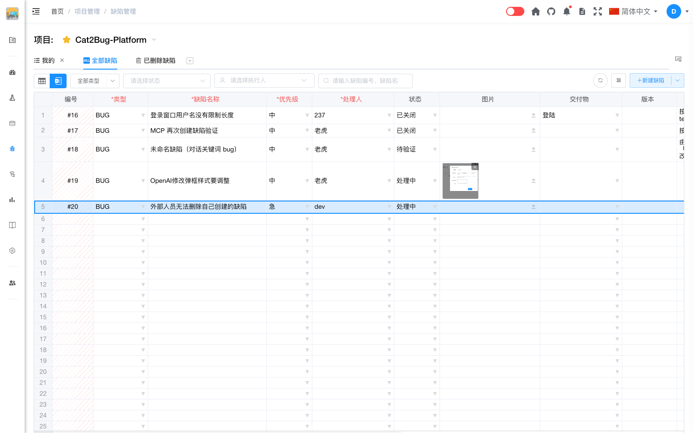

# 删除缺陷（Excel模式）

Excel 模式支持通过键盘快速删除缺陷，适合批量清理误录数据。

## 操作步骤

1. 在 Excel 模式中，用鼠标在表格**最左侧行号列**点选一行或多行（按住 Ctrl / Shift 可多选）。
2. 按键盘 **Del**（或 Backspace）键。
3. 在确认对话框中确认后，系统删除所选行中已保存的缺陷。

## 权限说明

- 拥有缺陷删除权限的用户可删除任意可删缺陷。
- 无删除权限时，仅可删除**自己创建**的缺陷；尝试删除他人缺陷会提示**无法删除**（无权限）。
- 仅选中尚未保存的空白占位行时，Del 键只会清除该行，不调用删除接口。

## 说明

- 删除为**软删除**，可在「已删除缺陷」页签中查看与恢复（与 Table 模式一致）。
- 已删除的缺陷不能在 Excel 表格中继续编辑。
