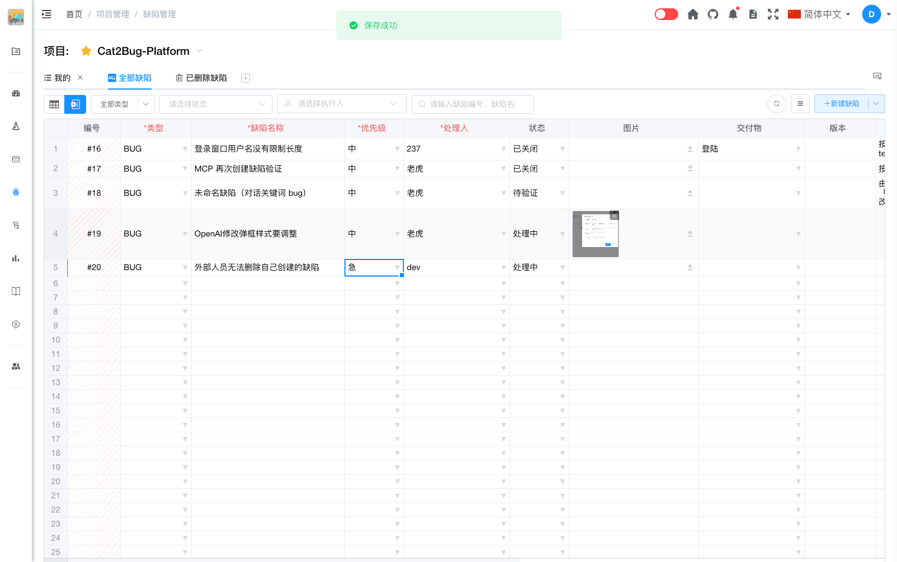

# 修改缺陷（Excel模式）

Excel 模式支持在表格中**直接修改**已有缺陷，无需打开详情或流程按钮。

## 操作步骤

1. 在 Excel 模式中找到要修改的缺陷行。
2. 单击目标单元格，像 Excel 一样编辑内容（类型、名称、优先级、处理人、描述等可编辑列）。
3. 编辑完成后移开焦点或切换到其他单元格，修改会**实时保存**到系统；成功时提示「保存成功」。

## 说明

- 已保存的缺陷（有编号）修改后立即调用更新接口同步。
- **已删除缺陷**行不可编辑，尝试修改会提示无法编辑。
- 部分列（如编号、创建人等）为只读，不可在表格中修改。
- 若需执行修复、驳回、通过等工作流操作，请切换到 [Table 模式](../table-mode/table-mode-intro.md)。
