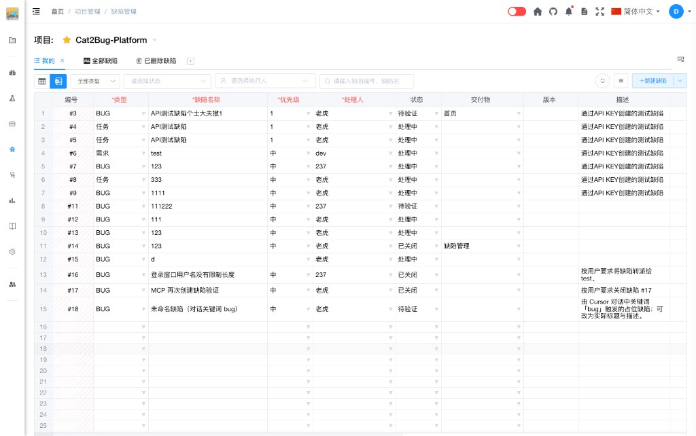

# Excel模式介绍

Excel 模式以电子表格形式展示、编辑缺陷数据，适合**习惯用 Excel 表格管理信息**的用户。

与 Table 模式不同，Excel 模式**不必按**「新建 → 修改 → 修复 → 驳回或通过」的严格工作流程维护缺陷，可直接在表格中**新建、修改、删除**，降低学习成本，便于快速录入与批量整理。

## 什么是 Excel 模式

在缺陷管理页面顶部工具栏，点击 Excel 图标即可切换到 Excel 模式。表头带红色 `*` 的列为**必填项**（类型、缺陷名称、优先级、处理人等），填写后即可保存或自动创建记录。

## 适用场景

- 熟悉 Excel 操作，希望像编辑表格一样维护缺陷
- 需要连续录入多条缺陷，减少弹窗与流程步骤
- 临时整理、批量修改字段，而不强调状态流转

## 功能指南

- [新建缺陷](defect-create.md) - 在空白行填写必填项后自动创建
- [修改缺陷](defect-edit.md) - 在单元格中直接编辑，实时保存
- [删除缺陷](defect-delete.md) - 选中行后按 Del 键删除

若需按标准工作流操作（指派、修复、驳回、通过等），请切换到 [Table 模式](../table-mode/table-mode-intro.md)。

## 键盘快捷键

通用说明见 [键盘快捷键](../../../../advanced/keyboard-shortcuts.md)。列表级动作（E/J/I/G/O、打开行详情）见 [缺陷管理](../../../defect.md#键盘快捷键)。

Excel 模式补充说明：

- 按住 **⌘/Ctrl** 时，可见行序号列显示动态字母，按字母打开该行详情
- **正在编辑单元格时**快捷键不拦截，按键用于输入；结束编辑后再使用 ⌘/Ctrl 浮层
- 选中行后按 **Del** 删除（见 [删除缺陷](defect-delete.md)）
