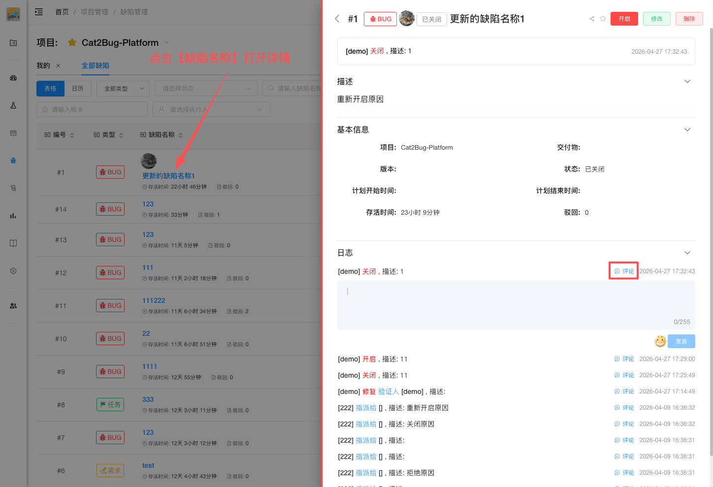

# 新建评论

在缺陷详情页面，可以对缺陷日志添加评论，用于记录讨论、补充说明或跟进进度。

## 使用场景

- 讨论解决方案
- 记录处理进度
- 回复其他成员的评论
- 提供额外的测试信息

## 操作步骤

### 1. 打开缺陷详情

在缺陷列表中点击「缺陷名称」或右侧「查看」按钮，进入缺陷详情页面。

### 2. 找到评论区

在缺陷详情页面下方找到「日志」区域。

### 3. 输入评论内容

在评论输入框中输入评论内容。

### 4. 提交评论

点击「发言」按钮提交评论。

## 评论功能

### 删除评论

点击自己评论右侧的「删除」按钮可以删除评论。

::: tip 提示
1. 只能编辑和删除自己的评论
2. 项目管理员可以删除任何评论
3. 评论会按时间顺序显示
4. 评论会记录在缺陷的操作历史中
:::

## 键盘快捷键

评论在**处理缺陷抽屉**内操作，无独立工具弹框。抽屉快捷键见 [Table模式介绍 - 处理缺陷抽屉](../table-mode-intro.md#处理缺陷抽屉)。
