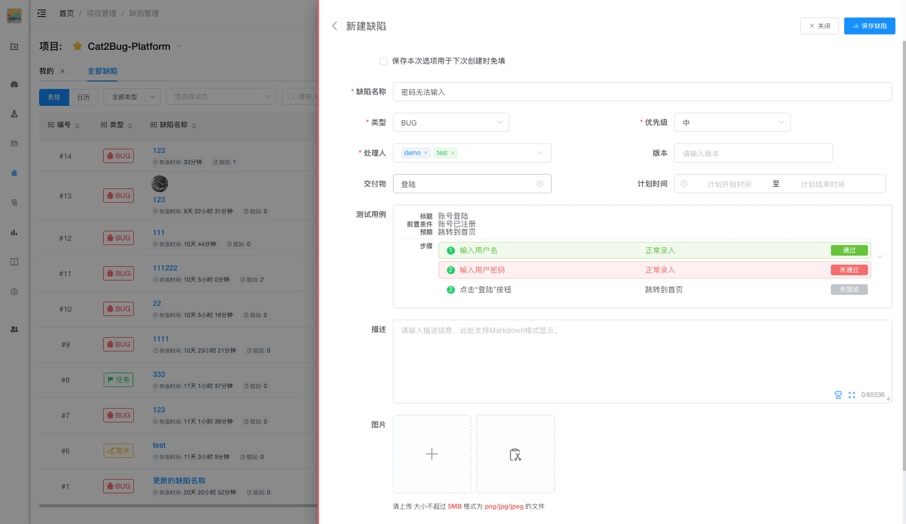

# 新建缺陷

在缺陷列表页面，点击「新建缺陷」按钮，从右侧弹出新建对话框，填写相关数据后点击「新建」按钮保存提交。



## 使用场景

- 测试过程中发现软件 BUG
- 记录产品需求
- 创建工作任务
- 记录待处理问题

## 操作步骤

### 1. 缺陷名称（必填）

输入缺陷的标题，简明扼要地描述问题。

### 2. 类型（必填）

选择缺陷类型：
- **BUG** - 软件缺陷
- **任务** - 工作任务
- **需求** - 产品需求

### 3. 优先级（必填）

选择缺陷优先级：
- **紧急** - 系统崩溃、数据丢失、安全漏洞
- **高** - 核心功能无法使用、严重影响用户体验
- **中** - 一般功能问题、可以绕过的问题
- **低** - UI 细节问题、优化建议

### 4. 处理人

选择负责处理的人员，可以选择多个处理人。

### 5. 版本

输入缺陷所属的版本号。

### 6. 交付物（必填）

选择缺陷所属的模块。

### 7. 计划时间

设置缺陷的计划开始时间和结束时间。

### 8. 测试用例

关联相关的测试用例，包括：
- **标题** - 测试用例标题
- **前置条件** - 测试前置条件
- **步骤** - 测试步骤，可以点击选择未通过的步骤

::: tip 提示
用例与交付物关联，如没有选择交付物，将无法显示可选择的用例；用例选择后，可「点击」选择任意步骤，代表在此步骤未通过测试。
:::

### 9. 描述

详细说明缺陷信息，支持 Markdown 格式。

**描述框功能按钮：**

- **AI 智能填充按钮**（机器人图标）- 根据描述内容自动填写其他属性（类型、优先级、交付物等），减少手动录入
- **最大化按钮** - 打开全功能描述编辑器
  - 左侧：Markdown 工具条和输入框
  - 右侧：实时渲染预览


**好的缺陷描述应包含：**
1. **问题现象** - 发生了什么
2. **重现步骤** - 如何重现问题
3. **预期结果** - 应该是什么样
4. **实际结果** - 实际是什么样
5. **环境信息** - 操作系统、浏览器版本等

**示例：**
```
1. 问题现象：在登录页面的用户名输入框中无法输入中文字符
2. 重现步骤：
   - 打开登录页面
   - 点击用户名输入框
   - 切换到中文输入法
   - 尝试输入中文
3. 预期结果：应该能够输入中文字符
4. 实际结果：无法输入任何中文字符
5. 环境：Windows 10, Chrome 120.0
```

### 10. 图片

上传缺陷相关的截图，支持的格式：
- 单个文件不超过 5MB
- 支持 png/jpg/jpeg 格式

### 11. 附件

上传缺陷相关的附件文件，支持的格式：
- 单个文件不超过 30MB
- 支持各种文件格式

### 12. 保存提交

点击右上角的「保存缺陷」按钮保存提交缺陷，此时缺陷状态为「处理中」。

## 批量录入免填小技巧

在新建缺陷界面中，勾选"保存本次选项用于下次创建时免填"可以保存当前选择的类型、优先级、处理人、交付物等信息，下次新建时自动填充，便于持续录入多条缺陷。
