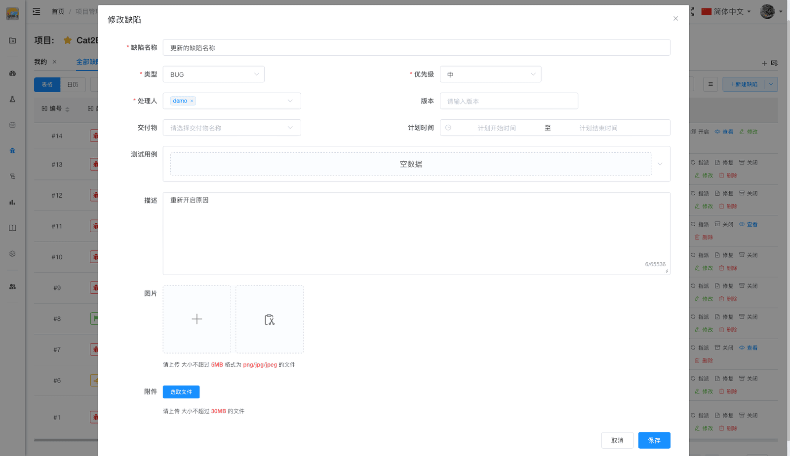
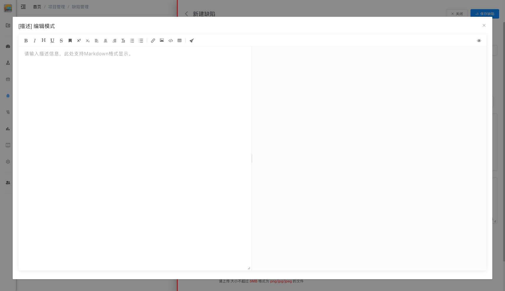

# 修改缺陷

在缺陷列表页面，点击缺陷右侧的「修改」按钮，从右侧弹出修改对话框，调整相关数据后点击「保存」按钮提交。

## 使用场景

- 补充或修正缺陷描述
- 调整缺陷优先级或类型
- 更改关联的交付物或测试用例
- 添加或删除附件和图片

## 操作步骤

### 1. 打开修改界面

在缺陷列表中，点击需要修改的缺陷右侧的「修改」按钮，从右侧弹出修改对话框。

### 2. 缺陷名称

修改缺陷的标题，简明扼要地描述问题。

### 3. 类型

修改缺陷类型：
- **BUG** - 软件缺陷
- **任务** - 工作任务
- **需求** - 产品需求

### 4. 优先级

修改缺陷优先级：
- **急** - 系统崩溃、数据丢失、安全漏洞
- **高** - 核心功能无法使用、严重影响用户体验
- **中** - 一般功能问题、可以绕过的问题
- **低** - UI 细节问题、优化建议

### 5. 处理人

修改负责处理的人员，可以选择多个处理人。

### 6. 版本

修改缺陷所属的版本号。

### 7. 交付物

修改缺陷所属的模块。

### 8. 计划时间

修改缺陷的计划开始时间和结束时间。

### 9. 测试用例

从测试用例列表中选择指定用例。

::: tip 提示
用例与交付物关联，如没有选择交付物，将无法显示可选择的用例。
:::

### 10. 描述

修改缺陷的详细说明，支持 Markdown 格式。

**描述框功能按钮：**

- **AI 智能填充按钮**（机器人图标）- 根据描述内容自动填写其他属性（类型、优先级、交付物等），减少手动录入
- **最大化按钮** - 打开全功能描述编辑器
  - 左侧：Markdown 工具条和输入框
  - 右侧：实时渲染预览

### 11. 图片

修改缺陷相关的截图，支持的格式：
- 单个文件不超过 5MB
- 支持 png/jpg/jpeg 格式

### 12. 附件

修改缺陷相关的附件文件，支持的格式：
- 单个文件不超过 30MB
- 支持各种文件格式

### 13. 保存修改

点击右上角的「保存缺陷」按钮保存提交修改。

::: tip 提示
1. 只有缺陷创建人、测试人员、项目管理员有修改权限
2. 修改缺陷会记录在操作历史中
3. 重大修改建议在评论中说明原因
4. 修改处理人时建议通知相关人员
:::
