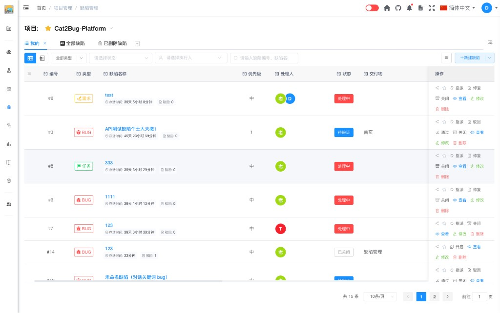
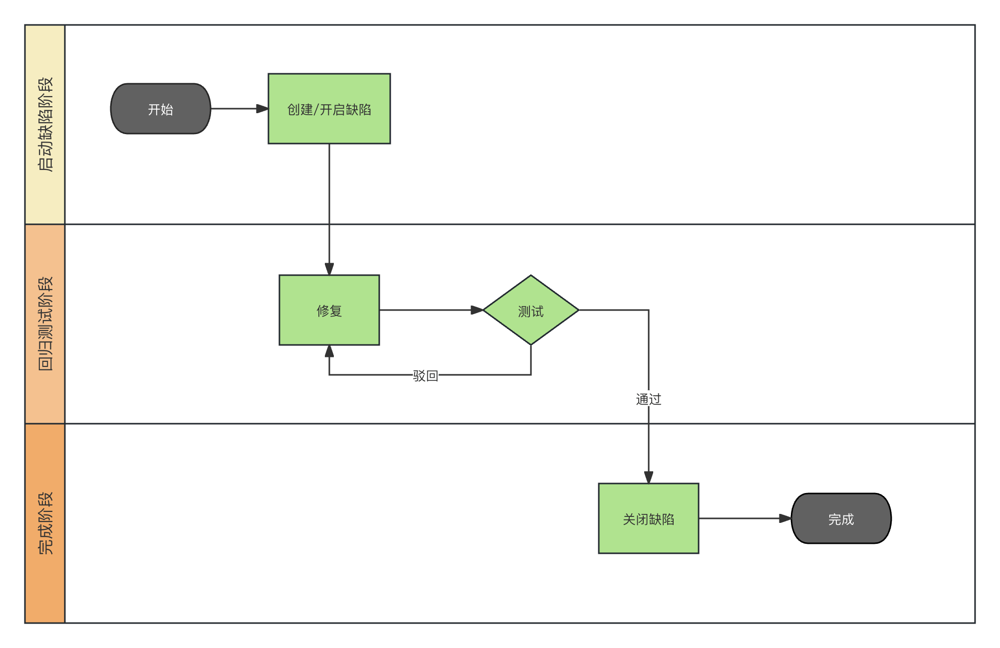

# Table模式介绍

Table 模式是 Cat2Bug 中管理 Bug 的**主要模式**。缺陷列表以表格形式展示，支持查询、排序、自定义列，并在列表或详情中完成缺陷的全生命周期操作。

## 什么是 Table 模式

在缺陷管理页面顶部工具栏，点击表格图标即可切换到 Table 模式（默认即为该模式）。与 Excel 模式相比，Table 模式强调**按标准工作流程**逐条管理缺陷，适合日常测试与开发协作。

## 表格操作

### 列固定与排序

- **固定列**：点击表头每列标题左侧的图钉图标，可将该列固定到表格左侧；再次点击可取消固定。
- **调整列顺序**：按住列标题拖动，可改变列在表格中的左右顺序。列宽与顺序会按项目保存在本地，下次进入仍生效。

### 显示/隐藏列

点击表格右上角 **列选项**（显示字段）按钮，在弹出面板中勾选或取消勾选字段，即可显示或隐藏表格中的对应列。

### 交付物列表与筛选

- **显示/隐藏交付物列表**：点击表格最左上角图标，可展开或收起左侧交付物列表。
- **按交付物筛选**：在交付物列表中点击某一交付物（或其子节点），右侧缺陷表格仅显示关联该交付物的缺陷；再次点击可取消筛选。

## 缺陷生命周期与工作流程

Table 模式下，缺陷须按 **新建 → 修改 → 修复 → 驳回或通过** 推进，并与下列状态一一对应。整体流转如下图所示：

| 操作 | 说明 | 缺陷状态 |
|------|------|----------|
| **新建** | 测试人员或相关人员创建缺陷；也可通过**开启**重新打开已关闭缺陷 | **处理中** |
| **修改** | 标题、描述、优先级等信息有误或需补充时更新 | 保持当前状态 |
| **指派** | 更改处理人，便于协作分工 | 保持当前状态 |
| **修复** | 开发人员完成修复并提交 | **待验证** |
| **驳回** | 测试人员验证未通过 | **已驳回**（通常回到处理中继续修复） |
| **通过** | 测试人员验证通过 | **已关闭** |
| **关闭** | 手动关闭，无需再验证 | **已关闭** |

**状态说明：**

- **处理中** - 新建或开启后，等待开发人员修复
- **待验证** - 已修复，等待测试人员验证
- **已驳回** - 验证未通过，需继续处理
- **已关闭** - 验证通过或手动关闭

此外可使用 **删除**、**新建评论** 等辅助操作。各步骤的详细说明见下方 [功能指南](#功能指南)。

## 功能指南

- [新建缺陷](defect-create.md) - 创建新的缺陷记录
- [修改缺陷](defect-edit.md) - 修改缺陷信息
- [指派缺陷](defect-assign.md) - 更改缺陷处理人
- [修复缺陷](defect-repair.md) - 开发人员提交修复
- [驳回缺陷](defect-reject.md) - 测试人员驳回修复
- [通过缺陷](defect-pass.md) - 测试人员验证通过
- [开启缺陷](defect-reopen.md) - 重新开启已关闭的缺陷
- [关闭缺陷](defect-close.md) - 关闭缺陷
- [删除缺陷](defect-delete.md) - 删除缺陷记录
- [新建评论](defect-comment.md) - 对缺陷添加评论和讨论

## 何时使用 Table 模式

- 需要按流程跟踪单条缺陷的状态变化
- 需要查看存活时间、驳回次数等列表统计信息
- 需要在列表中快速筛选、排序并执行操作

若需类似电子表格的批量浏览与编辑，可切换到 [Excel模式介绍](../excel-mode/excel-mode-intro.md)。

## 键盘快捷键

通用说明见 [键盘快捷键](../../../../advanced/keyboard-shortcuts.md)。缺陷列表操作见 [缺陷管理](../../../defect.md#键盘快捷键)。

### 处理缺陷抽屉

打开缺陷详情（处理抽屉）后，按住 **⌘/Ctrl**：

- 右上角工具按钮（指派、修复、驳回、通过等）显示字母，以界面为准
- 风琴分组标题可能显示数字，用于跳转到视口内可见分组
- **⌘/Ctrl + ↑/↓** 滚动抽屉内容区

### 工具弹框（指派、修复、驳回等）

Table 模式下各工作流弹框通用：

| 操作 | 按键 |
|------|------|
| 提交 | ⌘/Ctrl + Enter |
| 关闭 | Esc（未保存时确认） |
| 跳转字段 | 按住 ⌘/Ctrl，按字段右下角字母 |

各操作步骤文档（[指派](defect-assign.md)、[修复](defect-repair.md) 等）均适用上述规则。
