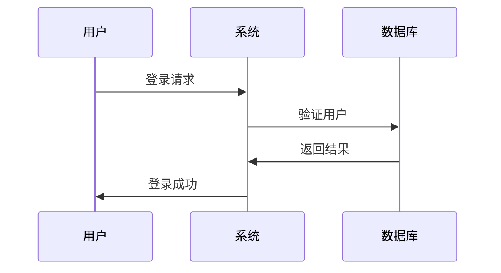

# 创建文档

在线创建 Markdown 格式的文档，无需上传文件。

## 使用场景

- 编写项目文档
- 记录会议纪要
- 编写技术文档
- 创建知识库文章

## 操作步骤

### 1. 点击新建按钮

在文档列表页面，点击【新建文档】按钮。


### 2. 选择文档类型

选择【Markdown 文档】。

### 3. 填写文档标题

输入文档的标题。

**命名建议：**
- 使用清晰的名称
- 包含文档主题
- 便于后续查找

**示例：**
- ✅ 用户管理模块接口文档
- ✅ 2024年第一季度测试总结
- ✅ 项目部署指南
- ❌ 文档1
- ❌ 新建文档
- ❌ untitled

### 4. 编写文档内容

使用 Markdown 编辑器编写文档内容。

#### Markdown 编辑器功能

**工具栏：**
- **标题** - 插入标题（H1-H6）
- **粗体** - 加粗文本
- **斜体** - 倾斜文本
- **引用** - 插入引用块
- **代码** - 插入代码块
- **链接** - 插入链接
- **图片** - 插入图片
- **列表** - 插入有序/无序列表
- **表格** - 插入表格

**快捷键：**
- `Ctrl/Cmd + B` - 粗体
- `Ctrl/Cmd + I` - 斜体
- `Ctrl/Cmd + K` - 插入链接
- `Ctrl/Cmd + Shift + C` - 插入代码块
- `Ctrl/Cmd + S` - 保存文档

**实时预览：**
- 左侧编辑区
- 右侧预览区
- 同步滚动
- 实时渲染

#### Markdown 语法支持

**标题：**
```markdown
# 一级标题
## 二级标题
### 三级标题
```

**文本样式：**
```markdown
**粗体文本**
*斜体文本*
~~删除线~~
`行内代码`
```

**列表：**
```markdown
- 无序列表项 1
- 无序列表项 2

1. 有序列表项 1
2. 有序列表项 2
```

**链接和图片：**
```markdown
[链接文本](链接地址)

```

**表格：**
```markdown
| 表头1 | 表头2 | 表头3 |
|-------|-------|-------|
| 内容1 | 内容2 | 内容3 |
```

**代码块：**
````markdown
```javascript
function hello() {
  console.log('Hello World');
}
```
````

**引用：**
```markdown
> 这是一段引用文本
```

**分隔线：**
```markdown
---
```

### 5. 插入图片

可以通过多种方式插入图片。

#### 上传图片

1. 点击工具栏的【图片】按钮
2. 选择【上传图片】
3. 选择本地图片文件
4. 系统自动上传并插入图片链接

#### 粘贴图片

1. 复制图片到剪贴板
2. 在编辑器中按 `Ctrl/Cmd + V` 粘贴
3. 系统自动上传并插入图片链接

#### 引用图片链接

1. 点击工具栏的【图片】按钮
2. 选择【图片链接】
3. 输入图片 URL
4. 点击【确定】插入

### 6. 设置文档信息

填写文档的其他信息。

#### 文档类型

选择文档的类型：
- 需求文档
- 设计文档
- 测试文档
- 会议纪要
- 技术文档
- 其他文档

#### 文档标签

为文档添加标签，便于分类和检索。

#### 文档描述

输入文档的简要描述。

### 7. 保存文档

点击【保存】按钮完成创建。

**保存选项：**
- **保存** - 保存文档并继续编辑
- **保存并关闭** - 保存文档并返回列表
- **保存为草稿** - 保存为草稿状态

## Markdown 高级功能

### 任务列表

```markdown
- [x] 已完成的任务
- [ ] 未完成的任务
```

### 表情符号

```markdown
:smile: :heart: :thumbsup:
```

### 脚注

```markdown
这是一段文本[^1]

[^1]: 这是脚注内容
```

### 数学公式

```markdown
行内公式：$E=mc^2$

块级公式：
$$
\sum_{i=1}^{n} i = \frac{n(n+1)}{2}
$$
```

### 流程图

````markdown

````

### 时序图

````markdown

````

## 文档模板

系统提供了多种文档模板，可以快速创建标准化的文档。

### 需求文档模板

```markdown
# 需求文档

## 1. 需求概述
- 需求背景
- 需求目标
- 需求范围

## 2. 功能需求
### 2.1 功能点1
- 功能描述
- 用户场景
- 验收标准

## 3. 非功能需求
- 性能要求
- 安全要求
- 兼容性要求

## 4. 约束条件
- 技术约束
- 时间约束
- 资源约束
```

### 会议纪要模板

```markdown
# 会议纪要

**会议时间：** 2024-01-15 14:00-15:00
**会议地点：** 会议室A
**参会人员：** 张三、李四、王五
**记录人：** 张三

## 会议议题
1. 议题1
2. 议题2

## 讨论内容
### 议题1
- 讨论要点
- 决策结果

## 待办事项
- [ ] 任务1 - 负责人：张三 - 截止日期：2024-01-20
- [ ] 任务2 - 负责人：李四 - 截止日期：2024-01-25
```

### 技术文档模板

```markdown
# 技术文档

## 1. 概述
- 功能简介
- 技术架构

## 2. 接口说明
### 2.1 接口1
- 接口地址
- 请求方式
- 请求参数
- 响应参数
- 示例代码

## 3. 部署说明
- 环境要求
- 部署步骤
- 配置说明

## 4. 常见问题
- 问题1及解决方案
- 问题2及解决方案
```

## 自动保存

编辑器支持自动保存功能，防止内容丢失。

**自动保存规则：**
- 每 30 秒自动保存一次
- 内容有变化时才保存
- 保存为草稿状态
- 页面右上角显示保存状态

**保存状态提示：**
- "已保存" - 内容已保存
- "保存中..." - 正在保存
- "未保存" - 有未保存的更改

## 导出功能

创建的 Markdown 文档可以导出为多种格式。

**支持的导出格式：**
- **Markdown** - 原始 Markdown 文件
- **HTML** - 网页格式
- **PDF** - PDF 文档
- **Word** - Word 文档

**导出步骤：**
1. 点击【导出】按钮
2. 选择导出格式
3. 等待生成完成
4. 下载导出文件

::: tip 提示
1. Markdown 编辑器支持实时预览
2. 支持快捷键操作，提高编辑效率
3. 图片可以通过上传或粘贴方式插入
4. 编辑器会自动保存，防止内容丢失
5. 可以使用文档模板快速创建标准化文档
:::
