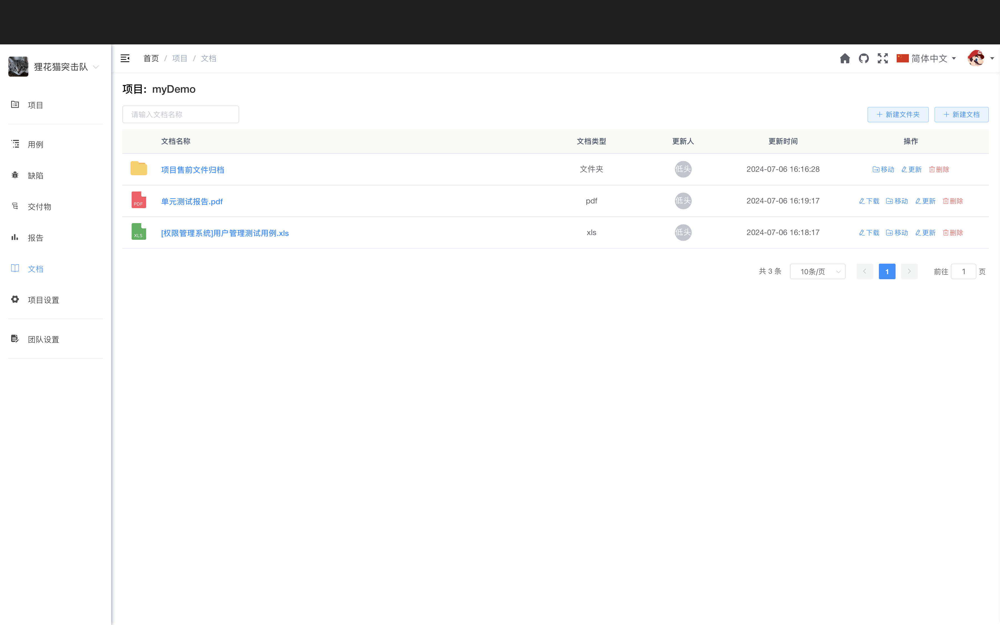

# 删除文档

删除不再需要的文档。

## 使用场景

- 删除过期的文档
- 清理测试文档
- 删除重复的文档
- 删除错误上传的文档

## 操作步骤

### 单个删除

#### 1. 找到要删除的文档

在文档列表中找到要删除的文档。

#### 2. 点击删除按钮

点击文档右侧的【删除】按钮。

#### 3. 确认删除

在弹出的确认对话框中，确认删除操作。

**确认信息：**
- 显示文档名称
- 提示删除不可恢复
- 提示历史版本一并删除

#### 4. 完成删除

系统删除文档并刷新列表。

### 批量删除

#### 1. 选择文档

在文档列表中勾选要删除的多个文档。

#### 2. 点击批量删除

点击列表上方的【批量删除】按钮。

#### 3. 确认删除

在弹出的确认对话框中，确认删除操作。

**确认信息：**
- 显示选中的文档数量
- 列出文档名称
- 提示删除不可恢复

#### 4. 完成删除

系统批量删除文档并刷新列表。

**删除结果：**
- 成功删除的数量
- 失败的数量和原因
- 跳过的数量和原因

## 删除影响

删除文档会导致：

- ❌ 文档内容永久删除，无法恢复
- ❌ 文档的所有历史版本一并删除
- ❌ 文档的评论一并删除
- ❌ 文档的分享链接失效
- ❌ 文档的下载记录删除

**不会影响：**
- ✅ 其他文档
- ✅ 测试用例数据
- ✅ 缺陷数据
- ✅ 项目其他数据

## 删除前的考虑

### 是否需要归档

在删除前考虑是否需要归档保存。

**建议归档的文档：**
- 重要的需求文档
- 正式的设计文档
- 已发布的测试报告
- 重要的会议纪要
- 关键的技术文档

**归档方式：**
1. 下载文档到本地
2. 保存到云盘或文档系统
3. 记录文档的关键信息
4. 然后再删除系统中的文档

### 是否有人需要

确认是否有其他成员需要该文档。

**检查方式：**
- 查看文档的查看记录
- 查看文档的下载记录
- 查看文档的评论
- 询问团队成员

### 是否有关联

确认文档是否被其他地方引用。

**检查关联：**
- 是否在其他文档中被引用
- 是否在测试用例中被引用
- 是否在缺陷中被引用
- 是否在评论中被引用

## 删除权限

只有以下角色有删除权限：

### 可以删除的角色

- **项目创建人** - 可以删除所有文档
- **项目管理员** - 可以删除所有文档
- **文档创建人** - 可以删除自己创建的文档

### 权限限制

- 普通成员不能删除他人创建的文档
- 外部人员不能删除文档
- 删除操作会记录操作日志

## 删除记录

系统会记录文档的删除操作。

### 查看删除记录

1. 进入项目设置
2. 选择【操作日志】
3. 筛选删除操作
4. 查看删除记录

**记录内容：**
- 删除时间
- 删除人
- 被删除的文档名称
- 文档类型
- 文件大小
- 删除原因（如填写）

## 误删恢复

文档删除后无法直接恢复，但可以尝试以下方式。

### 从备份恢复

如果系统有定期备份：

1. 联系系统管理员
2. 说明需要恢复的文档
3. 提供文档的创建时间和名称
4. 从备份中恢复数据

**恢复条件：**
- 系统有定期备份
- 备份中包含该文档
- 删除时间在备份时间之后

### 从本地恢复

如果之前下载过文档：

1. 找到本地保存的文档文件
2. 重新上传到系统
3. 填写文档信息
4. 恢复文档内容

**注意事项：**
- 历史版本无法恢复
- 评论无法恢复
- 需要重新填写文档信息

### 从其他成员获取

如果其他成员下载过文档：

1. 询问团队成员
2. 获取文档副本
3. 重新上传到系统
4. 恢复文档内容

## 批量删除规则

批量删除时的处理规则：

### 删除条件

- 只删除有权限删除的文档
- 跳过没有权限的文档
- 显示删除结果统计

### 删除结果

**成功删除：**
- 显示成功删除的数量
- 列出成功删除的文档名称

**删除失败：**
- 显示失败的数量
- 列出失败的文档名称
- 说明失败原因（如权限不足）

**跳过删除：**
- 显示跳过的数量
- 列出跳过的文档名称
- 说明跳过原因

## 最佳实践

### 删除前确认

1. **确认文档不再需要**
   - 检查文档的使用情况
   - 询问团队成员意见
   - 确认没有依赖关系

2. **下载备份**
   - 重要文档先下载
   - 保存到安全位置
   - 记录文档信息

3. **填写删除原因**
   - 说明删除原因
   - 便于后续追溯
   - 避免误删

### 定期清理

1. **清理过期文档**
   - 删除过期的文档
   - 删除重复的文档
   - 删除测试文档

2. **归档重要文档**
   - 下载重要文档
   - 保存到文档系统
   - 删除系统中的副本

3. **保持列表清爽**
   - 定期整理文档列表
   - 删除不需要的文档
   - 提高查找效率

### 删除后处理

1. **通知相关人员**
   - 通知文档使用者
   - 说明删除原因
   - 提供替代方案（如有）

2. **更新关联内容**
   - 更新引用该文档的地方
   - 删除失效的链接
   - 避免死链接

3. **记录删除信息**
   - 记录删除的文档信息
   - 记录删除原因
   - 便于后续查询

## 替代方案

如果不确定是否要删除文档，可以考虑以下替代方案：

### 归档文档

将文档标记为归档状态，而不是删除：

1. 修改文档标签，添加"归档"标签
2. 修改文档描述，说明归档原因
3. 文档仍然保留在系统中
4. 可以通过筛选查看归档文档

### 移动文档

将文档移动到其他项目或文件夹：

1. 下载文档
2. 在目标位置上传文档
3. 删除原位置的文档

### 设置权限

限制文档的访问权限，而不是删除：

1. 修改文档权限
2. 只允许特定人员访问
3. 文档仍然保留
4. 需要时可以恢复权限

::: tip 提示
1. 删除操作不可恢复，请谨慎操作
2. 重要文档建议先下载备份再删除
3. 批量删除时会跳过没有权限的文档
4. 删除操作会记录在操作日志中
5. 如果不确定是否删除，可以考虑归档或限制权限
:::
