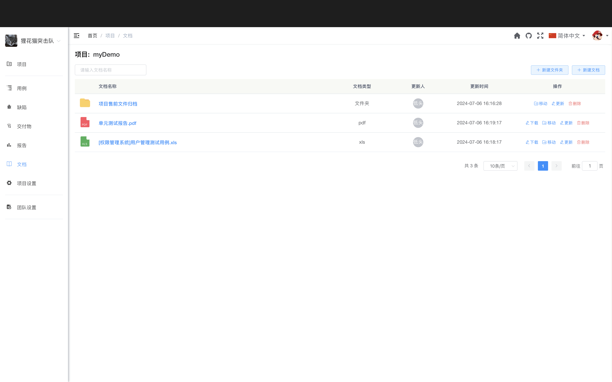

# 文档列表

文档列表展示了项目中的所有文档，支持多种查看和操作方式。

## 使用场景

- 查看项目文档
- 搜索特定文档
- 下载文档到本地
- 管理文档分类

## 列表展示

文档列表支持两种展示方式：列表视图和卡片视图。

### 列表视图

以表格形式展示文档信息。

**列表信息：**
- **文档名称** - 文档的标题
- **文档类型** - 需求文档、设计文档、测试文档等
- **文件大小** - 文档的大小
- **创建人** - 文档上传者
- **创建时间** - 文档上传时间
- **操作按钮** - 查看、下载、编辑、删除等操作

**优点：**
- 信息展示完整
- 便于排序和筛选
- 适合查找特定文档

### 卡片视图

以卡片形式展示文档信息。

**卡片信息：**
- 文档缩略图或图标
- 文档名称
- 文档类型
- 创建时间
- 操作按钮

**优点：**
- 视觉效果好
- 便于浏览
- 适合查看文档概览

### 切换视图

点击列表右上角的视图切换按钮，可以在列表视图和卡片视图之间切换。

## 筛选功能

通过筛选条件快速找到需要的文档。

### 按文档类型筛选

- **需求文档** - 产品需求、功能需求
- **设计文档** - 架构设计、详细设计
- **测试文档** - 测试方案、测试报告
- **会议纪要** - 会议记录、决策记录
- **技术文档** - API 文档、部署文档
- **其他文档** - 其他类型的文档

### 按创建人筛选

选择创建人，查看指定成员上传的文档。

### 按时间筛选

- **今天** - 今天上传的文档
- **本周** - 本周上传的文档
- **本月** - 本月上传的文档
- **自定义时间** - 指定时间范围

### 按标签筛选

选择标签，查看带有指定标签的文档。

**常用标签：**
- 版本标签：v1.0, v2.0
- 状态标签：草稿, 待审核, 已发布
- 优先级标签：重要, 紧急
- 模块标签：用户模块, 订单模块

## 搜索功能

在搜索框中输入关键字，快速搜索文档。

**搜索范围：**
- 文档标题
- 文档描述
- 文档内容（支持全文搜索）

**搜索特点：**
- 支持模糊匹配
- 实时搜索
- 高亮显示匹配内容
- 搜索结果排序

## 排序功能

点击列表表头，可以按不同字段排序。

**支持的排序字段：**
- **文档名称** - 按名称字母顺序排序
- **创建时间** - 按上传时间排序
- **更新时间** - 按最后修改时间排序
- **文件大小** - 按文件大小排序

**排序方式：**
- **升序** - 从小到大、从旧到新、A-Z
- **降序** - 从大到小、从新到旧、Z-A

## 批量操作

选中多个文档，进行批量操作。

### 批量下载

1. 勾选要下载的多个文档
2. 点击【批量下载】按钮
3. 系统将文档打包成 ZIP 文件
4. 下载 ZIP 文件到本地

**打包规则：**
- 保留原文件名
- 保留文件夹结构（如有）
- 自动命名为：文档_{日期}.zip

### 批量删除

1. 勾选要删除的多个文档
2. 点击【批量删除】按钮
3. 确认删除操作
4. 系统删除选中的文档

**删除规则：**
- 只删除有权限删除的文档
- 跳过没有权限的文档
- 显示删除结果统计

### 批量修改标签

1. 勾选要修改的多个文档
2. 点击【批量修改】按钮
3. 选择【修改标签】
4. 添加或删除标签
5. 点击【确定】完成修改

## 快速操作

### 快速预览

点击文档名称，快速打开文档预览。

**支持预览的格式：**
- PDF 文档
- 图片文件（JPG、PNG、GIF）
- Markdown 文档
- 文本文件（TXT）
- Office 文档（需要配置在线预览服务）

### 快速下载

点击文档右侧的【下载】按钮，快速下载文档到本地。

### 快速分享

点击文档右侧的【分享】按钮，生成分享链接。

## 文档统计

列表顶部显示文档的统计信息：

- **文档总数** - 项目中的文档总数
- **总大小** - 所有文档的总大小
- **本周新增** - 本周新增的文档数量
- **本月新增** - 本月新增的文档数量

## 文档分组

可以按不同维度对文档进行分组展示。

### 按类型分组

将文档按类型分组显示：
- 需求文档组
- 设计文档组
- 测试文档组
- 其他文档组

### 按创建人分组

将文档按创建人分组显示：
- 张三的文档
- 李四的文档
- 王五的文档

### 按时间分组

将文档按时间分组显示：
- 今天
- 昨天
- 本周
- 本月
- 更早

::: tip 提示
1. 列表视图和卡片视图可以随时切换
2. 筛选和搜索可以组合使用
3. 批量操作前请确认选中的文档
4. 全文搜索可能需要一些时间
5. 建议使用标签来组织和管理文档
:::
