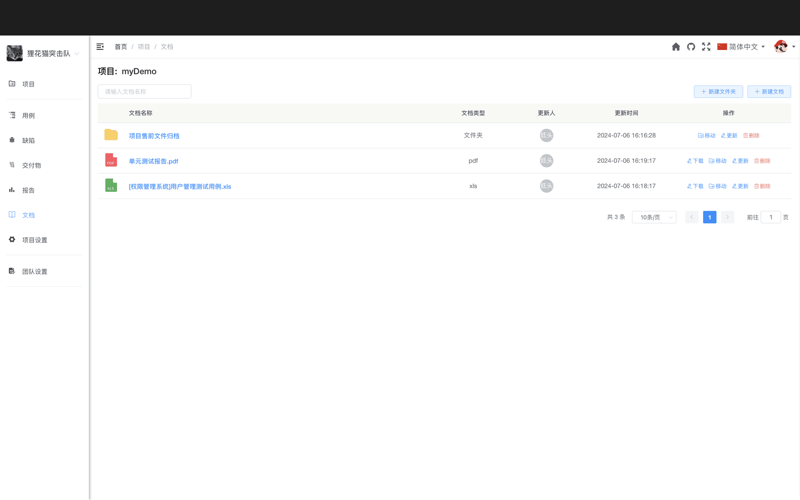

# 上传文档

上传文档文件到项目中，便于团队成员查阅和管理。

## 使用场景

- 上传需求文档
- 上传设计文档
- 上传测试方案
- 上传会议纪要
- 上传技术文档

## 操作步骤

### 1. 点击上传按钮

在文档列表页面，点击「上传文档」按钮。

### 2. 选择文件

点击「选择文件」按钮，或将文件拖拽到上传区域。

**支持的上传方式：**
- 点击选择文件
- 拖拽文件到上传区域
- 批量选择多个文件

### 3. 填写文档信息

为上传的文档填写相关信息。

#### 文档标题（必填）

输入文档的标题。

**命名建议：**
- 使用清晰的名称
- 包含文档类型
- 包含版本号（如有）
- 包含日期（如需要）

**示例：**
- ✅ 用户管理模块需求文档_v1.0
- ✅ 系统架构设计_v2.0_20240101
- ✅ 测试报告_第一轮_20240120
- ❌ 文档1
- ❌ 需求
- ❌ test

#### 文档描述

输入文档的详细描述。

**描述内容建议：**
- 文档的主要内容
- 文档的适用范围
- 文档的版本说明
- 文档的更新记录

#### 文档类型（必填）

选择文档的类型。

**文档类型：**
- **需求文档** - 产品需求、功能需求
- **设计文档** - 架构设计、详细设计
- **测试文档** - 测试方案、测试报告
- **会议纪要** - 会议记录、决策记录
- **技术文档** - API 文档、部署文档
- **其他文档** - 其他类型的文档

#### 文档标签

为文档添加标签，便于分类和检索。

**标签使用建议：**
- 使用简短的关键词
- 一个文档可以有多个标签
- 使用统一的标签命名规范
- 选择已有标签或创建新标签

**示例标签：**
- 版本标签：v1.0, v2.0
- 状态标签：草稿, 待审核, 已发布
- 优先级标签：重要, 紧急
- 模块标签：用户模块, 订单模块

### 4. 确认上传

点击「确定」按钮开始上传。

**上传过程：**
- 显示上传进度
- 支持取消上传
- 上传完成后自动跳转到文档列表

## 支持的文件格式

### 文档类

- **Word** - .doc, .docx
- **PDF** - .pdf
- **Excel** - .xls, .xlsx
- **PowerPoint** - .ppt, .pptx

### 文本类

- **文本文件** - .txt
- **Markdown** - .md

### 图片类

- **JPEG** - .jpg, .jpeg
- **PNG** - .png
- **GIF** - .gif
- **BMP** - .bmp

### 压缩包

- **ZIP** - .zip
- **RAR** - .rar
- **7Z** - .7z

### 其他

根据系统配置支持更多格式。

## 文件大小限制

**默认限制：** 单个文件最大 500MB

**超出限制的处理：**
- 系统会提示文件过大
- 建议压缩文件后上传
- 或联系系统管理员调整限制

## 批量上传

### 批量上传文件

可以一次选择多个文件进行上传。

**批量上传步骤：**

1. 点击「上传文档」按钮
2. 选择多个文件（按住 Ctrl/Cmd 多选）
3. 为每个文件填写信息
4. 点击「确定」开始批量上传

**批量上传特点：**
- 支持同时上传多个文件
- 每个文件独立填写信息
- 显示总体上传进度
- 支持取消单个文件上传

### 上传压缩包

可以将多个文件打包成 ZIP 文件上传。

**上传压缩包步骤：**

1. 将多个文件打包成 ZIP 文件
2. 上传 ZIP 文件
3. 选择「自动解压」选项
4. 系统自动解压并创建多个文档

**自动解压规则：**
- 保留文件夹结构
- 自动识别文件类型
- 文件名作为文档标题
- 可以批量设置文档类型和标签

## 上传失败处理

### 常见失败原因

**1. 文件格式不支持**
- 原因：上传的文件格式不在支持列表中
- 解决：转换为支持的格式后上传

**2. 文件过大**
- 原因：文件大小超过系统限制
- 解决：压缩文件或联系管理员

**3. 网络问题**
- 原因：网络中断导致上传失败
- 解决：检查网络连接，重新上传

**4. 存储空间不足**
- 原因：项目存储空间已满
- 解决：删除不需要的文档或联系管理员

### 重试上传

如果上传失败，可以重试：

1. 关闭失败提示
2. 再次点击「上传文档」按钮
3. 重新选择文件
4. 重新填写信息
5. 点击「确定」上传

## 上传后操作

### 查看文档

上传完成后，可以在文档列表中查看上传的文档。

### 编辑信息

如果发现信息填写有误，可以编辑文档信息：

1. 找到上传的文档
2. 点击「编辑」按钮
3. 修改文档信息
4. 点击「保存」

### 分享文档

上传后可以立即分享文档：

1. 找到上传的文档
2. 点击「分享」按钮
3. 生成分享链接
4. 复制链接分享给他人

## 最佳实践

### 上传前准备

1. **整理文件**
   - 检查文件内容是否完整
   - 确认文件格式是否支持
   - 检查文件大小是否合适

2. **规划命名**
   - 使用统一的命名规范
   - 包含必要的版本信息
   - 便于后续查找和管理

3. **准备描述**
   - 提前准备文档描述
   - 说明文档的用途和范围
   - 记录重要的更新信息

### 上传时注意

1. **填写完整信息**
   - 填写准确的文档标题
   - 选择正确的文档类型
   - 添加合适的标签

2. **检查上传进度**
   - 等待上传完成
   - 不要关闭页面
   - 确认上传成功

3. **验证上传结果**
   - 检查文档是否正常显示
   - 验证文档内容是否完整
   - 确认文档信息是否正确

### 上传后管理

1. **及时分享**
   - 上传后及时通知相关人员
   - 分享文档链接
   - 说明文档用途

2. **定期更新**
   - 文档有更新时及时上传新版本
   - 标注版本号
   - 说明更新内容

3. **清理旧版本**
   - 定期清理过期文档
   - 归档历史版本
   - 保持文档列表整洁

::: tip 提示
1. 单个文件最大 500MB，超出请压缩或联系管理员
2. 支持批量上传多个文件
3. 上传压缩包可以选择自动解压
4. 建议使用统一的命名规范
5. 上传后可以随时编辑文档信息
:::
