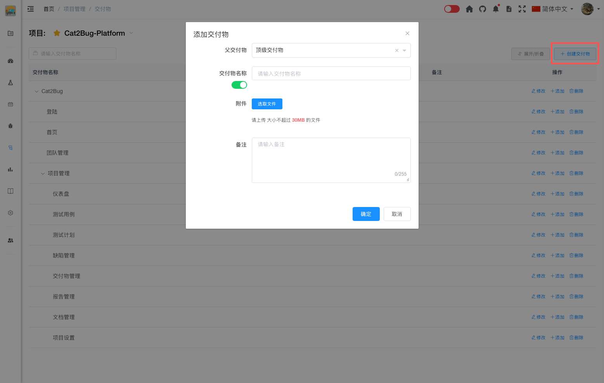

# 新建交付物

创建新的交付物，用于组织测试用例和缺陷。

## 使用场景

- 项目启动时创建交付物结构
- 新增功能模块时创建对应交付物
- 调整项目架构时重组交付物
- 细化交付物粒度

## 操作步骤

### 1. 进入交付物管理页面

在项目菜单中选择「交付物管理」。

### 2. 点击创建按钮

点击「创建交付物」按钮，打开创建对话框。



### 3. 填写交付物信息

#### 父级交付物

选择上级交付物，建立层级关系。

**选择建议：**
- 根据业务逻辑选择父级
- 保持层级清晰
- 避免层级过深（建议不超过 4 层）

**示例结构：**
```
电商系统（根节点）
└── 用户模块（父级）
    └── 用户注册（当前创建）
```

#### 交付物名称（必填）

输入简洁明了的交付物名称。

**命名建议：**
- 使用业务术语，避免技术术语
- 避免使用缩写
- 保持命名一致性
- 名称长度建议在 20 字以内

**示例：**
- ✅ 用户管理模块
- ✅ 商品搜索功能
- ✅ 订单支付流程
- ❌ 模块1
- ❌ test
- ❌ 功能A

::: tip 提示

1. 点击「交付物名称」下面的开关，可以切换批量添加交付物的功能，多个交付物通过换行分割。
2. 一次创建多个交付物，无法为这些交付物设置附件，只能创建完成后单独添加服务。

:::

#### 附件

为交付物添加相关文件。

**附件操作：**
- 点击「上传附件」按钮添加文件
- 支持多个附件
- 附件可以是任何格式的文件

**附件用途：**
- 需求文档
- 设计文档
- 接口文档
- 其他相关资料

**键盘操作：** Tab 至附件上传外框后，**Enter** / **Space** 选取文件；已有附件时 **↓** 进入列表，**↑↓** 切换，**Delete** 删除，首项 **↑** 回到外框。详见 [键盘快捷键 — 附件上传](../../../advanced/keyboard-shortcuts.md#附件上传fileupload)。

#### 备注

详细描述交付物的功能和范围。

**描述内容建议：**
- 交付物的主要功能
- 包含的子功能
- 业务范围
- 技术实现方式

### 4. 保存交付物

点击「确定」按钮完成创建。

::: tip 提示
1. 交付物名称在同一父级下不能重复
2. 创建后可以继续编辑补充详细信息
3. 建议先规划好交付物结构，再批量创建
4. 批量创建的交付物无法设置附件，需要创建后单独添加
5. 附件可以帮助团队成员更好地理解交付物
:::
