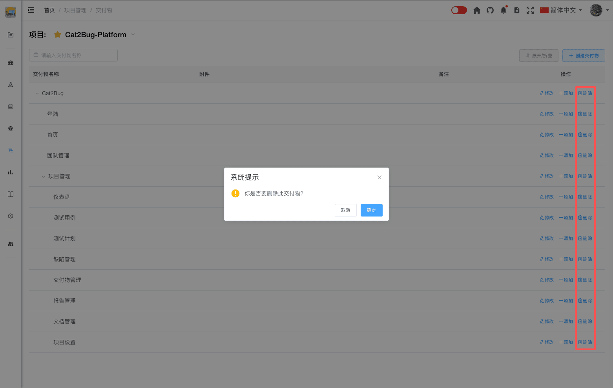

# 删除交付物

删除不再需要的交付物。

## 使用场景

- 删除创建错误的交付物
- 清理废弃的交付物
- 项目架构调整时删除旧交付物
- 测试数据清理

## 删除条件

删除交付物前需要确认以下条件：

- ✅ 该交付物下没有关联的测试用例
- ✅ 该交付物下没有关联的缺陷
- ✅ 该交付物下没有子交付物

如果不满足以上条件，系统会阻止删除操作。

## 操作步骤

### 1. 找到要删除的交付物

在交付物列表中找到要删除的交付物。

### 2. 点击删除按钮

点击交付物右侧的「删除」按钮。

### 3. 确认删除

在弹出的确认对话框中，确认删除操作。

### 4. 完成删除

系统删除交付物并刷新列表。

::: tip 提示
1. 删除操作不可恢复，请谨慎操作
2. 建议先转移关联数据，再删除交付物
3. 对于暂时不用的交付物，建议保留而不是删除
4. 删除父交付物前，必须先处理所有子交付物
:::
