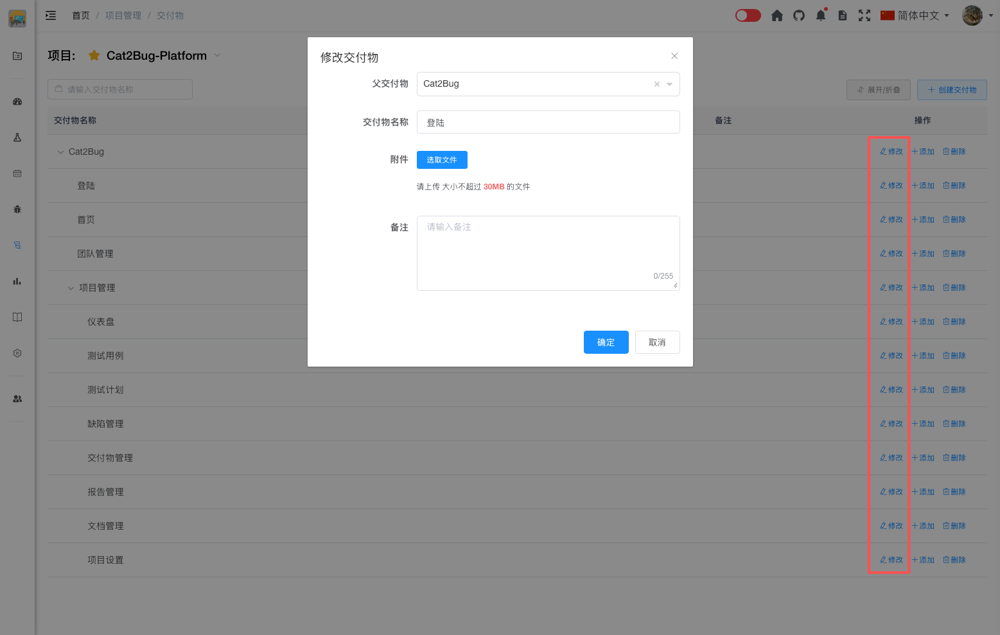

# 修改交付物

修改交付物的基本信息或调整交付物的层级关系。

## 使用场景

- 更新交付物名称或备注
- 调整交付物的层级关系
- 补充交付物信息
- 添加或删除附件

## 操作步骤

### 1. 找到要修改的交付物

在交付物列表中找到要修改的交付物。

### 2. 点击编辑按钮

点击交付物右侧的【编辑】按钮，打开编辑对话框。

### 3. 修改交付物信息

#### 父级交付物

调整交付物的层级关系。

**调整方式：**
- 选择新的父级交付物
- 选择"无"设为根节点
- 不能选择自己或自己的子节点作为父级

#### 交付物名称（必填）

更新交付物的名称。

**注意事项：**
- 名称在同一父级下不能重复
- 修改名称不影响已关联的用例和缺陷
- 建议保持命名规范的一致性

#### 备注

更新交付物的详细备注。

**建议补充的内容：**
- 功能范围的变更
- 技术实现的更新
- 业务逻辑的调整
- 依赖关系的说明

#### 附件

为交付物添加或删除附件。

**附件操作：**
- 点击【上传附件】按钮添加文件
- 点击附件右侧的【删除】按钮删除文件
- 支持多个附件

### 4. 保存修改

点击【确定】按钮保存修改。

::: tip 提示
1. 修改交付物名称不会影响已关联的用例和缺陷
2. 调整层级关系时，子交付物会随父交付物一起移动
3. 附件可以是任何格式的文件
4. 建议为重要交付物添加相关文档作为附件
:::
