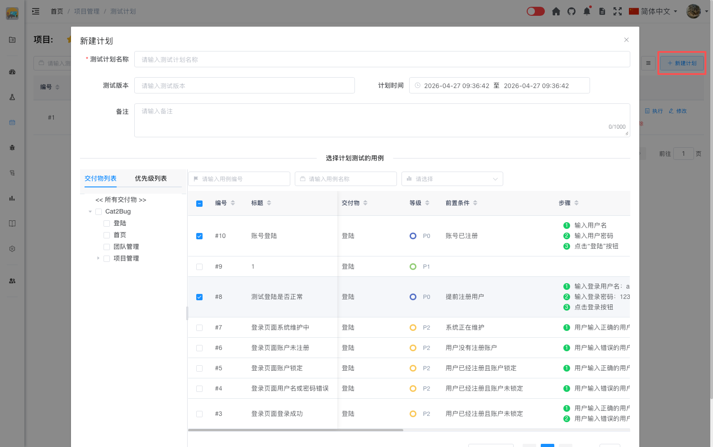

# 新建计划

新建计划是测试工作的第一步，通过合理的计划可以有效组织和管理测试活动。

## 1. 打开创建见面

首先点击页面右上侧的【新建计划】按钮，将从右侧打开新建计划界面，如下图：

## 2. 填写基本信息

创建测试计划时需要填写以下基本信息：

- **测试计划名称**（必填）- 简洁明了的计划名称
- **测试版本** - 本次测试对应的版本号
- **计划时间** - 测试计划的时间范围
- **备注** - 其他需要说明的信息

## 3. 选择测试用例

将相关的测试用例添加到测试计划中：

### 单独选择测试用例

从【选择计划测试的用例】下的用例列表中选择需要执行的用例。

### 批量添加测试用例

从【选择计划测试的用例】左下侧的目录中，可以按照交付物、优先级批量添加用例。

4. 完成创建

当输入完所有数据后，点击右下角的【保存计划】按钮完成计划的创建。

::: tip 提示：
1. 计划名称应该简洁明了，能够清楚表达测试目标
2. 合理设置开始和结束时间，预留足够的测试时间
3. 选择用例时要考虑测试的完整性和覆盖率
4. 分配执行人时要考虑成员的技能和工作量平衡
:::