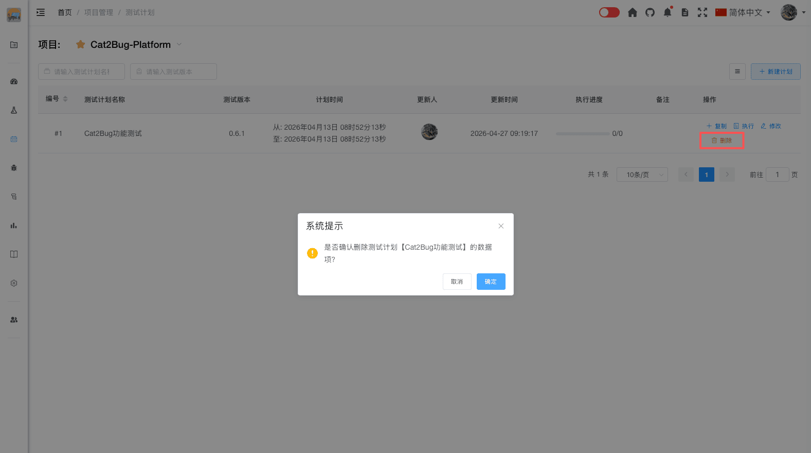

# 删除计划

删除计划会永久移除计划及其相关数据，请谨慎操作。

## 使用场景

- 删除错误创建的测试计划
- 清理不再需要的历史计划
- 删除测试数据进行重新规划

## 操作步骤

### 1. 选择要删除的计划

在测试计划列表中，找到需要删除的测试计划。

### 2. 点击删除按钮

点击测试计划右侧的「删除」按钮。

### 3. 确认删除

系统会弹出确认对话框，提示删除操作的影响。

### 4. 完成删除

点击「确认」按钮后，测试计划将被永久删除。

## 删除影响

删除测试计划会导致以下数据被删除：

- 测试计划的基本信息
- 计划中的用例关联关系
- 用例的执行记录和状态
- 计划相关的统计数据

::: tip 注意：
删除操作不会删除测试用例本身，只会删除用例在该计划中的执行记录。
:::

::: alarm 警告：
1. 删除操作不可恢复，请谨慎操作
2. 建议在删除前导出测试报告进行归档
3. 正在执行中的计划建议先完成或暂停后再删除
4. 如果只是暂时不需要，建议归档而不是删除
:::