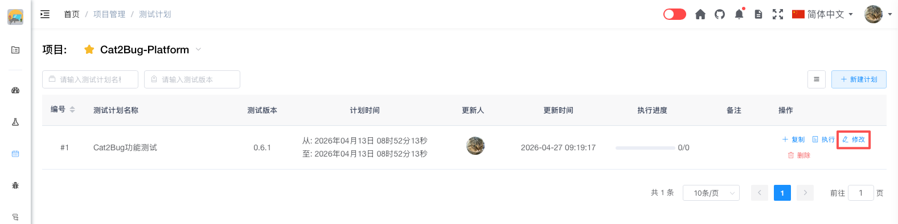

# 修改计划

修改计划可以在计划执行过程中根据实际情况调整计划内容。

## 使用场景

- 修改计划的基本信息
- 调整测试用例范围
- 更新计划时间
- 补充备注说明

## 操作步骤

### 1. 打开测试计划

在测试计划列表中，在需要编辑的测试计划右侧点击「编辑」按钮，打开编辑界面。

### 2. 修改计划信息

可以修改以下信息：

- **测试计划名称** - 修改计划名称
- **测试版本** - 更新版本号
- **计划时间** - 调整时间范围
- **备注** - 更新备注信息

### 3. 调整测试用例

可以对测试用例进行以下操作：

- **单个修改** - 通过勾选测试用例列表中的用例进行单个用例的选择
- **批量修改** - 通过勾选交付物或优先级进行批量选择用例

### 4. 保存修改

确认修改无误后，点击「保存计划」按钮完成编辑。

## 注意事项

> **提示：**
> 1. 编辑计划不会影响已执行用例的状态
> 2. 删除用例时，该用例的执行记录也会被删除
> 3. 建议在计划执行前完成主要的编辑工作
> 4. 重大调整建议在备注中说明原因
